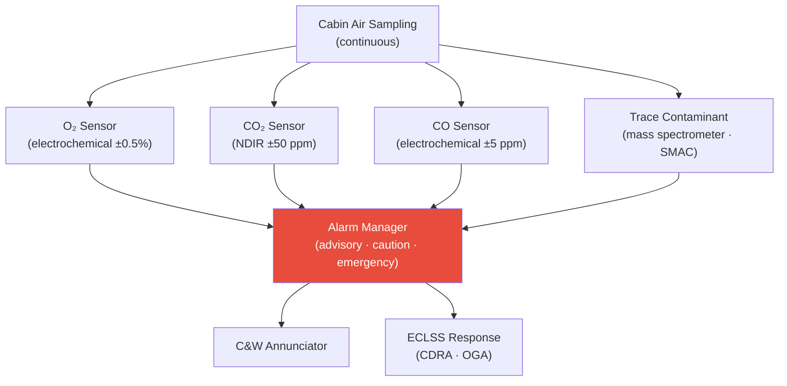

# STA 100-109 · 105-070 — Atmospheric Monitoring and Contaminant Detection

## 1. Purpose

Defines the **atmospheric monitoring and contaminant detection** architecture for Q+ATLANTIDE crewed modules, specifying the sensor suite, SMAC limits, detection algorithms, and crew alert procedures per NASA-STD-3001[^nastd3001] and JSC-20584[^nasajsc].

The atmospheric monitoring system continuously samples cabin air for: O₂ (electrochemical cell, 0–100 % range, ±0.5 %); CO₂ (NDIR spectrometer, 0–5 %, ±50 ppm); CO (electrochemical cell, 0–200 ppm, ±5 ppm); trace contaminants (mass spectrometer, JSC SMAC list > 200 compounds); humidity (capacitive RH sensor, 25–75 % RH, ±3 %); and cabin total pressure. Alarms are tiered: advisory (approaching SMAC limit), caution (SMAC 1-hour limit), emergency (SMAC 1-minute limit). The system interfaces with the ECLSS CDRA for CO₂ response and the ATCS HVAC for ventilation increase.

## 2. Scope

- Covers the *Atmospheric Monitoring and Contaminant Detection* subsubject (`070`) of subsection `105`.
- Inherits Q-Division authority and ORB support from the parent row in [`../../README.md` §3](../../README.md#3-architecture-table)[^archtable].
- All design decisions traceable to source standards and CSDB evidence per subsection `109`.

## 3. Diagram — Atmospheric Monitoring and Contaminant Detection

## 4. Footprint

| Metric | Value |
|---|---|
| Architecture | `STA` — Space Technology Architecture |
| Master range | `100–199` |
| Code range | `100-109` |
| Section | `00` — Sistemas Generales y Soporte Vital Espacial |
| Subsection | `105` — Presurización y Atmósfera Interna |
| Subsubject | `070` — Atmospheric Monitoring and Contaminant Detection |
| Primary Q-Division | Q-SPACE[^qdiv] |
| Support Q-Divisions | Q-DATAGOV, Q-HORIZON, Q-HPC, Q-GREENTECH |
| ORB support | ORB-PMO, ORB-LEG |
| Governance class | `baseline`[^gov] |
| Folder path | `Q+ATLANTIDE/100-199_STA/100-109_Sistemas-Generales-y-Soporte-Vital-Espacial/105_Presurizacion-y-Atmosfera-Interna/` |
| Document | `105-070-Atmospheric-Monitoring-and-Contaminant-Detection.md` (this file) |
| Parent subsection | [`README.md`](./README.md) · [`105-000-General.md`](./105-000-General.md) |
| Parent architecture | [`../../README.md`](../../README.md) |
| Parent baseline | [`organization/Q+ATLANTIDE.md`](../../../../organization/Q+ATLANTIDE.md) |

## 5. References & Citations

[^baseline]: **Q+ATLANTIDE controlled baseline (v1.0.0)** — [`organization/Q+ATLANTIDE.md`](../../../../organization/Q+ATLANTIDE.md).

[^archtable]: **STA §3 Architecture Table** — [`../../README.md` §3](../../README.md#3-architecture-table).

[^qdiv]: **Q-Division authority** — See [`organization/Q+ATLANTIDE.md` §4](../../../../organization/Q+ATLANTIDE.md#4-notes).

[^gov]: **Governance class** — `baseline` denotes documents under controlled change management.

[^ecsse34]: **ECSS-E-ST-34C Rev.1 — Space Engineering: Environmental Control and Life Support** — Primary standard for pressurization design, cabin atmosphere, and leak detection requirements.

[^nastd3001]: **NASA-STD-3001 Vol.2 — Human Factors, Habitability, and Environmental Health** — Cabin pressure and atmospheric composition requirements for crew health.

[^nasajsc]: **NASA/JSC-65591 — ECLSS Design and Performance Requirements** — Pressurization system design reference for ISS-class crewed modules.

[^iso20521]: **ISO 20521 — Space Systems: Human Spaceflight** — Crew habitability and pressurization requirements for crewed spacecraft.

### Applicable industry standards

- ECSS-E-ST-34C Rev.1 — Space Engineering: Environmental Control and Life Support[^ecsse34]
- NASA-STD-3001 Vol.2 — Human Factors, Habitability, and Environmental Health[^nastd3001]
- NASA/JSC-65591 — ECLSS Design and Performance Requirements[^nasajsc]
- ISO 20521 — Space Systems: Human Spaceflight[^iso20521]
