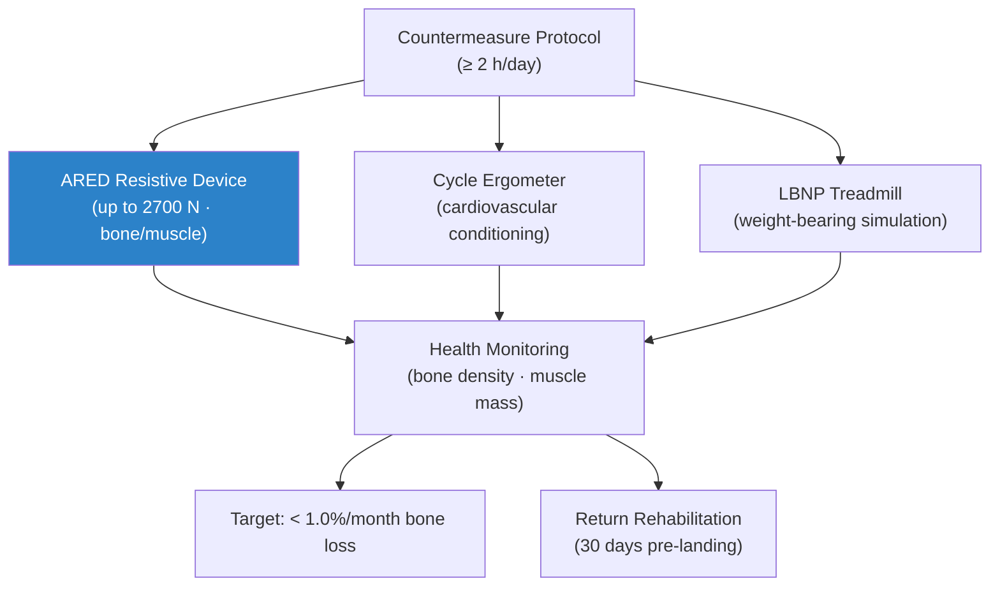

# STA 100-109 · 106-040 — Musculoskeletal-Countermeasures-and-Exercise

## 1. Purpose

Defines the **musculoskeletal countermeasure programme** for Q+ATLANTIDE crewed missions, specifying resistive and aerobic exercise protocols, exercise hardware, bone density monitoring, and return-to-gravity rehabilitation per NASA-STD-3001[^nastd3001].

Microgravity-induced musculoskeletal deconditioning includes: bone mineral density loss (~1.0–1.5 % per month in weight-bearing bones without countermeasures), muscle mass loss (~1–3 % per week), and postural muscle atrophy. The countermeasure programme requires: ≥ 2 hours daily exercise (combination of resistive + aerobic); advanced resistive exercise device (ARED) providing up to 2700 N (~270 kg) loaded resistance; cycle ergometer; treadmill with lower-body negative pressure (LBNP) to simulate weight-bearing. Bone density monitored monthly via portable DXA-equivalent device; target: < 1.0 % per month bone loss. Rehabilitation programme initiated 30 days pre-return for long-duration missions.

## 2. Scope

- Covers the *Musculoskeletal-Countermeasures-and-Exercise* subsubject (`040`) of subsection `106`.
- Inherits Q-Division authority and ORB support from the parent row in [`../../README.md` §3](../../README.md#3-architecture-table)[^archtable].
- All design decisions and monitoring thresholds traceable to NASA-STD-3001[^nastd3001] and CSDB evidence per subsection `109`.

## 3. Diagram — Musculoskeletal-Countermeasures-and-Exercise

## 4. Footprint

| Metric | Value |
|---|---|
| Architecture | `STA` — Space Technology Architecture |
| Master range | `100–199` |
| Code range | `100-109` |
| Section | `00` — Sistemas Generales y Soporte Vital Espacial |
| Subsection | `106` — Salud Tripulación y Factores Humanos |
| Subsubject | `040` — Musculoskeletal-Countermeasures-and-Exercise |
| Primary Q-Division | Q-SPACE[^qdiv] |
| Support Q-Divisions | Q-DATAGOV, Q-HORIZON, Q-HPC |
| ORB support | ORB-PMO, ORB-LEG |
| Governance class | `baseline`[^gov] |
| Folder path | `Q+ATLANTIDE/100-199_STA/100-109_Sistemas-Generales-y-Soporte-Vital-Espacial/106_Salud-Tripulacion-y-Factores-Humanos/` |
| Document | `106-040-Musculoskeletal-Countermeasures-and-Exercise.md` (this file) |
| Parent subsection | [`README.md`](./README.md) · [`106-000-General.md`](./106-000-General.md) |
| Parent architecture | [`../../README.md`](../../README.md) |
| Parent baseline | [`organization/Q+ATLANTIDE.md`](../../../../organization/Q+ATLANTIDE.md) |

## 5. References & Citations

[^baseline]: **Q+ATLANTIDE controlled baseline (v1.0.0)** — [`organization/Q+ATLANTIDE.md`](../../../../organization/Q+ATLANTIDE.md).

[^archtable]: **STA §3 Architecture Table** — [`../../README.md` §3](../../README.md#3-architecture-table).

[^qdiv]: **Q-Division authority** — See [`organization/Q+ATLANTIDE.md` §4](../../../../organization/Q+ATLANTIDE.md#4-notes).

[^gov]: **Governance class** — `baseline` denotes documents under controlled change management.

[^nastd3001]: **NASA-STD-3001 Vol.1 & Vol.2 — Human Integration Design Handbook / Human Factors, Habitability, and Environmental Health** — Primary standard for crew health, physical performance, and medical monitoring requirements.

[^nasahf]: **NASA/SP-2010-3407 — Human Integration Design Handbook (HIDH)** — Comprehensive human factors guidance for crewed spacecraft design.

[^ecsse10]: **ECSS-E-HB-10-12A — Methods for the Calculation of Reliability** — Reliability and human factors engineering methodology applicable to crew health monitoring systems.

[^iso9241]: **ISO 9241-11:2018 — Ergonomics of Human-System Interaction** — Usability and ergonomics standards applicable to crew health monitoring interfaces.

### Applicable industry standards

- NASA-STD-3001 Vol.1 & Vol.2 — Human Integration Design Handbook[^nastd3001]
- NASA/SP-2010-3407 — Human Integration Design Handbook[^nasahf]
- ECSS-E-HB-10-12A — Methods for the Calculation of Reliability[^ecsse10]
- ISO 9241-11:2018 — Ergonomics of Human-System Interaction[^iso9241]

[^ncrp132]: **NCRP Report No. 132 — Radiation Protection Guidance for Activities in Low-Earth Orbit** — Career dose limits and SPE protection requirements for crewed space missions.

[^milstd1472]: **MIL-STD-1472G — Human Engineering** — Anthropometric, display, control, and cognitive load requirements applicable to crewed spacecraft.
