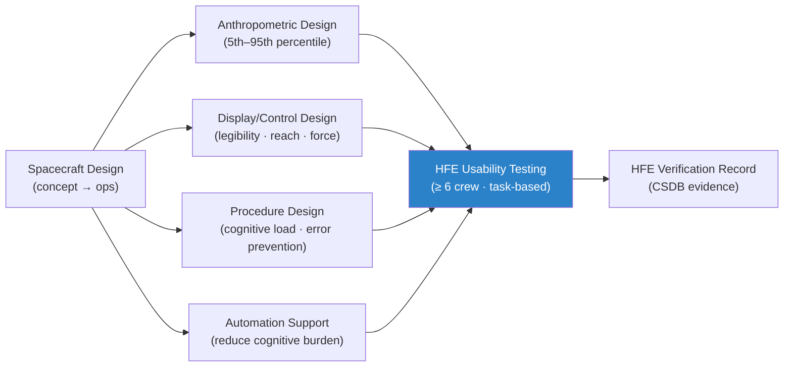

# STA 100-109 · 106-070 — Human-Factors-Ergonomics-and-Cognitive-Load

## 1. Purpose

Defines the **human factors, ergonomics, and cognitive load management** requirements for Q+ATLANTIDE spacecraft design and crew procedures, ensuring that all hardware interfaces, displays, and task sequences are designed for safe, efficient human operation per NASA-STD-3001[^nastd3001] and MIL-STD-1472G[^milstd1472].

Human factors engineering (HFE) is applied throughout the spacecraft design lifecycle from concept through operations. Key requirements: anthropometric design range (5th–95th percentile of mixed-sex international astronaut population); control reach envelope; display legibility (minimum 0.3 m, maximum 3 m viewing distance; character height ≥ 16 arcminutes); force limits (maximum 111 N hand force for emergency operations); task time limits for safety-critical actions; cognitive load management through procedural design, automation support, and alert prioritization. Usability testing required for all crew interfaces (at minimum 6-crew task-based evaluation).

## 2. Scope

- Covers the *Human-Factors-Ergonomics-and-Cognitive-Load* subsubject (`070`) of subsection `106`.
- Inherits Q-Division authority and ORB support from the parent row in [`../../README.md` §3](../../README.md#3-architecture-table)[^archtable].
- All design decisions and monitoring thresholds traceable to NASA-STD-3001[^nastd3001] and CSDB evidence per subsection `109`.

## 3. Diagram — Human-Factors-Ergonomics-and-Cognitive-Load

## 4. Footprint

| Metric | Value |
|---|---|
| Architecture | `STA` — Space Technology Architecture |
| Master range | `100–199` |
| Code range | `100-109` |
| Section | `00` — Sistemas Generales y Soporte Vital Espacial |
| Subsection | `106` — Salud Tripulación y Factores Humanos |
| Subsubject | `070` — Human-Factors-Ergonomics-and-Cognitive-Load |
| Primary Q-Division | Q-SPACE[^qdiv] |
| Support Q-Divisions | Q-DATAGOV, Q-HORIZON, Q-HPC |
| ORB support | ORB-PMO, ORB-LEG |
| Governance class | `baseline`[^gov] |
| Folder path | `Q+ATLANTIDE/100-199_STA/100-109_Sistemas-Generales-y-Soporte-Vital-Espacial/106_Salud-Tripulacion-y-Factores-Humanos/` |
| Document | `106-070-Human-Factors-Ergonomics-and-Cognitive-Load.md` (this file) |
| Parent subsection | [`README.md`](./README.md) · [`106-000-General.md`](./106-000-General.md) |
| Parent architecture | [`../../README.md`](../../README.md) |
| Parent baseline | [`organization/Q+ATLANTIDE.md`](../../../../organization/Q+ATLANTIDE.md) |

## 5. References & Citations

[^baseline]: **Q+ATLANTIDE controlled baseline (v1.0.0)** — [`organization/Q+ATLANTIDE.md`](../../../../organization/Q+ATLANTIDE.md).

[^archtable]: **STA §3 Architecture Table** — [`../../README.md` §3](../../README.md#3-architecture-table).

[^qdiv]: **Q-Division authority** — See [`organization/Q+ATLANTIDE.md` §4](../../../../organization/Q+ATLANTIDE.md#4-notes).

[^gov]: **Governance class** — `baseline` denotes documents under controlled change management.

[^nastd3001]: **NASA-STD-3001 Vol.1 & Vol.2 — Human Integration Design Handbook / Human Factors, Habitability, and Environmental Health** — Primary standard for crew health, physical performance, and medical monitoring requirements.

[^nasahf]: **NASA/SP-2010-3407 — Human Integration Design Handbook (HIDH)** — Comprehensive human factors guidance for crewed spacecraft design.

[^ecsse10]: **ECSS-E-HB-10-12A — Methods for the Calculation of Reliability** — Reliability and human factors engineering methodology applicable to crew health monitoring systems.

[^iso9241]: **ISO 9241-11:2018 — Ergonomics of Human-System Interaction** — Usability and ergonomics standards applicable to crew health monitoring interfaces.

### Applicable industry standards

- NASA-STD-3001 Vol.1 & Vol.2 — Human Integration Design Handbook[^nastd3001]
- NASA/SP-2010-3407 — Human Integration Design Handbook[^nasahf]
- ECSS-E-HB-10-12A — Methods for the Calculation of Reliability[^ecsse10]
- ISO 9241-11:2018 — Ergonomics of Human-System Interaction[^iso9241]

[^ncrp132]: **NCRP Report No. 132 — Radiation Protection Guidance for Activities in Low-Earth Orbit** — Career dose limits and SPE protection requirements for crewed space missions.

[^milstd1472]: **MIL-STD-1472G — Human Engineering** — Anthropometric, display, control, and cognitive load requirements applicable to crewed spacecraft.
