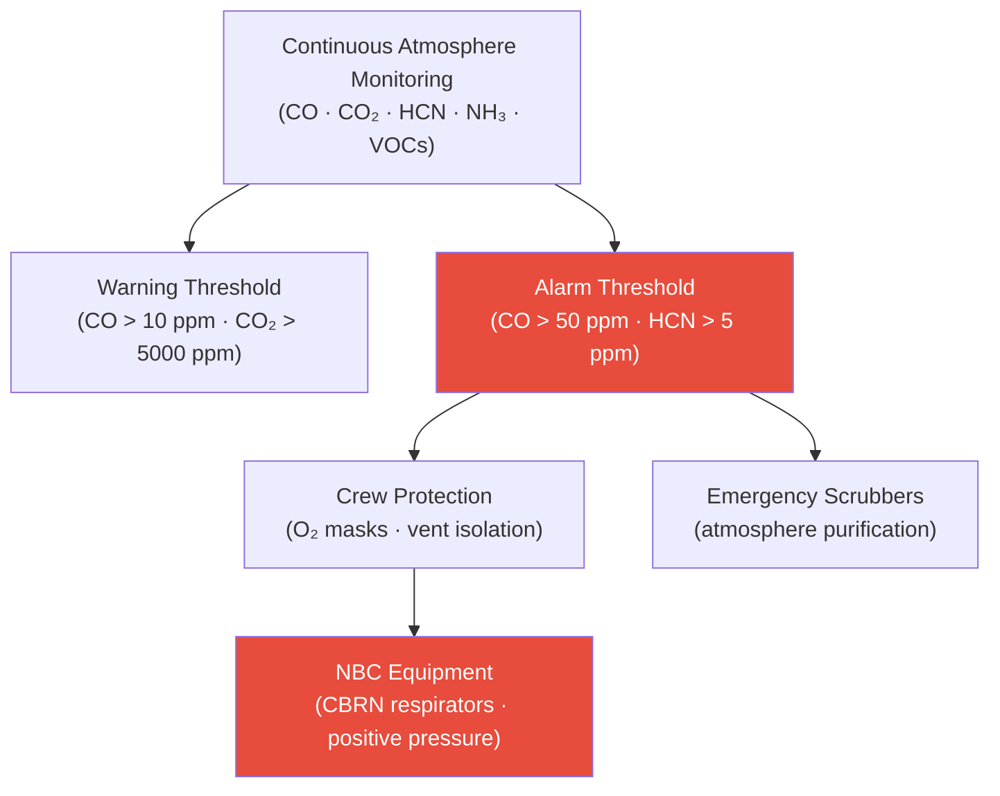

# STA 100-109 · 107-060 — Toxic-Atmosphere-Response-and-NBC-Protection

## 1. Purpose

Defines the **toxic atmosphere response and NBC (nuclear, biological, chemical) protection** architecture for Q+ATLANTIDE missions, specifying contaminant monitoring, emergency atmosphere control, crew protection equipment, and decontamination procedures per ECSS-Q-ST-40C[^ecssq40].

Toxic contaminant monitoring: continuously monitors CO (> 10 ppm warning, > 50 ppm alarm), CO₂ (> 5000 ppm warning per 102-070), HCN (> 5 ppm alarm), NH₃ (> 25 ppm alarm), off-gassing VOCs from spacecraft materials (< SMAC limits per NASA JSC-65591). NBC threats (primarily applicable to ground operations and re-entry landing zones): crew module designed for positive pressure isolation (prevents external contaminant ingress); crew personal protective equipment includes full-face respirators with CBRN-rated filters. Emergency atmosphere control: activates emergency O₂ masks (100 % O₂), isolates cabin ventilation, activates emergency atmosphere purification scrubbers.

## 2. Scope

- Covers the *Toxic-Atmosphere-Response-and-NBC-Protection* subsubject (`060`) of subsection `107`.
- Inherits Q-Division authority and ORB support from the parent row in [`../../README.md` §3](../../README.md#3-architecture-table)[^archtable].
- All emergency/abort systems are life-safety critical per MIL-STD-882E[^milstd882] Hazard Risk Index I.

## 3. Diagram — Toxic-Atmosphere-Response-and-NBC-Protection

## 4. Footprint

| Metric | Value |
|---|---|
| Architecture | `STA` — Space Technology Architecture |
| Master range | `100–199` |
| Code range | `100-109` |
| Section | `00` — Sistemas Generales y Soporte Vital Espacial |
| Subsection | `107` — Supervivencia, Emergencia y Aborto |
| Subsubject | `060` — Toxic-Atmosphere-Response-and-NBC-Protection |
| Primary Q-Division | Q-SPACE[^qdiv] |
| Support Q-Divisions | Q-DATAGOV, Q-HORIZON, Q-HPC, Q-AIR |
| ORB support | ORB-PMO, ORB-LEG |
| Governance class | `baseline`[^gov] |
| Folder path | `Q+ATLANTIDE/100-199_STA/100-109_Sistemas-Generales-y-Soporte-Vital-Espacial/107_Supervivencia-Emergencia-y-Aborto/` |
| Document | `107-060-Toxic-Atmosphere-Response-and-NBC-Protection.md` (this file) |
| Parent subsection | [`README.md`](./README.md) · [`107-000-General.md`](./107-000-General.md) |
| Parent architecture | [`../../README.md`](../../README.md) |
| Parent baseline | [`organization/Q+ATLANTIDE.md`](../../../../organization/Q+ATLANTIDE.md) |

## 5. References & Citations

[^baseline]: **Q+ATLANTIDE controlled baseline (v1.0.0)** — [`organization/Q+ATLANTIDE.md`](../../../../organization/Q+ATLANTIDE.md).

[^archtable]: **STA §3 Architecture Table** — [`../../README.md` §3](../../README.md#3-architecture-table).

[^qdiv]: **Q-Division authority** — See [`organization/Q+ATLANTIDE.md` §4](../../../../organization/Q+ATLANTIDE.md#4-notes).

[^gov]: **Governance class** — `baseline` denotes documents under controlled change management.

[^ecssq40]: **ECSS-Q-ST-40C — Safety** — ESA safety standards applicable to space systems including abort, emergency, and hazard management.

[^iso14620]: **ISO 14620-1:2018 — Space Systems Safety Requirements** — International safety requirements for space launch vehicles and spacecraft.

[^milstd882]: **MIL-STD-882E — System Safety** — Hazard analysis methodology (PHL, SSHA, SHA, SSHA, O&SHA) and risk acceptance criteria.

[^nastd8739]: **NASA-STD-8739.8A — Software Assurance Standard** — Software safety requirements applicable to abort and emergency management systems.

### Applicable industry standards

- ECSS-Q-ST-40C — Safety[^ecssq40]
- ISO 14620-1:2018 — Space Systems Safety Requirements[^iso14620]
- MIL-STD-882E — System Safety[^milstd882]
- NASA-STD-8739.8A — Software Assurance Standard[^nastd8739]

[^nastd3001]: **NASA-STD-3001 Vol.1 & Vol.2 — Human Integration Design Handbook**.
[^ccsds]: **CCSDS 401.0-B — Radio Frequency and Modulation Systems** — Emergency communications protocols for crewed spacecraft.
