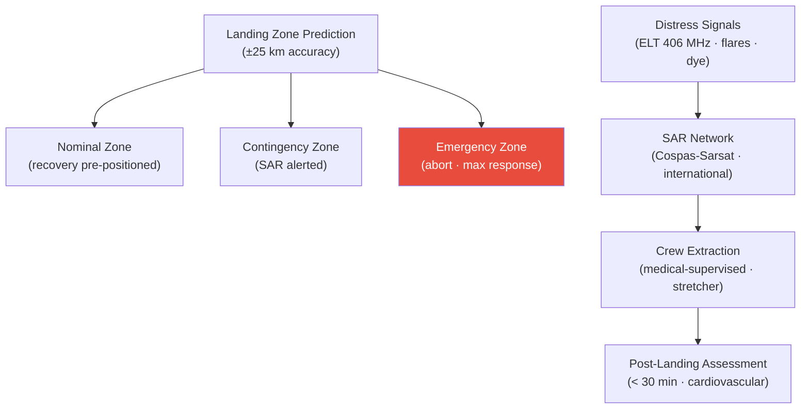

# STA 100-109 · 107-070 — Crew-Rescue-Recovery-and-Search-and-Rescue

## 1. Purpose

Defines the **crew rescue, recovery, and search-and-rescue (SAR)** architecture for Q+ATLANTIDE missions, specifying landing zone prediction, SAR force integration, crew extraction procedures, and post-landing medical assessment per NASA-STD-3001[^nastd3001].

Landing zone prediction: on-board and ground trajectory analysis providing landing zone ±25 km accuracy; zones pre-classified as: nominal (designated landing area, recovery forces pre-positioned), contingency (off-nominal trajectory, SAR forces alerted), and emergency (abort, maximum response). SAR integration: distress signals (ELT 406 MHz Cospas-Sarsat + visual flares + dye marker) activate international SAR network; crew survival window ≥ 72 hours to allow global SAR response. Crew extraction: medical crew extraction procedures for post-landing deconditioning (cardiovascular orthostatic intolerance after long-duration missions); stretcher extraction capability for incapacitated crew. Post-landing medical: immediate crew health assessment within 30 minutes of recovery.

## 2. Scope

- Covers the *Crew-Rescue-Recovery-and-Search-and-Rescue* subsubject (`070`) of subsection `107`.
- Inherits Q-Division authority and ORB support from the parent row in [`../../README.md` §3](../../README.md#3-architecture-table)[^archtable].
- All emergency/abort systems are life-safety critical per MIL-STD-882E[^milstd882] Hazard Risk Index I.

## 3. Diagram — Crew-Rescue-Recovery-and-Search-and-Rescue

## 4. Footprint

| Metric | Value |
|---|---|
| Architecture | `STA` — Space Technology Architecture |
| Master range | `100–199` |
| Code range | `100-109` |
| Section | `00` — Sistemas Generales y Soporte Vital Espacial |
| Subsection | `107` — Supervivencia, Emergencia y Aborto |
| Subsubject | `070` — Crew-Rescue-Recovery-and-Search-and-Rescue |
| Primary Q-Division | Q-SPACE[^qdiv] |
| Support Q-Divisions | Q-DATAGOV, Q-HORIZON, Q-HPC, Q-AIR |
| ORB support | ORB-PMO, ORB-LEG |
| Governance class | `baseline`[^gov] |
| Folder path | `Q+ATLANTIDE/100-199_STA/100-109_Sistemas-Generales-y-Soporte-Vital-Espacial/107_Supervivencia-Emergencia-y-Aborto/` |
| Document | `107-070-Crew-Rescue-Recovery-and-Search-and-Rescue.md` (this file) |
| Parent subsection | [`README.md`](./README.md) · [`107-000-General.md`](./107-000-General.md) |
| Parent architecture | [`../../README.md`](../../README.md) |
| Parent baseline | [`organization/Q+ATLANTIDE.md`](../../../../organization/Q+ATLANTIDE.md) |

## 5. References & Citations

[^baseline]: **Q+ATLANTIDE controlled baseline (v1.0.0)** — [`organization/Q+ATLANTIDE.md`](../../../../organization/Q+ATLANTIDE.md).

[^archtable]: **STA §3 Architecture Table** — [`../../README.md` §3](../../README.md#3-architecture-table).

[^qdiv]: **Q-Division authority** — See [`organization/Q+ATLANTIDE.md` §4](../../../../organization/Q+ATLANTIDE.md#4-notes).

[^gov]: **Governance class** — `baseline` denotes documents under controlled change management.

[^ecssq40]: **ECSS-Q-ST-40C — Safety** — ESA safety standards applicable to space systems including abort, emergency, and hazard management.

[^iso14620]: **ISO 14620-1:2018 — Space Systems Safety Requirements** — International safety requirements for space launch vehicles and spacecraft.

[^milstd882]: **MIL-STD-882E — System Safety** — Hazard analysis methodology (PHL, SSHA, SHA, SSHA, O&SHA) and risk acceptance criteria.

[^nastd8739]: **NASA-STD-8739.8A — Software Assurance Standard** — Software safety requirements applicable to abort and emergency management systems.

### Applicable industry standards

- ECSS-Q-ST-40C — Safety[^ecssq40]
- ISO 14620-1:2018 — Space Systems Safety Requirements[^iso14620]
- MIL-STD-882E — System Safety[^milstd882]
- NASA-STD-8739.8A — Software Assurance Standard[^nastd8739]

[^nastd3001]: **NASA-STD-3001 Vol.1 & Vol.2 — Human Integration Design Handbook**.
[^ccsds]: **CCSDS 401.0-B — Radio Frequency and Modulation Systems** — Emergency communications protocols for crewed spacecraft.
