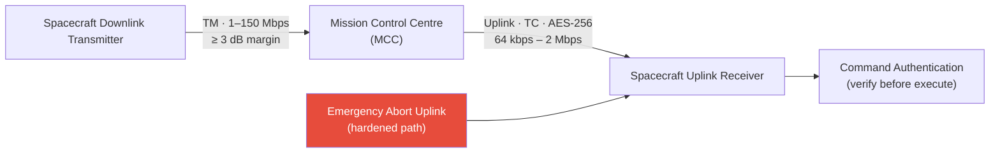

# STA 100-109 · 108-030 — Mission-Control-Uplink-and-Downlink

## 1. Purpose

Defines the **mission control uplink and downlink architecture** for Q+ATLANTIDE missions, specifying command/telemetry protocols, link margins, encryption, and CCSDS compliance per CCSDS standards[^ccsds].

Uplink (ground → spacecraft): command uplink via S-band or Ka-band; CCSDS Telecommand (TC) standard; data rate 64 kbps – 2 Mbps; authenticated command packets (CCSDS Space Data Link Security[^ccsds] with AES-256 encryption); commanded actions require authentication before execution; emergency abort commands routed via hardened uplink path. Downlink (spacecraft → ground): telemetry downlink; CCSDS TM standard; data rate 1 – 150 Mbps; housekeeping TM (health · status) at 1 Mbps continuous; science/payload TM configurable; real-time health parameters at 1 Hz minimum. Link margin: ≥ 3 dB end-to-end under worst-case geometry.

## 2. Scope

- Covers the *Mission-Control-Uplink-and-Downlink* subsubject (`030`) of subsection `108`.
- Inherits Q-Division authority and ORB support from the parent row in [`../../README.md` §3](../../README.md#3-architecture-table)[^archtable].
- All HMI designs require human factors evaluation per MIL-STD-1472G[^milstd1472] and NASA-STD-3001 Vol.2[^nastd3001v2].

## 3. Diagram — Mission-Control-Uplink-and-Downlink

## 4. Footprint

| Metric | Value |
|---|---|
| Architecture | `STA` — Space Technology Architecture |
| Master range | `100–199` |
| Code range | `100-109` |
| Section | `00` — Sistemas Generales y Soporte Vital Espacial |
| Subsection | `108` — Interfaces de Operación Tripulación y Tierra |
| Subsubject | `030` — Mission-Control-Uplink-and-Downlink |
| Primary Q-Division | Q-SPACE[^qdiv] |
| Support Q-Divisions | Q-DATAGOV, Q-HORIZON, Q-HPC, Q-AIR |
| ORB support | ORB-PMO, ORB-LEG |
| Governance class | `baseline`[^gov] |
| Folder path | `Q+ATLANTIDE/100-199_STA/100-109_Sistemas-Generales-y-Soporte-Vital-Espacial/108_Interfaces-de-Operacion-Tripulacion-y-Tierra/` |
| Document | `108-030-Mission-Control-Uplink-and-Downlink.md` (this file) |
| Parent subsection | [`README.md`](./README.md) · [`108-000-General.md`](./108-000-General.md) |
| Parent architecture | [`../../README.md`](../../README.md) |
| Parent baseline | [`organization/Q+ATLANTIDE.md`](../../../../organization/Q+ATLANTIDE.md) |

## 5. References & Citations

[^baseline]: **Q+ATLANTIDE controlled baseline (v1.0.0)** — [`organization/Q+ATLANTIDE.md`](../../../../organization/Q+ATLANTIDE.md).

[^archtable]: **STA §3 Architecture Table** — [`../../README.md` §3](../../README.md#3-architecture-table).

[^qdiv]: **Q-Division authority** — See [`organization/Q+ATLANTIDE.md` §4](../../../../organization/Q+ATLANTIDE.md#4-notes).

[^gov]: **Governance class** — `baseline` denotes documents under controlled change management.

[^ecsse1011]: **ECSS-E-ST-10-11C — Spacecraft Environment Interaction** — Applied here for operations interface monitoring standards.

[^nastd3001v2]: **NASA-STD-3001 Vol.2 — Human Factors, Habitability, and Environmental Health** — Display, control, and HMI design requirements for crewed spacecraft operations.

[^milstd1472]: **MIL-STD-1472G — Human Engineering** — Anthropometric, display, control-force, and cognitive load requirements.

[^ccsds]: **CCSDS 401.0-B — Radio Frequency and Modulation Systems; CCSDS 131.0-B — TM Synchronization and Channel Coding** — Uplink/downlink communications standards.

### Applicable industry standards

- ECSS-E-ST-10-11C — Spacecraft Environment Interaction[^ecsse1011]
- NASA-STD-3001 Vol.2 — Human Factors, Habitability, and Environmental Health[^nastd3001v2]
- MIL-STD-1472G — Human Engineering[^milstd1472]
- CCSDS — Radio Frequency and Modulation Systems[^ccsds]
