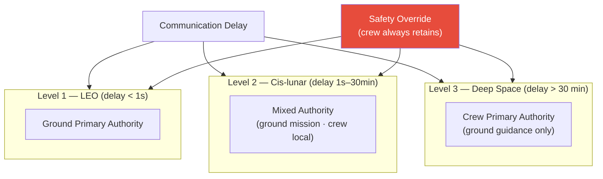

# STA 100-109 · 108-040 — Crew-Autonomy-and-Ground-Authority-Management

## 1. Purpose

Defines the **crew autonomy and ground authority management** framework for Q+ATLANTIDE missions, specifying the transition from ground-dependent to crew-autonomous operations as communication delay increases, and the authority delegation rules for each mission phase per NASA-STD-3001 Vol.2[^nastd3001v2].

Crew autonomy levels by communication delay: Level 1 (delay < 1 s, LEO): ground retains primary authority, crew executes ground instructions; Level 2 (delay 1 s – 30 min, cis-lunar): mixed authority, crew has local authority for time-critical safety decisions, ground authority for mission-level decisions; Level 3 (delay > 30 min, deep space): crew has primary authority for all time-critical decisions, ground provides guidance and oversight. Authority delegation rules: safety-critical systems (abort, emergency) always retain crew override authority regardless of communication delay; experimental and science operations delegated to crew autonomy at Level 2+. Conflict resolution: crew safety decision takes precedence over ground instructions if communication would cause harm to crew.

## 2. Scope

- Covers the *Crew-Autonomy-and-Ground-Authority-Management* subsubject (`040`) of subsection `108`.
- Inherits Q-Division authority and ORB support from the parent row in [`../../README.md` §3](../../README.md#3-architecture-table)[^archtable].
- All HMI designs require human factors evaluation per MIL-STD-1472G[^milstd1472] and NASA-STD-3001 Vol.2[^nastd3001v2].

## 3. Diagram — Crew-Autonomy-and-Ground-Authority-Management

## 4. Footprint

| Metric | Value |
|---|---|
| Architecture | `STA` — Space Technology Architecture |
| Master range | `100–199` |
| Code range | `100-109` |
| Section | `00` — Sistemas Generales y Soporte Vital Espacial |
| Subsection | `108` — Interfaces de Operación Tripulación y Tierra |
| Subsubject | `040` — Crew-Autonomy-and-Ground-Authority-Management |
| Primary Q-Division | Q-SPACE[^qdiv] |
| Support Q-Divisions | Q-DATAGOV, Q-HORIZON, Q-HPC, Q-AIR |
| ORB support | ORB-PMO, ORB-LEG |
| Governance class | `baseline`[^gov] |
| Folder path | `Q+ATLANTIDE/100-199_STA/100-109_Sistemas-Generales-y-Soporte-Vital-Espacial/108_Interfaces-de-Operacion-Tripulacion-y-Tierra/` |
| Document | `108-040-Crew-Autonomy-and-Ground-Authority-Management.md` (this file) |
| Parent subsection | [`README.md`](./README.md) · [`108-000-General.md`](./108-000-General.md) |
| Parent architecture | [`../../README.md`](../../README.md) |
| Parent baseline | [`organization/Q+ATLANTIDE.md`](../../../../organization/Q+ATLANTIDE.md) |

## 5. References & Citations

[^baseline]: **Q+ATLANTIDE controlled baseline (v1.0.0)** — [`organization/Q+ATLANTIDE.md`](../../../../organization/Q+ATLANTIDE.md).

[^archtable]: **STA §3 Architecture Table** — [`../../README.md` §3](../../README.md#3-architecture-table).

[^qdiv]: **Q-Division authority** — See [`organization/Q+ATLANTIDE.md` §4](../../../../organization/Q+ATLANTIDE.md#4-notes).

[^gov]: **Governance class** — `baseline` denotes documents under controlled change management.

[^ecsse1011]: **ECSS-E-ST-10-11C — Spacecraft Environment Interaction** — Applied here for operations interface monitoring standards.

[^nastd3001v2]: **NASA-STD-3001 Vol.2 — Human Factors, Habitability, and Environmental Health** — Display, control, and HMI design requirements for crewed spacecraft operations.

[^milstd1472]: **MIL-STD-1472G — Human Engineering** — Anthropometric, display, control-force, and cognitive load requirements.

[^ccsds]: **CCSDS 401.0-B — Radio Frequency and Modulation Systems; CCSDS 131.0-B — TM Synchronization and Channel Coding** — Uplink/downlink communications standards.

### Applicable industry standards

- ECSS-E-ST-10-11C — Spacecraft Environment Interaction[^ecsse1011]
- NASA-STD-3001 Vol.2 — Human Factors, Habitability, and Environmental Health[^nastd3001v2]
- MIL-STD-1472G — Human Engineering[^milstd1472]
- CCSDS — Radio Frequency and Modulation Systems[^ccsds]
