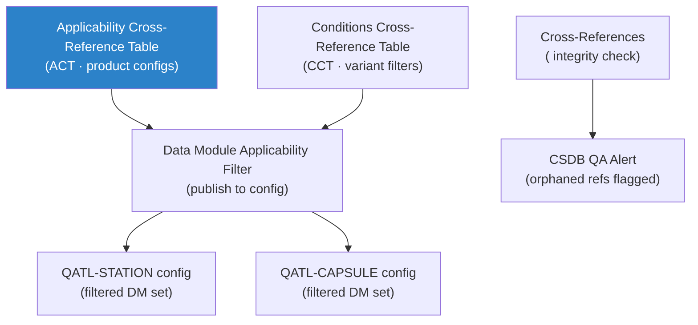

# STA 100-109 · 109-050 — Applicability-and-Cross-Reference-Management

## 1. Purpose

Defines the **applicability management and cross-reference** architecture for the Q+ATLANTIDE `100-109` CSDB, specifying the Applicability Cross-Reference Table (ACT), product variant management, and data module cross-referencing per S1000D Issue 5.0[^s1000d].

Applicability: every data module carries an applicability annotation indicating which product configuration(s) it applies to (e.g., `QATL-STATION-v1`, `QATL-CAPSULE-v2`); applicability defined using S1000D ACT and CCT (Conditions Cross-Reference Table) mechanism. Product variants defined in CSDB at configuration level: baseline configuration (all DMs applicable), variant filter (subset applicable). Cross-references: data modules reference related DMs via `<dmRef>` elements; cross-reference integrity checked automatically via CSDB tooling; orphaned references trigger CSDB quality alert (subsubject 090). Applicability changes require CCB approval with impact analysis of all affected DMs.

## 2. Scope

- Covers the *Applicability-and-Cross-Reference-Management* subsubject (`050`) of subsection `109`.
- Inherits Q-Division authority and ORB support from the parent row in [`../../README.md` §3](../../README.md#3-architecture-table)[^archtable].
- All CSDB data modules governed by the BREX rules defined in `109-010` and the S1000D Issue 5.0 standard[^s1000d].

## 3. Diagram — Applicability-and-Cross-Reference-Management

## 4. Footprint

| Metric | Value |
|---|---|
| Architecture | `STA` — Space Technology Architecture |
| Master range | `100–199` |
| Code range | `100-109` |
| Section | `00` — Sistemas Generales y Soporte Vital Espacial |
| Subsection | `109` — Trazabilidad S1000D, CSDB y Evidencia |
| Subsubject | `050` — Applicability-and-Cross-Reference-Management |
| Primary Q-Division | Q-SPACE[^qdiv] |
| Support Q-Divisions | Q-DATAGOV, Q-HORIZON, Q-HPC |
| ORB support | ORB-PMO, ORB-LEG |
| Governance class | `baseline`[^gov] |
| Folder path | `Q+ATLANTIDE/100-199_STA/100-109_Sistemas-Generales-y-Soporte-Vital-Espacial/109_Trazabilidad-S1000D-CSDB-y-Evidencia/` |
| Document | `109-050-Applicability-and-Cross-Reference-Management.md` (this file) |
| Parent subsection | [`README.md`](./README.md) · [`109-000-General.md`](./109-000-General.md) |
| Parent architecture | [`../../README.md`](../../README.md) |
| Parent baseline | [`organization/Q+ATLANTIDE.md`](../../../../organization/Q+ATLANTIDE.md) |

## 5. References & Citations

[^baseline]: **Q+ATLANTIDE controlled baseline (v1.0.0)** — [`organization/Q+ATLANTIDE.md`](../../../../organization/Q+ATLANTIDE.md).

[^archtable]: **STA §3 Architecture Table** — [`../../README.md` §3](../../README.md#3-architecture-table).

[^qdiv]: **Q-Division authority** — See [`organization/Q+ATLANTIDE.md` §4](../../../../organization/Q+ATLANTIDE.md#4-notes).

[^gov]: **Governance class** — `baseline` denotes documents under controlled change management.

[^s1000d]: **S1000D Issue 5.0 — International Specification for Technical Publications** — Governing standard for CSDB data module coding, SNS mapping, BREX, and technical publication production.

[^asdste100]: **ASD-STE100 Issue 7 — Simplified Technical English** — Writing standard for all S1000D procedural and descriptive content.

[^iso10303]: **ISO 10303-239 — STEP Product Life Cycle Support (PLCS)** — Data exchange standard for product and maintenance data compatible with S1000D CSDB.

[^asds2000m]: **ASD S2000M — International Specification for Materiel Management** — Parts data management integrated with CSDB IPD/illustrated parts data.

### Applicable industry standards

- S1000D Issue 5.0 — International Specification for Technical Publications[^s1000d]
- ASD-STE100 Issue 7 — Simplified Technical English[^asdste100]
- ISO 10303-239 — STEP PLCS[^iso10303]
- ASD S2000M — International Specification for Materiel Management[^asds2000m]
