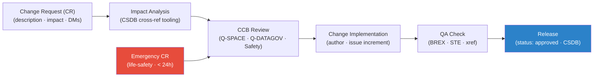

# STA 100-109 · 109-070 — Lifecycle-Change-Management-and-CCB

## 1. Purpose

Defines the **lifecycle change management and Change Control Board (CCB)** process for the Q+ATLANTIDE `100-109` CSDB, specifying the change request workflow, impact analysis, approval authority, and issue increment per S1000D Issue 5.0[^s1000d].

Change lifecycle: (1) Change Request (CR) submitted by author/engineer with: affected DM(s), change description, justification, and impact assessment; (2) Impact Analysis: CSDB tooling identifies all cross-referencing DMs and affected publications; (3) CCB Review: Q-SPACE-led board including Q-DATAGOV and safety representatives; approval, rejection, or return-for-revision; (4) Change Implementation: author revises DM(s), increments issue number, updates inwork status to `revised`; (5) Quality Review: CSDB QA team validates BREX compliance, STE compliance, and cross-reference integrity; (6) Release: DM status changes to `approved`; new issue published to CSDB. Emergency changes: expedited CCB path for life-safety-critical changes (< 24 hours); safety officer co-signature required.

## 2. Scope

- Covers the *Lifecycle-Change-Management-and-CCB* subsubject (`070`) of subsection `109`.
- Inherits Q-Division authority and ORB support from the parent row in [`../../README.md` §3](../../README.md#3-architecture-table)[^archtable].
- All CSDB data modules governed by the BREX rules defined in `109-010` and the S1000D Issue 5.0 standard[^s1000d].

## 3. Diagram — Lifecycle-Change-Management-and-CCB

## 4. Footprint

| Metric | Value |
|---|---|
| Architecture | `STA` — Space Technology Architecture |
| Master range | `100–199` |
| Code range | `100-109` |
| Section | `00` — Sistemas Generales y Soporte Vital Espacial |
| Subsection | `109` — Trazabilidad S1000D, CSDB y Evidencia |
| Subsubject | `070` — Lifecycle-Change-Management-and-CCB |
| Primary Q-Division | Q-SPACE[^qdiv] |
| Support Q-Divisions | Q-DATAGOV, Q-HORIZON, Q-HPC |
| ORB support | ORB-PMO, ORB-LEG |
| Governance class | `baseline`[^gov] |
| Folder path | `Q+ATLANTIDE/100-199_STA/100-109_Sistemas-Generales-y-Soporte-Vital-Espacial/109_Trazabilidad-S1000D-CSDB-y-Evidencia/` |
| Document | `109-070-Lifecycle-Change-Management-and-CCB.md` (this file) |
| Parent subsection | [`README.md`](./README.md) · [`109-000-General.md`](./109-000-General.md) |
| Parent architecture | [`../../README.md`](../../README.md) |
| Parent baseline | [`organization/Q+ATLANTIDE.md`](../../../../organization/Q+ATLANTIDE.md) |

## 5. References & Citations

[^baseline]: **Q+ATLANTIDE controlled baseline (v1.0.0)** — [`organization/Q+ATLANTIDE.md`](../../../../organization/Q+ATLANTIDE.md).

[^archtable]: **STA §3 Architecture Table** — [`../../README.md` §3](../../README.md#3-architecture-table).

[^qdiv]: **Q-Division authority** — See [`organization/Q+ATLANTIDE.md` §4](../../../../organization/Q+ATLANTIDE.md#4-notes).

[^gov]: **Governance class** — `baseline` denotes documents under controlled change management.

[^s1000d]: **S1000D Issue 5.0 — International Specification for Technical Publications** — Governing standard for CSDB data module coding, SNS mapping, BREX, and technical publication production.

[^asdste100]: **ASD-STE100 Issue 7 — Simplified Technical English** — Writing standard for all S1000D procedural and descriptive content.

[^iso10303]: **ISO 10303-239 — STEP Product Life Cycle Support (PLCS)** — Data exchange standard for product and maintenance data compatible with S1000D CSDB.

[^asds2000m]: **ASD S2000M — International Specification for Materiel Management** — Parts data management integrated with CSDB IPD/illustrated parts data.

### Applicable industry standards

- S1000D Issue 5.0 — International Specification for Technical Publications[^s1000d]
- ASD-STE100 Issue 7 — Simplified Technical English[^asdste100]
- ISO 10303-239 — STEP PLCS[^iso10303]
- ASD S2000M — International Specification for Materiel Management[^asds2000m]
