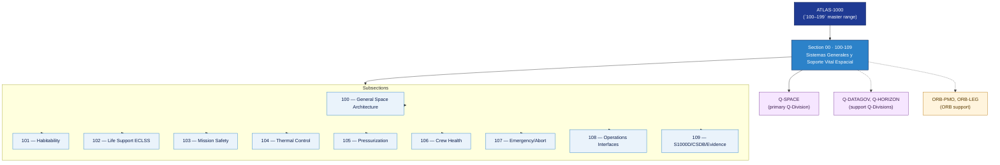

# STA 100-109 · Section 00 — Sistemas Generales y Soporte Vital Espacial

## 1. Purpose

Section-level index for *Sistemas Generales y Soporte Vital Espacial* (`100-109`) within the STA band. Arquitectura general espacial, habitabilidad, soporte vital ECLSS y seguridad de misión.

This section is part of the **ATLAS-1000** register, a subpart of the controlled **Q+ATLANTIDE** baseline[^baseline][^n001]. Bands classify technologies, Q-Divisions provide technical authority and ORB-Functions provide enterprise support[^n002].

## 2. Scope

- Aggregates the subsections within the `100-109` code range listed in §3.
- Inherits Q-Division authority and ORB support from the parent row in [`../README.md` §3](../README.md#3-architecture-table)[^archtable].
- Each subsection folder contains its own `README.md` (subsection index) and may contain Overview and subsubject documents.

## 3. Subsection Index

| Code | Title | Folder | Status |
|---:|---|---|---|
| `100` | Arquitectura General Espacial | [`./100_Arquitectura-General-Espacial/`](./100_Arquitectura-General-Espacial/) | reserved |
| `101` | Habitabilidad | [`./101_Habitabilidad/`](./101_Habitabilidad/) | reserved |
| `102` | Soporte Vital ECLSS | [`./102_Soporte-Vital-ECLSS/`](./102_Soporte-Vital-ECLSS/) | reserved |
| `103` | Seguridad de Misión | [`./103_Seguridad-de-Mision/`](./103_Seguridad-de-Mision/) | reserved |
| `104` | Gestión Térmica y Control Ambiental | [`./104_Gestion-Termica-y-Control-Ambiental/`](./104_Gestion-Termica-y-Control-Ambiental/) | active |
| `105` | Presurización y Atmósfera Interna | [`./105_Presurizacion-y-Atmosfera-Interna/`](./105_Presurizacion-y-Atmosfera-Interna/) | active |
| `106` | Salud Tripulación y Factores Humanos | [`./106_Salud-Tripulacion-y-Factores-Humanos/`](./106_Salud-Tripulacion-y-Factores-Humanos/) | active |
| `107` | Supervivencia, Emergencia y Aborto | [`./107_Supervivencia-Emergencia-y-Aborto/`](./107_Supervivencia-Emergencia-y-Aborto/) | active |
| `108` | Interfaces de Operación Tripulación y Tierra | [`./108_Interfaces-de-Operacion-Tripulacion-y-Tierra/`](./108_Interfaces-de-Operacion-Tripulacion-y-Tierra/) | active |
| `109` | Trazabilidad S1000D, CSDB y Evidencia | [`./109_Trazabilidad-S1000D-CSDB-y-Evidencia/`](./109_Trazabilidad-S1000D-CSDB-y-Evidencia/) | active |

## 4. Interfaces Diagram

*Solid arrows show parent→section→subsection ownership and primary Q-Division authority; dotted arrows show support Q-Divisions, ORB enterprise support, and notable cross-section interfaces.*

## 5. Footprint

| Metric | Value |
|---|---|
| Architecture | `STA` — Space Technology Architecture |
| Master range | `100–199` |
| Code range | `100-109` |
| Section | `00` — Sistemas Generales y Soporte Vital Espacial |
| Subsections | 10 active (100–103 reserved; 104–109 active) |
| Primary Q-Division | Q-SPACE[^qdiv] |
| Support Q-Divisions | Q-DATAGOV, Q-HORIZON |
| ORB support | ORB-PMO, ORB-LEG |
| Governance class | `baseline`[^gov] |
| Folder path | `Q+ATLANTIDE/100-199_STA/100-109_Sistemas-Generales-y-Soporte-Vital-Espacial/` |
| Document | `README.md` (this file) |
| Parent architecture | [`../README.md`](../README.md) |
| Parent baseline | [`organization/Q+ATLANTIDE.md`](../../../organization/Q+ATLANTIDE.md) |

## Governance

Governed by [`organization/Q+ATLANTIDE.md`](../../../organization/Q+ATLANTIDE.md)[^baseline]. All subsections under this section inherit `architecture_code = STA`, `primary_q_division = Q-SPACE` and `governance_class = baseline` from this section header. Templates declared in this section must populate `architecture_band`, `architecture_code = STA`, `q_division_owner` and `orb_function_support` per the Templates System[^templates]. The No-AAA Rule[^n004] applies.

## 6. References & Citations

[^baseline]: **Q+ATLANTIDE controlled baseline (v1.0.0)** — [`organization/Q+ATLANTIDE.md`](../../../organization/Q+ATLANTIDE.md). Defines the controlled `000-999` architecture-band taxonomy and the ATLAS-1000 register subpart.

[^archtable]: **§3 — Architecture Table (parent)** — [`../README.md` §3](../README.md#3-architecture-table). Source of authority for primary/support Q-Divisions and ORB support of this section.

[^qdiv]: **Q-Division authority** — [`organization/Q-Divisions/`](../../../organization/Q-Divisions/). Technical-authority units for the Q+ATLANTIDE baseline.

[^gov]: **Governance class** — `baseline` denotes documents under controlled change management within the Q+ATLANTIDE baseline.

[^templates]: **§5 — Templates System** — [`organization/Q+ATLANTIDE.md` §5](../../../organization/Q+ATLANTIDE.md#5-templates-system).

[^n001]: **Note N-001** — Q+ATLANTIDE (with its ATLAS-1000 register subpart) is a taxonomy and traceability ecosystem, not an organization chart. See [`organization/Q+ATLANTIDE.md` §4](../../../organization/Q+ATLANTIDE.md#4-notes).

[^n002]: **Note N-002** — Architecture bands classify technologies; Q-Divisions provide technical authority; ORB-Functions provide enterprise support. See [`organization/Q+ATLANTIDE.md` §4](../../../organization/Q+ATLANTIDE.md#4-notes).

[^n004]: **Note N-004 (No-AAA Rule)** — "AAA" is not a valid domain, division, architecture, interface or function in this baseline. See [`organization/Q+ATLANTIDE.md` §4](../../../organization/Q+ATLANTIDE.md#4-notes).
