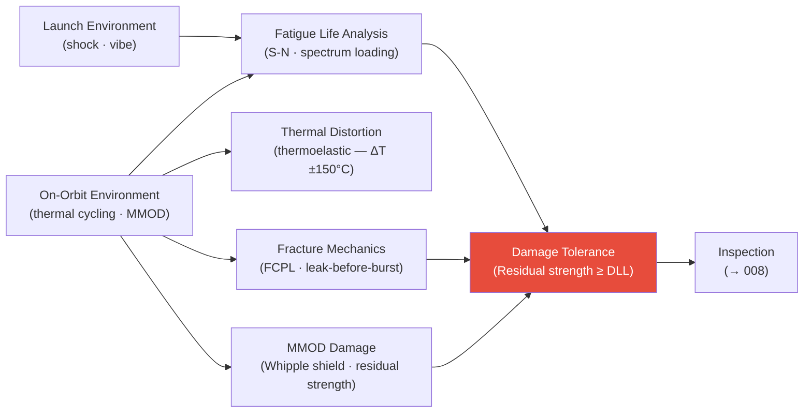

# STA 110-119 · Section 01 · Subsection 110 · Subsubject 007 — Thermal Distortion, Fatigue and Damage Tolerance

## 1. Purpose

Defines the **thermal distortion analysis, fatigue life requirements, and damage-tolerance design rules** for orbital structures — ensuring structural integrity over the full design service life under repeated thermal cycling, vibration fatigue, and debris-impact damage scenarios, per ECSS-E-ST-32C[^ecsse32].

## 2. Scope

- Covers the *Thermal Distortion, Fatigue and Damage Tolerance* subsubject (`007`) of subsection `110`.
- Inherits Q-Division authority and ORB support from the parent row in [`../../README.md` §3](../../README.md#3-architecture-table)[^archtable].
- Concepts in scope:
  - **Thermal distortion** — thermal gradient analysis over the orbital day/night cycle (ΔT up to ±150 °C at LEO), thermoelastic displacement at payload attachment points, and pointing budget impact; material CTE mismatch at joints.
  - **Fatigue** — stress range spectrum from launch + on-orbit thermal cycling (5,840 cycles/year at 90-min ISS orbit); fatigue life design target (≥ design service life × 4 scatter factor per ECSS-E-ST-32C[^ecsse32]); S-N curve data from material allowables (`111`).
  - **Fracture mechanics** — fracture-critical parts list (FCPL), flaw size assumptions (NASA-STD-5001B[^nasastd5001]), stress intensity factor analysis, and leak-before-burst requirement for pressure-carrying structures.
  - **Damage tolerance** — Barely Visible Impact Damage (BVID) design threshold; Residual Strength after damage (≥ DLL); design for inspectability per `008`.
  - **Micro-meteoroid and orbital debris (MMOD)** — penetration risk assessment, shielding design (Whipple shields), and residual structural capability after MMOD penetration.
  - **Life extension** — structural re-life assessment procedure; inspection-based life extension criteria for structures beyond initial design service life.

## 3. Diagram — Structural Lifecycle Degradation

## 3. Footprint

| Metric | Value |
|---|---|
| Architecture | `STA` — Space Technology Architecture |
| Master range | `100–199` |
| Code range | `110-119` |
| Section | `01` — Estructuras y Materiales Espaciales |
| Subsection | `110` — Estructuras Orbitales |
| Subsubject | `007` — Thermal Distortion Fatigue and Damage Tolerance |
| Primary Q-Division | Q-SPACE[^qdiv] |
| Support Q-Divisions | Q-STRUCTURES, Q-DATAGOV, Q-HORIZON, Q-HPC, Q-INDUSTRY |
| ORB support | ORB-PMO, ORB-FIN |
| Governance class | `baseline`[^gov] |
| Folder path | `Q+ATLANTIDE/100-199_STA/110-119_Estructuras-y-Materiales-Espaciales/110_Estructuras-Orbitales/` |
| Document | `007_Thermal-Distortion-Fatigue-and-Damage-Tolerance.md` (this file) |
| Parent subsection | [`README.md`](./README.md) · [`000_Overview.md`](./000_Overview.md) |
| Parent architecture | [`../../README.md`](../../README.md) |
| Parent baseline | [`organization/Q+ATLANTIDE.md`](../../../../organization/Q+ATLANTIDE.md) |

## 5. References & Citations

[^baseline]: **Q+ATLANTIDE controlled baseline (v1.0.0)** — [`organization/Q+ATLANTIDE.md`](../../../../organization/Q+ATLANTIDE.md). Defines the controlled `000-999` architecture-band taxonomy and the ATLAS-1000 register subpart.

[^archtable]: **STA §3 Architecture Table** — [`../../README.md` §3](../../README.md#3-architecture-table). Authoritative source for the `110-119` row.

[^qdiv]: **Q-Division authority** — Q-Divisions provide technical authority over an architecture row (Q+ATLANTIDE Note N-002). See [`organization/Q+ATLANTIDE.md` §4](../../../../organization/Q+ATLANTIDE.md#4-notes).

[^gov]: **Governance class** — `baseline` denotes documents under controlled change management within the Q+ATLANTIDE baseline.

[^ecsse32]: **ECSS-E-ST-32C Rev.1 — Space Engineering: Structural General Requirements** — European standard governing structural design, analysis, testing, and documentation for space systems.

[^ecsse3210]: **ECSS-E-ST-32-10C — Space Engineering: Structural Factors of Safety for Spaceflight Hardware** — European standard defining factors of safety applicable to STA structural elements.

[^nasastd5001]: **NASA-STD-5001B — Structural Design and Test Factors of Safety for Spaceflight Hardware** — NASA factors-of-safety standard applicable to orbital structure design and test verification.

[^nasatm2012]: **NASA/TM-2012-217519 — Best Practices for Structural and Mechanical Systems** — NASA technical memo on structural design best practices for crewed and uncrewed systems.

[^iso11960]: **ISO 15630-1:2019 / ECSS-Q-ST-70C — Materials Testing and Qualification** — Material qualification and structural testing standard used in conjunction with ECSS-E-ST-32C.

### Applicable industry standards

- ECSS-E-ST-32C Rev.1 — Space Engineering: Structural General Requirements[^ecsse32]
- ECSS-E-ST-32-10C — Structural Factors of Safety for Spaceflight Hardware[^ecsse3210]
- NASA-STD-5001B — Structural Design and Test Factors of Safety[^nasastd5001]
- NASA/TM-2012-217519 — Best Practices for Structural and Mechanical Systems[^nasatm2012]
- ECSS-Q-ST-70C — Space Product Assurance: Materials, Processes and their Data[^iso11960]
