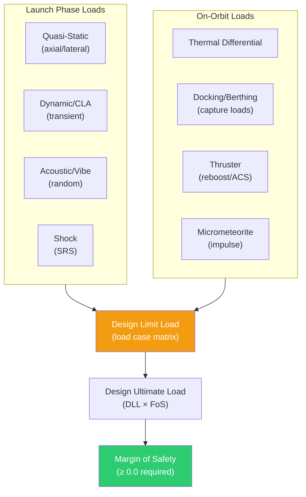

# STA 110-119 · 110-040 — Load Paths Launch Loads and Orbital Loads

## 1. Purpose

Defines the **structural load environment, load-path definition methodology, and load-combination rules** for orbital structures throughout all mission phases — from launch liftoff through on-orbit operations — per ECSS-E-ST-32C[^ecsse32] and NASA-STD-5001B[^nasastd5001].

## 2. Scope

- Covers the *Load Paths, Launch Loads and Orbital Loads* subsubject (`004`) of subsection `110`.
- Inherits Q-Division authority and ORB support from the parent row in [`../../README.md` §3](../../README.md#3-architecture-table)[^archtable].
- Concepts in scope:
  - **Load-path definition** — internal force flow from payload to LVI; load-path diagrams (free-body diagrams, shear/moment envelopes); ICD load table format.
  - **Launch load envelopes** — quasi-static limit loads (axial/lateral/combined), dynamic load factors from coupled loads analysis (CLA), acoustic/random vibration environment (dB, PSD), and shock spectrum (SRS) per launch vehicle ICD.
  - **Design limit loads (DLL)** — load case matrix (liftoff, max-q, MECO, separation, jettison, landing); load combination method per ECSS-E-ST-32-10C[^ecsse3210].
  - **On-orbit loads** — thermal differential expansion loads, docking/berthing capture loads, reboost and attitude-control thruster loads, micrometeorite/debris impact impulse, and EVA/crew-induced loads.
  - **Factors of safety** — ultimate FoS = 1.5 (metal primary), 2.0 (composite primary), 1.25 (secondary); yield FoS = 1.0 per ECSS-E-ST-32-10C[^ecsse3210] and NASA-STD-5001B[^nasastd5001].
  - **Structural margins** — MoS calculation methodology; positive MoS required at DUL for all primary structure; margin budget and closure plan.

## 3. Diagram — Load-Path and Load-Case Architecture

## 3. Footprint

| Metric | Value |
|---|---|
| Architecture | `STA` — Space Technology Architecture |
| Master range | `100–199` |
| Code range | `110-119` |
| Section | `01` — Estructuras y Materiales Espaciales |
| Subsection | `110` — Estructuras Orbitales |
| Subsubject | `004` — Load Paths Launch Loads and Orbital Loads |
| Primary Q-Division | Q-SPACE[^qdiv] |
| Support Q-Divisions | Q-STRUCTURES, Q-DATAGOV, Q-HORIZON, Q-HPC, Q-INDUSTRY |
| ORB support | ORB-PMO, ORB-FIN |
| Governance class | `baseline`[^gov] |
| Folder path | `Q+ATLANTIDE/100-199_STA/110-119_Estructuras-y-Materiales-Espaciales/110_Estructuras-Orbitales/` |
| Document | `110-040-Load-Paths-Launch-Loads-and-Orbital-Loads.md` (this file) |
| Parent subsection | [`README.md`](./README.md) · [`110-000-General.md`](./110-000-General.md) |
| Parent architecture | [`../../README.md`](../../README.md) |
| Parent baseline | [`organization/Q+ATLANTIDE.md`](../../../../organization/Q+ATLANTIDE.md) |

## 5. References & Citations

[^baseline]: **Q+ATLANTIDE controlled baseline (v1.0.0)** — [`organization/Q+ATLANTIDE.md`](../../../../organization/Q+ATLANTIDE.md). Defines the controlled `000-999` architecture-band taxonomy and the ATLAS-1000 register subpart.

[^archtable]: **STA §3 Architecture Table** — [`../../README.md` §3](../../README.md#3-architecture-table). Authoritative source for the `110-119` row.

[^qdiv]: **Q-Division authority** — Q-Divisions provide technical authority over an architecture row (Q+ATLANTIDE Note N-002). See [`organization/Q+ATLANTIDE.md` §4](../../../../organization/Q+ATLANTIDE.md#4-notes).

[^gov]: **Governance class** — `baseline` denotes documents under controlled change management within the Q+ATLANTIDE baseline.

[^ecsse32]: **ECSS-E-ST-32C Rev.1 — Space Engineering: Structural General Requirements** — European standard governing structural design, analysis, testing, and documentation for space systems.

[^ecsse3210]: **ECSS-E-ST-32-10C — Space Engineering: Structural Factors of Safety for Spaceflight Hardware** — European standard defining factors of safety applicable to STA structural elements.

[^nasastd5001]: **NASA-STD-5001B — Structural Design and Test Factors of Safety for Spaceflight Hardware** — NASA factors-of-safety standard applicable to orbital structure design and test verification.

[^nasatm2012]: **NASA/TM-2012-217519 — Best Practices for Structural and Mechanical Systems** — NASA technical memo on structural design best practices for crewed and uncrewed systems.

[^iso11960]: **ISO 15630-1:2019 / ECSS-Q-ST-70C — Materials Testing and Qualification** — Material qualification and structural testing standard used in conjunction with ECSS-E-ST-32C.

### Applicable industry standards

- ECSS-E-ST-32C Rev.1 — Space Engineering: Structural General Requirements[^ecsse32]
- ECSS-E-ST-32-10C — Structural Factors of Safety for Spaceflight Hardware[^ecsse3210]
- NASA-STD-5001B — Structural Design and Test Factors of Safety[^nasastd5001]
- NASA/TM-2012-217519 — Best Practices for Structural and Mechanical Systems[^nasatm2012]
- ECSS-Q-ST-70C — Space Product Assurance: Materials, Processes and their Data[^iso11960]
