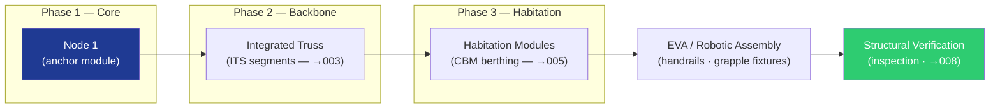

# STA 110-119 · 110-060 — Modular Assembly and On Orbit Construction

## 1. Purpose

Defines the **modular assembly architecture and on-orbit construction sequence** for orbital structures — covering EVA and robotic assembly procedures, module-join structural interfaces, and the structural build-up sequence — per ECSS-E-ST-32C[^ecsse32] and NASA assembly heritage (ISS, Gateway).

## 2. Scope

- Covers the *Modular Assembly and On-Orbit Construction* subsubject (`006`) of subsection `110`.
- Inherits Q-Division authority and ORB support from the parent row in [`../../README.md` §3](../../README.md#3-architecture-table)[^archtable].
- Concepts in scope:
  - **Modular design philosophy** — pre-integrated modules (I-class: single-launch, fully integrated), expandable modules (inflatable, BEAM-class), and truss-assembled structures (ITS-class).
  - **Assembly sequence** — structural build-up order (Node-first, backbone-first), assembly sequence analysis (kinematic, geometric), and schedule critical-path identification.
  - **EVA assembly interfaces** — handrail and foot-restraint placement, tool stowage locations, torque tool access for structural bolts, EVA time budget per interface joint.
  - **Robotic assembly** — SRMS/ERA end-effector grapple fixture placement on structural elements, PDGF locations, and SSRMS payload handling limits.
  - **Module-join structural interface** — active Common Berthing Mechanism (CBM) bolt-pattern, bolt preload targets, and leak-path sealing at structural joint.
  - **On-orbit reconfiguration** — structural reconfiguration procedures (module relocation, port reassignment), FDIR impact on structural state, and configuration management interface with `100.006`.

## 3. Diagram — Modular Assembly Sequence

## 3. Footprint

| Metric | Value |
|---|---|
| Architecture | `STA` — Space Technology Architecture |
| Master range | `100–199` |
| Code range | `110-119` |
| Section | `01` — Estructuras y Materiales Espaciales |
| Subsection | `110` — Estructuras Orbitales |
| Subsubject | `006` — Modular Assembly and On-Orbit Construction |
| Primary Q-Division | Q-SPACE[^qdiv] |
| Support Q-Divisions | Q-STRUCTURES, Q-DATAGOV, Q-HORIZON, Q-HPC, Q-INDUSTRY |
| ORB support | ORB-PMO, ORB-FIN |
| Governance class | `baseline`[^gov] |
| Folder path | `Q+ATLANTIDE/100-199_STA/110-119_Estructuras-y-Materiales-Espaciales/110_Estructuras-Orbitales/` |
| Document | `110-060-Modular-Assembly-and-On-Orbit-Construction.md` (this file) |
| Parent subsection | [`README.md`](./README.md) · [`110-000-General.md`](./110-000-General.md) |
| Parent architecture | [`../../README.md`](../../README.md) |
| Parent baseline | [`organization/Q+ATLANTIDE.md`](../../../../organization/Q+ATLANTIDE.md) |

## 5. References & Citations

[^baseline]: **Q+ATLANTIDE controlled baseline (v1.0.0)** — [`organization/Q+ATLANTIDE.md`](../../../../organization/Q+ATLANTIDE.md). Defines the controlled `000-999` architecture-band taxonomy and the ATLAS-1000 register subpart.

[^archtable]: **STA §3 Architecture Table** — [`../../README.md` §3](../../README.md#3-architecture-table). Authoritative source for the `110-119` row.

[^qdiv]: **Q-Division authority** — Q-Divisions provide technical authority over an architecture row (Q+ATLANTIDE Note N-002). See [`organization/Q+ATLANTIDE.md` §4](../../../../organization/Q+ATLANTIDE.md#4-notes).

[^gov]: **Governance class** — `baseline` denotes documents under controlled change management within the Q+ATLANTIDE baseline.

[^ecsse32]: **ECSS-E-ST-32C Rev.1 — Space Engineering: Structural General Requirements** — European standard governing structural design, analysis, testing, and documentation for space systems.

[^ecsse3210]: **ECSS-E-ST-32-10C — Space Engineering: Structural Factors of Safety for Spaceflight Hardware** — European standard defining factors of safety applicable to STA structural elements.

[^nasastd5001]: **NASA-STD-5001B — Structural Design and Test Factors of Safety for Spaceflight Hardware** — NASA factors-of-safety standard applicable to orbital structure design and test verification.

[^nasatm2012]: **NASA/TM-2012-217519 — Best Practices for Structural and Mechanical Systems** — NASA technical memo on structural design best practices for crewed and uncrewed systems.

[^iso11960]: **ISO 15630-1:2019 / ECSS-Q-ST-70C — Materials Testing and Qualification** — Material qualification and structural testing standard used in conjunction with ECSS-E-ST-32C.

### Applicable industry standards

- ECSS-E-ST-32C Rev.1 — Space Engineering: Structural General Requirements[^ecsse32]
- ECSS-E-ST-32-10C — Structural Factors of Safety for Spaceflight Hardware[^ecsse3210]
- NASA-STD-5001B — Structural Design and Test Factors of Safety[^nasastd5001]
- NASA/TM-2012-217519 — Best Practices for Structural and Mechanical Systems[^nasatm2012]
- ECSS-Q-ST-70C — Space Product Assurance: Materials, Processes and their Data[^iso11960]
