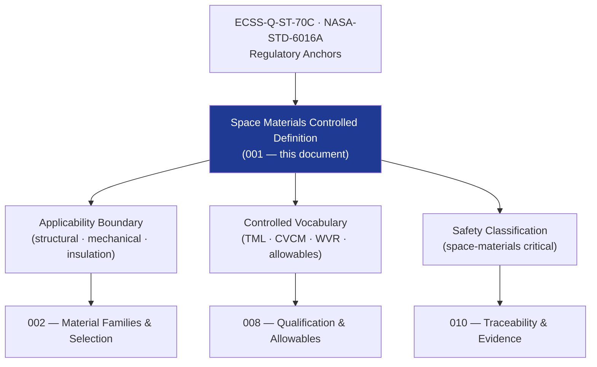

# STA 110-119 · Section 01 · Subsection 111 · Subsubject 001 — Space Materials Controlled Definition

## 1. Purpose

Establishes the **normative definition and controlled scope** of space materials within the Q+ATLANTIDE STA band, defining applicability limits, key controlled terms, and the regulatory reference hierarchy per ECSS-Q-ST-70C[^ecssqst70].

## 2. Scope

- Covers the *Space Materials Controlled Definition* subsubject (`001`) of subsection `111`.
- Inherits Q-Division authority and ORB support from the parent row in [`../../README.md` §3](../../README.md#3-architecture-table)[^archtable].
- Concepts in scope:
  - **Controlled definition** — Space Materials are all raw materials, semi-finished products, adhesives, coatings, surface treatments, sealants, and consumables used in the manufacture, assembly, and integration of space-system structural and mechanical hardware, that must satisfy the requirements of ECSS-Q-ST-70C[^ecssqst70] and NASA-STD-6016A[^nasastd6016].
  - **Applicability boundary** — STA `111` covers materials for all Q+ATLANTIDE STA-band structural and mechanical elements (primary/secondary structure, mechanisms, thermal insulation substrates); excludes propellants/propulsion materials (→ `130`) and electronic substrate materials (→ QCSAA band).
  - **Controlled vocabulary** — *total mass loss (TML)*, *collected volatile condensable material (CVCM)*, *water vapour regained (WVR)*, *material allowable*, *coupon*, *A-basis*, *B-basis*, *design values*, *space-qualified material*.
  - **Safety classification** — space-materials critical; all materials shall have documented qualification data, outgassing compliance, and controlled substances check per ECSS-Q-ST-70C[^ecssqst70].
  - **Relationship to other subsections** — `110` (structures) consumes material allowables from `111`; `112` (thermal protection) references TPS materials via `111`; `100` (system architecture).

## 3. Diagram — Space Materials Controlled Definition Framework

## 3. Footprint

| Metric | Value |
|---|---|
| Architecture | `STA` — Space Technology Architecture |
| Master range | `100–199` |
| Code range | `110-119` |
| Section | `01` — Estructuras y Materiales Espaciales |
| Subsection | `111` — Materiales Espaciales |
| Subsubject | `001` — Space Materials Controlled Definition |
| Primary Q-Division | Q-SPACE[^qdiv] |
| Support Q-Divisions | Q-STRUCTURES, Q-DATAGOV, Q-HORIZON, Q-HPC, Q-INDUSTRY |
| ORB support | ORB-PMO, ORB-FIN |
| Governance class | `baseline`[^gov] |
| Folder path | `Q+ATLANTIDE/100-199_STA/110-119_Estructuras-y-Materiales-Espaciales/111_Materiales-Espaciales/` |
| Document | `001_Space-Materials-Controlled-Definition.md` (this file) |
| Parent subsection | [`README.md`](./README.md) · [`000_Overview.md`](./000_Overview.md) |
| Parent architecture | [`../../README.md`](../../README.md) |
| Parent baseline | [`organization/Q+ATLANTIDE.md`](../../../../organization/Q+ATLANTIDE.md) |

## 5. References & Citations

[^baseline]: **Q+ATLANTIDE controlled baseline (v1.0.0)** — [`organization/Q+ATLANTIDE.md`](../../../../organization/Q+ATLANTIDE.md). Defines the controlled `000-999` architecture-band taxonomy and the ATLAS-1000 register subpart.

[^archtable]: **STA §3 Architecture Table** — [`../../README.md` §3](../../README.md#3-architecture-table). Authoritative source for the `110-119` row.

[^qdiv]: **Q-Division authority** — Q-Divisions provide technical authority over an architecture row (Q+ATLANTIDE Note N-002). See [`organization/Q+ATLANTIDE.md` §4](../../../../organization/Q+ATLANTIDE.md#4-notes).

[^gov]: **Governance class** — `baseline` denotes documents under controlled change management within the Q+ATLANTIDE baseline.

[^ecssqst70]: **ECSS-Q-ST-70C — Space Product Assurance: Materials, Mechanical Parts and their Data** — European standard for space materials qualification, controlled substances, outgassing, and materials data management.

[^ecssqst7001]: **ECSS-Q-ST-70-01C — Cleanliness and Contamination Control** — European standard for contamination control on spacecraft hardware.

[^nasastd6016]: **NASA-STD-6016A — Standard Materials and Processes Requirements for Spacecraft** — NASA standard governing material selection, prohibited materials, contamination and outgassing requirements.

[^nasarpd7901]: **NASA-RP-1401 — Outgassing Data for Selecting Spacecraft Materials** — NASA reference publication providing outgassing TML and CVCM data for spacecraft material selection.

[^iso11357]: **ISO 11357-1:2023 — Plastics: Differential Scanning Calorimetry (DSC)** — thermal characterisation standard used for polymer and composite material qualification in the space environment.

### Applicable industry standards

- ECSS-Q-ST-70C — Space Product Assurance: Materials, Mechanical Parts and their Data[^ecssqst70]
- ECSS-Q-ST-70-01C — Cleanliness and Contamination Control[^ecssqst7001]
- NASA-STD-6016A — Standard Materials and Processes Requirements for Spacecraft[^nasastd6016]
- NASA-RP-1401 — Outgassing Data for Selecting Spacecraft Materials[^nasarpd7901]
- ISO 11357-1 — Differential Scanning Calorimetry for polymer/composite qualification[^iso11357]
