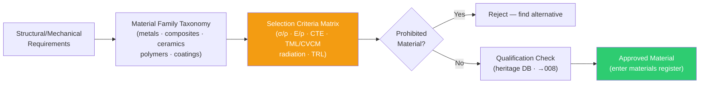

# STA 110-119 · Section 01 · Subsection 111 · Subsubject 002 — Material Families and Selection Criteria

## 1. Purpose

Defines the **taxonomy of space-qualified material families** and the **selection criteria methodology** used within STA `111` to identify the optimum material for each structural and mechanical application, per ECSS-Q-ST-70C[^ecssqst70] and NASA-STD-6016A[^nasastd6016].

## 2. Scope

- Covers the *Material Families and Selection Criteria* subsubject (`002`) of subsection `111`.
- Inherits Q-Division authority and ORB support from the parent row in [`../../README.md` §3](../../README.md#3-architecture-table)[^archtable].
- Concepts in scope:
  - **Material family taxonomy** — (1) metals and alloys, (2) composites (PMC/CMC/MMC), (3) ceramics, (4) polymers and elastomers, (5) adhesives and sealants, (6) coatings and surface treatments, (7) thermal interface materials, (8) optical/transparent materials (windows/lenses); each family indexed in `003`–`005`.
  - **Selection criteria matrix** — primary drivers: specific strength (σ/ρ), specific stiffness (E/ρ), CTE match to substrate, outgassing compliance (TML ≤ 1.0%, CVCM ≤ 0.1%), radiation tolerance, thermal cycling range, TRL ≥ 6.
  - **Prohibited materials** — mercury and mercury compounds, cadmium, asbestos, chlorofluorocarbons (CFCs); controlled substances list per ECSS-Q-ST-70C Annex A[^ecssqst70] and NASA-STD-6016A[^nasastd6016].
  - **Material heritage database** — Q+ATLANTIDE STA-band space-qualified materials register; new materials require material qualification programme per `008`.
  - **Material selection decision record** — mandatory DRD format: material ID, application, environment, selection justification, qualification status, outgassing data reference.

## 3. Diagram — Material Family Selection Flow

## 3. Footprint

| Metric | Value |
|---|---|
| Architecture | `STA` — Space Technology Architecture |
| Master range | `100–199` |
| Code range | `110-119` |
| Section | `01` — Estructuras y Materiales Espaciales |
| Subsection | `111` — Materiales Espaciales |
| Subsubject | `002` — Material Families and Selection Criteria |
| Primary Q-Division | Q-SPACE[^qdiv] |
| Support Q-Divisions | Q-STRUCTURES, Q-DATAGOV, Q-HORIZON, Q-HPC, Q-INDUSTRY |
| ORB support | ORB-PMO, ORB-FIN |
| Governance class | `baseline`[^gov] |
| Folder path | `Q+ATLANTIDE/100-199_STA/110-119_Estructuras-y-Materiales-Espaciales/111_Materiales-Espaciales/` |
| Document | `002_Material-Families-and-Selection-Criteria.md` (this file) |
| Parent subsection | [`README.md`](./README.md) · [`000_Overview.md`](./000_Overview.md) |
| Parent architecture | [`../../README.md`](../../README.md) |
| Parent baseline | [`organization/Q+ATLANTIDE.md`](../../../../organization/Q+ATLANTIDE.md) |

## 5. References & Citations

[^baseline]: **Q+ATLANTIDE controlled baseline (v1.0.0)** — [`organization/Q+ATLANTIDE.md`](../../../../organization/Q+ATLANTIDE.md). Defines the controlled `000-999` architecture-band taxonomy and the ATLAS-1000 register subpart.

[^archtable]: **STA §3 Architecture Table** — [`../../README.md` §3](../../README.md#3-architecture-table). Authoritative source for the `110-119` row.

[^qdiv]: **Q-Division authority** — Q-Divisions provide technical authority over an architecture row (Q+ATLANTIDE Note N-002). See [`organization/Q+ATLANTIDE.md` §4](../../../../organization/Q+ATLANTIDE.md#4-notes).

[^gov]: **Governance class** — `baseline` denotes documents under controlled change management within the Q+ATLANTIDE baseline.

[^ecssqst70]: **ECSS-Q-ST-70C — Space Product Assurance: Materials, Mechanical Parts and their Data** — European standard for space materials qualification, controlled substances, outgassing, and materials data management.

[^ecssqst7001]: **ECSS-Q-ST-70-01C — Cleanliness and Contamination Control** — European standard for contamination control on spacecraft hardware.

[^nasastd6016]: **NASA-STD-6016A — Standard Materials and Processes Requirements for Spacecraft** — NASA standard governing material selection, prohibited materials, contamination and outgassing requirements.

[^nasarpd7901]: **NASA-RP-1401 — Outgassing Data for Selecting Spacecraft Materials** — NASA reference publication providing outgassing TML and CVCM data for spacecraft material selection.

[^iso11357]: **ISO 11357-1:2023 — Plastics: Differential Scanning Calorimetry (DSC)** — thermal characterisation standard used for polymer and composite material qualification in the space environment.

### Applicable industry standards

- ECSS-Q-ST-70C — Space Product Assurance: Materials, Mechanical Parts and their Data[^ecssqst70]
- ECSS-Q-ST-70-01C — Cleanliness and Contamination Control[^ecssqst7001]
- NASA-STD-6016A — Standard Materials and Processes Requirements for Spacecraft[^nasastd6016]
- NASA-RP-1401 — Outgassing Data for Selecting Spacecraft Materials[^nasarpd7901]
- ISO 11357-1 — Differential Scanning Calorimetry for polymer/composite qualification[^iso11357]
