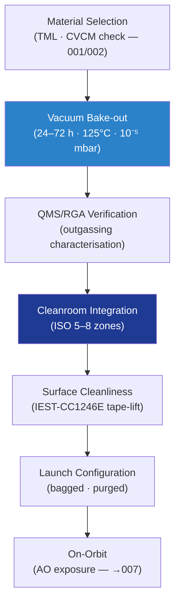

# STA 110-119 · Section 01 · Subsection 111 · Subsubject 006 — Outgassing, Vacuum and Contamination Control

## 1. Purpose

Defines the **outgassing limits, vacuum-bake-out requirements, and contamination control architecture** for Q+ATLANTIDE STA-band materials and hardware — protecting payload optics, thermal control surfaces, and sensitive instruments from molecular and particulate contamination, per ECSS-Q-ST-70-01C[^ecssqst7001] and NASA-STD-6016A[^nasastd6016].

## 2. Scope

- Covers the *Outgassing, Vacuum and Contamination Control* subsubject (`006`) of subsection `111`.
- Inherits Q-Division authority and ORB support from the parent row in [`../../README.md` §3](../../README.md#3-architecture-table)[^archtable].
- Concepts in scope:
  - **Outgassing limits** — TML ≤ 1.0%; CVCM ≤ 0.1%; WVR ≤ 0.5% after 24 h bake-out at 125°C/10⁻⁶ mbar per ECSS-Q-ST-70C[^ecssqst70] and NASA-RP-1401[^nasarpd7901]. Materials failing these limits excluded from flight hardware unless waivered.
  - **Vacuum bake-out** — standard bake-out protocol: 24–72 h at 70–125°C in vacuum oven (≤ 10⁻⁵ mbar); temperature selection based on material service limits; verification by QMS or residual gas analyser.
  - **Contamination control zones** — sensitive zone (payload optics, sensors: Class 100 ISO 5 cleanroom); standard zone (structural assembly: Class 10,000 ISO 7); ambient zone (ground support equipment: Class 100,000 ISO 8); zone transitions require air-shower/coverall protocol per ECSS-Q-ST-70-01C[^ecssqst7001].
  - **Particulate contamination** — surface cleanliness levels (SCL) per IEST-STD-CC1246E; particulate count verification by tape-lift and microscope analysis; max allowable particle size for optical surfaces = 100 µm.
  - **Molecular contamination** — CVCM deposits on critical surfaces (mirrors, solar cells) calculated from material outgassing data and geometric view factors; max CVCM deposit on solar cell = 10 ng/cm² per cycle.
  - **In-orbit atomic oxygen (AO) exposure** — AO fluence at LEO ≈ 10²¹–10²² atoms/cm² per year; polyimide and PTFE susceptible to AO erosion; protective SiO₂/Al₂O₃ coatings required (→ `007`).

## 3. Diagram — Contamination Control Architecture

## 3. Footprint

| Metric | Value |
|---|---|
| Architecture | `STA` — Space Technology Architecture |
| Master range | `100–199` |
| Code range | `110-119` |
| Section | `01` — Estructuras y Materiales Espaciales |
| Subsection | `111` — Materiales Espaciales |
| Subsubject | `006` — Outgassing Vacuum and Contamination Control |
| Primary Q-Division | Q-SPACE[^qdiv] |
| Support Q-Divisions | Q-STRUCTURES, Q-DATAGOV, Q-HORIZON, Q-HPC, Q-INDUSTRY |
| ORB support | ORB-PMO, ORB-FIN |
| Governance class | `baseline`[^gov] |
| Folder path | `Q+ATLANTIDE/100-199_STA/110-119_Estructuras-y-Materiales-Espaciales/111_Materiales-Espaciales/` |
| Document | `006_Outgassing-Vacuum-and-Contamination-Control.md` (this file) |
| Parent subsection | [`README.md`](./README.md) · [`000_Overview.md`](./000_Overview.md) |
| Parent architecture | [`../../README.md`](../../README.md) |
| Parent baseline | [`organization/Q+ATLANTIDE.md`](../../../../organization/Q+ATLANTIDE.md) |

## 5. References & Citations

[^baseline]: **Q+ATLANTIDE controlled baseline (v1.0.0)** — [`organization/Q+ATLANTIDE.md`](../../../../organization/Q+ATLANTIDE.md). Defines the controlled `000-999` architecture-band taxonomy and the ATLAS-1000 register subpart.

[^archtable]: **STA §3 Architecture Table** — [`../../README.md` §3](../../README.md#3-architecture-table). Authoritative source for the `110-119` row.

[^qdiv]: **Q-Division authority** — Q-Divisions provide technical authority over an architecture row (Q+ATLANTIDE Note N-002). See [`organization/Q+ATLANTIDE.md` §4](../../../../organization/Q+ATLANTIDE.md#4-notes).

[^gov]: **Governance class** — `baseline` denotes documents under controlled change management within the Q+ATLANTIDE baseline.

[^ecssqst70]: **ECSS-Q-ST-70C — Space Product Assurance: Materials, Mechanical Parts and their Data** — European standard for space materials qualification, controlled substances, outgassing, and materials data management.

[^ecssqst7001]: **ECSS-Q-ST-70-01C — Cleanliness and Contamination Control** — European standard for contamination control on spacecraft hardware.

[^nasastd6016]: **NASA-STD-6016A — Standard Materials and Processes Requirements for Spacecraft** — NASA standard governing material selection, prohibited materials, contamination and outgassing requirements.

[^nasarpd7901]: **NASA-RP-1401 — Outgassing Data for Selecting Spacecraft Materials** — NASA reference publication providing outgassing TML and CVCM data for spacecraft material selection.

[^iso11357]: **ISO 11357-1:2023 — Plastics: Differential Scanning Calorimetry (DSC)** — thermal characterisation standard used for polymer and composite material qualification in the space environment.

### Applicable industry standards

- ECSS-Q-ST-70C — Space Product Assurance: Materials, Mechanical Parts and their Data[^ecssqst70]
- ECSS-Q-ST-70-01C — Cleanliness and Contamination Control[^ecssqst7001]
- NASA-STD-6016A — Standard Materials and Processes Requirements for Spacecraft[^nasastd6016]
- NASA-RP-1401 — Outgassing Data for Selecting Spacecraft Materials[^nasarpd7901]
- ISO 11357-1 — Differential Scanning Calorimetry for polymer/composite qualification[^iso11357]
