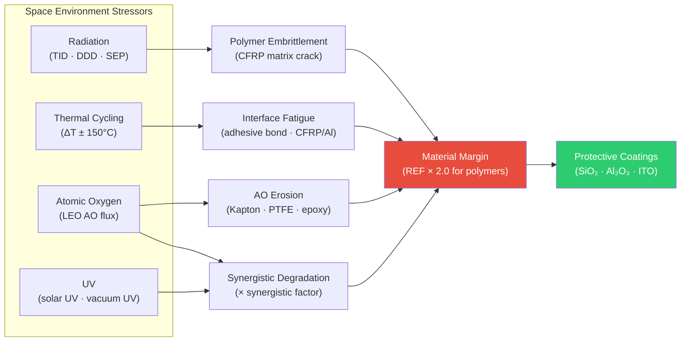

# STA 110-119 · Section 01 · Subsection 111 · Subsubject 007 — Radiation, Thermal Cycling and Atomic Oxygen Effects

## 1. Purpose

Defines the **material degradation mechanisms, design margins, and protective measures** for Q+ATLANTIDE STA-band materials exposed to the space environment — radiation, thermal cycling, and atomic oxygen (AO) — ensuring material property retention across the design service life, per ECSS-Q-ST-70C[^ecssqst70] and NASA-STD-6016A[^nasastd6016].

## 2. Scope

- Covers the *Radiation, Thermal Cycling and Atomic Oxygen Effects* subsubject (`007`) of subsection `111`.
- Inherits Q-Division authority and ORB support from the parent row in [`../../README.md` §3](../../README.md#3-architecture-table)[^archtable].
- Concepts in scope:
  - **Radiation environment** — trapped electron/proton belts (Van Allen), GCR, SEP events; Total Ionising Dose (TID) at material surface (krad(Si)/year by orbit); Displacement Damage Dose (DDD) for semiconductor materials; Non-Ionising Energy Loss (NIEL) for polymers and composites.
  - **Radiation effects on polymers** — embrittlement, tensile strength reduction, CFRP matrix micro-cracking, elastomer hardening; design margin: apply radiation environment factor (REF) of 2.0 to derived material TID; verify with coupon irradiation test.
  - **Radiation effects on metals** — generally minor at LEO TID; high-energy proton embrittlement of high-strength steels at trapped-belt orbits; weld zones more susceptible.
  - **Thermal cycling degradation** — Δα × ΔT-driven micro-cracking at material interfaces (CFRP/Al joints, adhesive bonds); thermal fatigue test programme: minimum 200 cycles from T_min to T_max across expected operational range; inspection criteria per ASTM E831/ISO 11359.
  - **Atomic oxygen (AO) erosion** — erosion yield (cm³/atom): Kapton® ≈ 3 × 10⁻²⁴; PTFE ≈ 3.7 × 10⁻²⁴; graphite-epoxy composites moderate; metals resistant. Protective coatings: SiO₂, Al₂O₃, SiO_x, ITO (optical solar reflectors); AO exposure estimate at LEO: 10²¹ atoms/cm² per year at 400 km altitude.
  - **Synergistic effects** — simultaneous exposure to UV + AO + thermal cycling accelerates degradation; synergistic factor applied in material lifetime analysis; testing per ASTM G173/ASTM E512.

## 3. Diagram — Space Environment Degradation Map

## 3. Footprint

| Metric | Value |
|---|---|
| Architecture | `STA` — Space Technology Architecture |
| Master range | `100–199` |
| Code range | `110-119` |
| Section | `01` — Estructuras y Materiales Espaciales |
| Subsection | `111` — Materiales Espaciales |
| Subsubject | `007` — Radiation Thermal Cycling and Atomic Oxygen Effects |
| Primary Q-Division | Q-SPACE[^qdiv] |
| Support Q-Divisions | Q-STRUCTURES, Q-DATAGOV, Q-HORIZON, Q-HPC, Q-INDUSTRY |
| ORB support | ORB-PMO, ORB-FIN |
| Governance class | `baseline`[^gov] |
| Folder path | `Q+ATLANTIDE/100-199_STA/110-119_Estructuras-y-Materiales-Espaciales/111_Materiales-Espaciales/` |
| Document | `007_Radiation-Thermal-Cycling-and-Atomic-Oxygen-Effects.md` (this file) |
| Parent subsection | [`README.md`](./README.md) · [`000_Overview.md`](./000_Overview.md) |
| Parent architecture | [`../../README.md`](../../README.md) |
| Parent baseline | [`organization/Q+ATLANTIDE.md`](../../../../organization/Q+ATLANTIDE.md) |

## 5. References & Citations

[^baseline]: **Q+ATLANTIDE controlled baseline (v1.0.0)** — [`organization/Q+ATLANTIDE.md`](../../../../organization/Q+ATLANTIDE.md). Defines the controlled `000-999` architecture-band taxonomy and the ATLAS-1000 register subpart.

[^archtable]: **STA §3 Architecture Table** — [`../../README.md` §3](../../README.md#3-architecture-table). Authoritative source for the `110-119` row.

[^qdiv]: **Q-Division authority** — Q-Divisions provide technical authority over an architecture row (Q+ATLANTIDE Note N-002). See [`organization/Q+ATLANTIDE.md` §4](../../../../organization/Q+ATLANTIDE.md#4-notes).

[^gov]: **Governance class** — `baseline` denotes documents under controlled change management within the Q+ATLANTIDE baseline.

[^ecssqst70]: **ECSS-Q-ST-70C — Space Product Assurance: Materials, Mechanical Parts and their Data** — European standard for space materials qualification, controlled substances, outgassing, and materials data management.

[^ecssqst7001]: **ECSS-Q-ST-70-01C — Cleanliness and Contamination Control** — European standard for contamination control on spacecraft hardware.

[^nasastd6016]: **NASA-STD-6016A — Standard Materials and Processes Requirements for Spacecraft** — NASA standard governing material selection, prohibited materials, contamination and outgassing requirements.

[^nasarpd7901]: **NASA-RP-1401 — Outgassing Data for Selecting Spacecraft Materials** — NASA reference publication providing outgassing TML and CVCM data for spacecraft material selection.

[^iso11357]: **ISO 11357-1:2023 — Plastics: Differential Scanning Calorimetry (DSC)** — thermal characterisation standard used for polymer and composite material qualification in the space environment.

### Applicable industry standards

- ECSS-Q-ST-70C — Space Product Assurance: Materials, Mechanical Parts and their Data[^ecssqst70]
- ECSS-Q-ST-70-01C — Cleanliness and Contamination Control[^ecssqst7001]
- NASA-STD-6016A — Standard Materials and Processes Requirements for Spacecraft[^nasastd6016]
- NASA-RP-1401 — Outgassing Data for Selecting Spacecraft Materials[^nasarpd7901]
- ISO 11357-1 — Differential Scanning Calorimetry for polymer/composite qualification[^iso11357]
