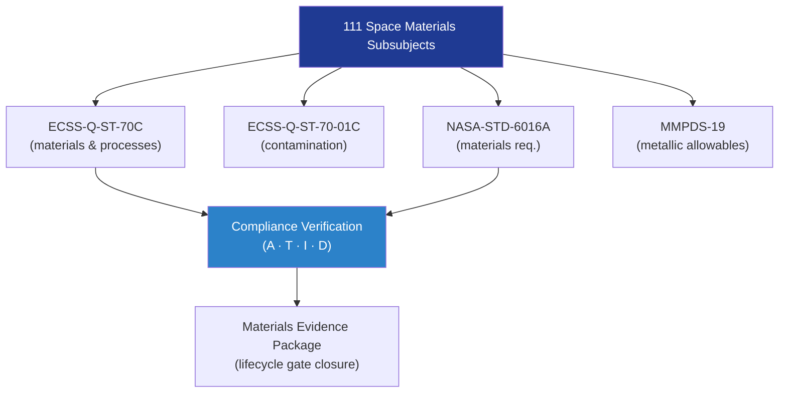

# STA 110-119 · Section 01 · Subsection 111 · Subsubject 009 — ECSS / NASA Materials Standards Mapping

## 1. Purpose

Provides the **materials-specific standards cross-reference** mapping ECSS, NASA, ASTM, and ISO standards to the STA `111` space-materials subsubjects, ensuring each materials module cites the correct normative hierarchy.

## 2. Scope

- Covers the *ECSS / NASA Materials Standards Mapping* subsubject (`009`) of subsection `111`.
- Inherits Q-Division authority and ORB support from the parent row in [`../../README.md` §3](../../README.md#3-architecture-table)[^archtable].
- Concepts in scope:
  - **ECSS materials mapping** — ECSS-Q-ST-70C (materials and processes), ECSS-Q-ST-70-01C (contamination control), ECSS-Q-ST-70-02C (thermal vacuum outgassing test), ECSS-Q-ST-70-71C (resin impregnation of CFRP).
  - **NASA materials mapping** — NASA-STD-6016A (materials and processes), NASA-RP-1401 (outgassing data), MMPDS-19 (metallic materials allowables), NASA-HDBK-4006 (MLI design).
  - **ISO/ASTM mapping** — ISO 11357 (thermal analysis), ASTM D3039/D7137/D5766 (composite testing), ASTM G173 (AO testing), ASTM E512 (synergistic effects).
  - **Standards traceability matrix** — tabular cross-reference of each `111` subsubject to primary and supporting standards.

| Subsubject | Primary Standards | Supporting Standards |
|---|---|---|
| 001 Definition | ECSS-Q-ST-70C | NASA-STD-6016A |
| 002 Families/Selection | ECSS-Q-ST-70C | MMPDS-19 |
| 003 Metals/Alloys | MMPDS-19, ECSS-Q-ST-70C | NASA-STD-6016A |
| 004 Composites/Ceramics | ECSS-Q-ST-70C, ECSS-Q-ST-70-71C | ASTM D3039/D7137 |
| 005 Polymers/Sealants | ECSS-Q-ST-70C, NASA-RP-1401 | NASA-STD-6016A |
| 006 Outgassing/Contamination | ECSS-Q-ST-70-01C, ECSS-Q-ST-70-02C | NASA-RP-1401, IEST-CC1246E |
| 007 Space Environment | ECSS-Q-ST-70C | ASTM G173, ASTM E512 |
| 008 Qualification/Allowables | ECSS-Q-ST-70C | MMPDS-19, ASTM D3039 |
| 010 Traceability | ECSS-Q-ST-70C | ECSS-Q-ST-70-01C |

## 3. Diagram — Materials Standards Hierarchy

## 3. Footprint

| Metric | Value |
|---|---|
| Architecture | `STA` — Space Technology Architecture |
| Master range | `100–199` |
| Code range | `110-119` |
| Section | `01` — Estructuras y Materiales Espaciales |
| Subsection | `111` — Materiales Espaciales |
| Subsubject | `009` — ECSS NASA Materials Standards Mapping |
| Primary Q-Division | Q-SPACE[^qdiv] |
| Support Q-Divisions | Q-STRUCTURES, Q-DATAGOV, Q-HORIZON, Q-HPC, Q-INDUSTRY |
| ORB support | ORB-PMO, ORB-FIN |
| Governance class | `baseline`[^gov] |
| Folder path | `Q+ATLANTIDE/100-199_STA/110-119_Estructuras-y-Materiales-Espaciales/111_Materiales-Espaciales/` |
| Document | `009_ECSS-NASA-Materials-Standards-Mapping.md` (this file) |
| Parent subsection | [`README.md`](./README.md) · [`000_Overview.md`](./000_Overview.md) |
| Parent architecture | [`../../README.md`](../../README.md) |
| Parent baseline | [`organization/Q+ATLANTIDE.md`](../../../../organization/Q+ATLANTIDE.md) |

## 5. References & Citations

[^baseline]: **Q+ATLANTIDE controlled baseline (v1.0.0)** — [`organization/Q+ATLANTIDE.md`](../../../../organization/Q+ATLANTIDE.md). Defines the controlled `000-999` architecture-band taxonomy and the ATLAS-1000 register subpart.

[^archtable]: **STA §3 Architecture Table** — [`../../README.md` §3](../../README.md#3-architecture-table). Authoritative source for the `110-119` row.

[^qdiv]: **Q-Division authority** — Q-Divisions provide technical authority over an architecture row (Q+ATLANTIDE Note N-002). See [`organization/Q+ATLANTIDE.md` §4](../../../../organization/Q+ATLANTIDE.md#4-notes).

[^gov]: **Governance class** — `baseline` denotes documents under controlled change management within the Q+ATLANTIDE baseline.

[^ecssqst70]: **ECSS-Q-ST-70C — Space Product Assurance: Materials, Mechanical Parts and their Data** — European standard for space materials qualification, controlled substances, outgassing, and materials data management.

[^ecssqst7001]: **ECSS-Q-ST-70-01C — Cleanliness and Contamination Control** — European standard for contamination control on spacecraft hardware.

[^nasastd6016]: **NASA-STD-6016A — Standard Materials and Processes Requirements for Spacecraft** — NASA standard governing material selection, prohibited materials, contamination and outgassing requirements.

[^nasarpd7901]: **NASA-RP-1401 — Outgassing Data for Selecting Spacecraft Materials** — NASA reference publication providing outgassing TML and CVCM data for spacecraft material selection.

[^iso11357]: **ISO 11357-1:2023 — Plastics: Differential Scanning Calorimetry (DSC)** — thermal characterisation standard used for polymer and composite material qualification in the space environment.

### Applicable industry standards

- ECSS-Q-ST-70C — Space Product Assurance: Materials, Mechanical Parts and their Data[^ecssqst70]
- ECSS-Q-ST-70-01C — Cleanliness and Contamination Control[^ecssqst7001]
- NASA-STD-6016A — Standard Materials and Processes Requirements for Spacecraft[^nasastd6016]
- NASA-RP-1401 — Outgassing Data for Selecting Spacecraft Materials[^nasarpd7901]
- ISO 11357-1 — Differential Scanning Calorimetry for polymer/composite qualification[^iso11357]
