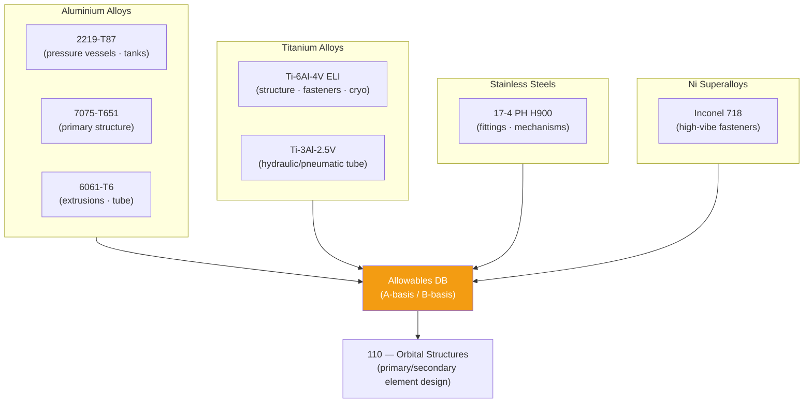

# STA 110-119 · 111-030 — Metals Alloys and Superalloys

## 1. Purpose

Defines the **space-heritage metallic material specifications, allowables, and application guidance** for the primary structural materials used in Q+ATLANTIDE STA-band systems — covering aluminium alloys, titanium alloys, stainless steels, and Ni-base superalloys, per ECSS-Q-ST-70C[^ecssqst70] and NASA-STD-6016A[^nasastd6016].

## 2. Scope

- Covers the *Metals, Alloys and Superalloys* subsubject (`003`) of subsection `111`.
- Inherits Q-Division authority and ORB support from the parent row in [`../../README.md` §3](../../README.md#3-architecture-table)[^archtable].
- Concepts in scope:
  - **Aluminium alloys** — 2000-series (2024-T3, 2219-T87: pressure vessel, tank), 6000-series (6061-T6: extrusion/tube), 7000-series (7075-T651, 7050-T7451: primary structure); allowables per MIL-HDBK-5J (MMPDS-19).
  - **Titanium alloys** — Ti-6Al-4V ELI (Ti-6-4, ASTM B265/B348): high specific strength, cryogenic compatibility, fasteners; Ti-3Al-2.5V tube; Ti-6Al-2Sn-4Zr-2Mo for elevated-temperature applications.
  - **Stainless steels** — 17-4 PH (H900/H1025): pressure fittings, mechanisms; 15-5 PH; 304/316L for non-structural fittings; Note: stainless requires corrosion-inhibiting coating in bimetallic contact with aluminium.
  - **Nickel superalloys** — Inconel 718 (fasteners, brackets in high-vibration/high-temperature zones); Haynes 230 (combustion proximity brackets at → `130`).
  - **Beryllium and Be-alloys** — restricted use per ECSS-Q-ST-70C Annex A[^ecssqst70] (toxicity); requires specific waiver from Q-STRUCTURES authority; applicable to precision optical mounts only.
  - **Metallic allowables database** — A-basis and B-basis mechanical properties at operating temperature range (−196°C to +200°C for non-TPS applications).

## 3. Diagram — Metallic Material Application Map

## 3. Footprint

| Metric | Value |
|---|---|
| Architecture | `STA` — Space Technology Architecture |
| Master range | `100–199` |
| Code range | `110-119` |
| Section | `01` — Estructuras y Materiales Espaciales |
| Subsection | `111` — Materiales Espaciales |
| Subsubject | `003` — Metals Alloys and Superalloys |
| Primary Q-Division | Q-SPACE[^qdiv] |
| Support Q-Divisions | Q-STRUCTURES, Q-DATAGOV, Q-HORIZON, Q-HPC, Q-INDUSTRY |
| ORB support | ORB-PMO, ORB-FIN |
| Governance class | `baseline`[^gov] |
| Folder path | `Q+ATLANTIDE/100-199_STA/110-119_Estructuras-y-Materiales-Espaciales/111_Materiales-Espaciales/` |
| Document | `111-030-Metals-Alloys-and-Superalloys.md` (this file) |
| Parent subsection | [`README.md`](./README.md) · [`111-000-General.md`](./111-000-General.md) |
| Parent architecture | [`../../README.md`](../../README.md) |
| Parent baseline | [`organization/Q+ATLANTIDE.md`](../../../../organization/Q+ATLANTIDE.md) |

## 5. References & Citations

[^baseline]: **Q+ATLANTIDE controlled baseline (v1.0.0)** — [`organization/Q+ATLANTIDE.md`](../../../../organization/Q+ATLANTIDE.md). Defines the controlled `000-999` architecture-band taxonomy and the ATLAS-1000 register subpart.

[^archtable]: **STA §3 Architecture Table** — [`../../README.md` §3](../../README.md#3-architecture-table). Authoritative source for the `110-119` row.

[^qdiv]: **Q-Division authority** — Q-Divisions provide technical authority over an architecture row (Q+ATLANTIDE Note N-002). See [`organization/Q+ATLANTIDE.md` §4](../../../../organization/Q+ATLANTIDE.md#4-notes).

[^gov]: **Governance class** — `baseline` denotes documents under controlled change management within the Q+ATLANTIDE baseline.

[^ecssqst70]: **ECSS-Q-ST-70C — Space Product Assurance: Materials, Mechanical Parts and their Data** — European standard for space materials qualification, controlled substances, outgassing, and materials data management.

[^ecssqst7001]: **ECSS-Q-ST-70-01C — Cleanliness and Contamination Control** — European standard for contamination control on spacecraft hardware.

[^nasastd6016]: **NASA-STD-6016A — Standard Materials and Processes Requirements for Spacecraft** — NASA standard governing material selection, prohibited materials, contamination and outgassing requirements.

[^nasarpd7901]: **NASA-RP-1401 — Outgassing Data for Selecting Spacecraft Materials** — NASA reference publication providing outgassing TML and CVCM data for spacecraft material selection.

[^iso11357]: **ISO 11357-1:2023 — Plastics: Differential Scanning Calorimetry (DSC)** — thermal characterisation standard used for polymer and composite material qualification in the space environment.

### Applicable industry standards

- ECSS-Q-ST-70C — Space Product Assurance: Materials, Mechanical Parts and their Data[^ecssqst70]
- ECSS-Q-ST-70-01C — Cleanliness and Contamination Control[^ecssqst7001]
- NASA-STD-6016A — Standard Materials and Processes Requirements for Spacecraft[^nasastd6016]
- NASA-RP-1401 — Outgassing Data for Selecting Spacecraft Materials[^nasarpd7901]
- ISO 11357-1 — Differential Scanning Calorimetry for polymer/composite qualification[^iso11357]
