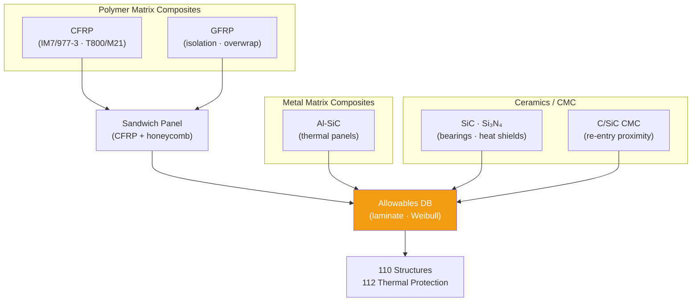

# STA 110-119 · 111-040 — Composites Ceramics and Hybrid Materials

## 1. Purpose

Defines the **composite, ceramic, and hybrid material specifications, qualification requirements, and application constraints** for Q+ATLANTIDE STA-band structural and thermal-protection elements, per ECSS-Q-ST-70C[^ecssqst70] and NASA-STD-6016A[^nasastd6016].

## 2. Scope

- Covers the *Composites, Ceramics and Hybrid Materials* subsubject (`004`) of subsection `111`.
- Inherits Q-Division authority and ORB support from the parent row in [`../../README.md` §3](../../README.md#3-architecture-table)[^archtable].
- Concepts in scope:
  - **Carbon Fibre Reinforced Polymer (CFRP)** — IM7/977-3, T800/M21 (primary structural panels, tubes, trusses); laminate design rules (symmetric/balanced), minimum gauge constraints, out-of-plane strength (ILSS), interlaminar fracture toughness (G_Ic/G_IIc); moisture absorption and vacuum outgassing characterisation.
  - **Glass Fibre Reinforced Polymer (GFRP)** — E-glass/epoxy (electrical isolation applications, secondary brackets, pressure vessel overwrap on metallic liners); outgassing compliance per NASA-RP-1401[^nasarpd7901].
  - **Metal Matrix Composites (MMC)** — Al-SiC/B₄C particulate MMC (high thermal conductivity panels, electronics cold plates); manufacturing constraints (machining, joining).
  - **Ceramics** — Si₃N₄, SiC (bearing materials, heat shields at → `112`); Al₂O₃ (electrical insulators); brittle material design rules (Weibull analysis, proof test requirement).
  - **Hybrid sandwich** — CFRP face sheets + Nomex/Al-honeycomb core (equipment panels, solar array substrates, equipment decks); design for core shear, face wrinkling, and flatwise tension.
  - **Ceramic Matrix Composites (CMC)** — C/SiC, SiC/SiC (high-temperature structural applications adjacent to re-entry TPS at → `112`); joining to metallic attachments (differential CTE management).

## 3. Diagram — Composite and Ceramic Application Hierarchy

## 3. Footprint

| Metric | Value |
|---|---|
| Architecture | `STA` — Space Technology Architecture |
| Master range | `100–199` |
| Code range | `110-119` |
| Section | `01` — Estructuras y Materiales Espaciales |
| Subsection | `111` — Materiales Espaciales |
| Subsubject | `004` — Composites Ceramics and Hybrid Materials |
| Primary Q-Division | Q-SPACE[^qdiv] |
| Support Q-Divisions | Q-STRUCTURES, Q-DATAGOV, Q-HORIZON, Q-HPC, Q-INDUSTRY |
| ORB support | ORB-PMO, ORB-FIN |
| Governance class | `baseline`[^gov] |
| Folder path | `Q+ATLANTIDE/100-199_STA/110-119_Estructuras-y-Materiales-Espaciales/111_Materiales-Espaciales/` |
| Document | `111-040-Composites-Ceramics-and-Hybrid-Materials.md` (this file) |
| Parent subsection | [`README.md`](./README.md) · [`111-000-General.md`](./111-000-General.md) |
| Parent architecture | [`../../README.md`](../../README.md) |
| Parent baseline | [`organization/Q+ATLANTIDE.md`](../../../../organization/Q+ATLANTIDE.md) |

## 5. References & Citations

[^baseline]: **Q+ATLANTIDE controlled baseline (v1.0.0)** — [`organization/Q+ATLANTIDE.md`](../../../../organization/Q+ATLANTIDE.md). Defines the controlled `000-999` architecture-band taxonomy and the ATLAS-1000 register subpart.

[^archtable]: **STA §3 Architecture Table** — [`../../README.md` §3](../../README.md#3-architecture-table). Authoritative source for the `110-119` row.

[^qdiv]: **Q-Division authority** — Q-Divisions provide technical authority over an architecture row (Q+ATLANTIDE Note N-002). See [`organization/Q+ATLANTIDE.md` §4](../../../../organization/Q+ATLANTIDE.md#4-notes).

[^gov]: **Governance class** — `baseline` denotes documents under controlled change management within the Q+ATLANTIDE baseline.

[^ecssqst70]: **ECSS-Q-ST-70C — Space Product Assurance: Materials, Mechanical Parts and their Data** — European standard for space materials qualification, controlled substances, outgassing, and materials data management.

[^ecssqst7001]: **ECSS-Q-ST-70-01C — Cleanliness and Contamination Control** — European standard for contamination control on spacecraft hardware.

[^nasastd6016]: **NASA-STD-6016A — Standard Materials and Processes Requirements for Spacecraft** — NASA standard governing material selection, prohibited materials, contamination and outgassing requirements.

[^nasarpd7901]: **NASA-RP-1401 — Outgassing Data for Selecting Spacecraft Materials** — NASA reference publication providing outgassing TML and CVCM data for spacecraft material selection.

[^iso11357]: **ISO 11357-1:2023 — Plastics: Differential Scanning Calorimetry (DSC)** — thermal characterisation standard used for polymer and composite material qualification in the space environment.

### Applicable industry standards

- ECSS-Q-ST-70C — Space Product Assurance: Materials, Mechanical Parts and their Data[^ecssqst70]
- ECSS-Q-ST-70-01C — Cleanliness and Contamination Control[^ecssqst7001]
- NASA-STD-6016A — Standard Materials and Processes Requirements for Spacecraft[^nasastd6016]
- NASA-RP-1401 — Outgassing Data for Selecting Spacecraft Materials[^nasarpd7901]
- ISO 11357-1 — Differential Scanning Calorimetry for polymer/composite qualification[^iso11357]
