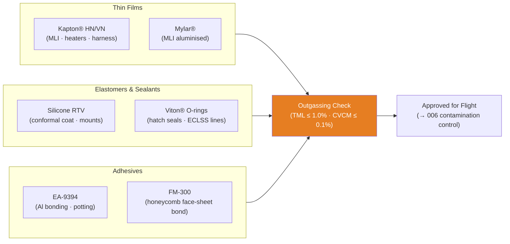

# STA 110-119 · 111-050 — Polymers Elastomers and Sealants

## 1. Purpose

Defines the **polymer, elastomer, and sealant specifications, outgassing requirements, and application constraints** for Q+ATLANTIDE STA-band systems — covering thin-film polymers, foam insulations, silicone elastomers, and pressure-seal compounds, per ECSS-Q-ST-70C[^ecssqst70] and NASA-STD-6016A[^nasastd6016].

## 2. Scope

- Covers the *Polymers, Elastomers and Sealants* subsubject (`005`) of subsection `111`.
- Inherits Q-Division authority and ORB support from the parent row in [`../../README.md` §3](../../README.md#3-architecture-table)[^archtable].
- Concepts in scope:
  - **Thin-film polymers** — Kapton® HN/VN (multi-layer insulation — MLI — inner-layer substrate, flexible heater substrate, harness wrap); Mylar® (MLI aluminised outer layer, alternate); Tedlar® (optical solar reflectors); outgassing data from NASA-RP-1401[^nasarpd7901]: all shall satisfy TML ≤ 1.0%, CVCM ≤ 0.1%.
  - **Polyimide foam** — Solimide® (acoustic damping in habitat modules, thermal insulation filler); low outgassing, fire-resistant.
  - **PTFE** — rod/tube/tape (bearing races, valve seats, anti-friction coatings); acceptable for vacuum service; restricted where exposed to atomic oxygen (→ `007`).
  - **Silicone elastomers** — RTV-566, RTV-655 (adhesive/sealant for electronic box conformal coating, vibration-isolated mount pads, crew window seals); vacuum outgassing characterised per ECSS-Q-ST-70-01C[^ecssqst7001].
  - **Fluoroelastomer seals** — Viton® (O-rings for panel hatch pressure-sealing, fluid line connectors in ECLSS → `102`); service temperature range −55°C to +200°C; qualification per ECSS-Q-ST-70C[^ecssqst70].
  - **Structural adhesives** — EA-9394 (aluminium bonding, bracket potting), FM-300 (film adhesive for honeycomb sandwich face-sheet bond); pot-life, mix-ratio, and cure monitoring per DRD.

## 3. Diagram — Polymer/Elastomer Application Map

## 3. Footprint

| Metric | Value |
|---|---|
| Architecture | `STA` — Space Technology Architecture |
| Master range | `100–199` |
| Code range | `110-119` |
| Section | `01` — Estructuras y Materiales Espaciales |
| Subsection | `111` — Materiales Espaciales |
| Subsubject | `005` — Polymers Elastomers and Sealants |
| Primary Q-Division | Q-SPACE[^qdiv] |
| Support Q-Divisions | Q-STRUCTURES, Q-DATAGOV, Q-HORIZON, Q-HPC, Q-INDUSTRY |
| ORB support | ORB-PMO, ORB-FIN |
| Governance class | `baseline`[^gov] |
| Folder path | `Q+ATLANTIDE/100-199_STA/110-119_Estructuras-y-Materiales-Espaciales/111_Materiales-Espaciales/` |
| Document | `111-050-Polymers-Elastomers-and-Sealants.md` (this file) |
| Parent subsection | [`README.md`](./README.md) · [`111-000-General.md`](./111-000-General.md) |
| Parent architecture | [`../../README.md`](../../README.md) |
| Parent baseline | [`organization/Q+ATLANTIDE.md`](../../../../organization/Q+ATLANTIDE.md) |

## 5. References & Citations

[^baseline]: **Q+ATLANTIDE controlled baseline (v1.0.0)** — [`organization/Q+ATLANTIDE.md`](../../../../organization/Q+ATLANTIDE.md). Defines the controlled `000-999` architecture-band taxonomy and the ATLAS-1000 register subpart.

[^archtable]: **STA §3 Architecture Table** — [`../../README.md` §3](../../README.md#3-architecture-table). Authoritative source for the `110-119` row.

[^qdiv]: **Q-Division authority** — Q-Divisions provide technical authority over an architecture row (Q+ATLANTIDE Note N-002). See [`organization/Q+ATLANTIDE.md` §4](../../../../organization/Q+ATLANTIDE.md#4-notes).

[^gov]: **Governance class** — `baseline` denotes documents under controlled change management within the Q+ATLANTIDE baseline.

[^ecssqst70]: **ECSS-Q-ST-70C — Space Product Assurance: Materials, Mechanical Parts and their Data** — European standard for space materials qualification, controlled substances, outgassing, and materials data management.

[^ecssqst7001]: **ECSS-Q-ST-70-01C — Cleanliness and Contamination Control** — European standard for contamination control on spacecraft hardware.

[^nasastd6016]: **NASA-STD-6016A — Standard Materials and Processes Requirements for Spacecraft** — NASA standard governing material selection, prohibited materials, contamination and outgassing requirements.

[^nasarpd7901]: **NASA-RP-1401 — Outgassing Data for Selecting Spacecraft Materials** — NASA reference publication providing outgassing TML and CVCM data for spacecraft material selection.

[^iso11357]: **ISO 11357-1:2023 — Plastics: Differential Scanning Calorimetry (DSC)** — thermal characterisation standard used for polymer and composite material qualification in the space environment.

### Applicable industry standards

- ECSS-Q-ST-70C — Space Product Assurance: Materials, Mechanical Parts and their Data[^ecssqst70]
- ECSS-Q-ST-70-01C — Cleanliness and Contamination Control[^ecssqst7001]
- NASA-STD-6016A — Standard Materials and Processes Requirements for Spacecraft[^nasastd6016]
- NASA-RP-1401 — Outgassing Data for Selecting Spacecraft Materials[^nasarpd7901]
- ISO 11357-1 — Differential Scanning Calorimetry for polymer/composite qualification[^iso11357]
