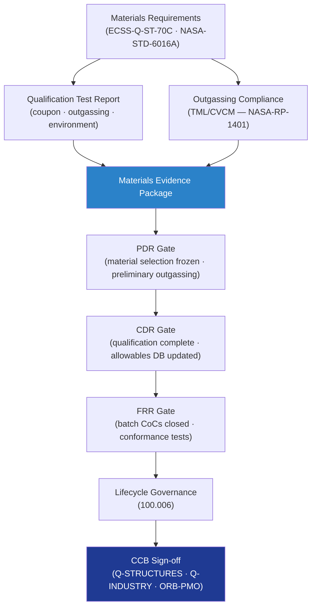

# STA 110-119 · 111-090 — Traceability Evidence and Lifecycle Governance

## 1. Purpose

Provides the **materials compliance traceability, evidence-package structure, and lifecycle governance rules** for subsection `111` *Materiales Espaciales* — declaring the controlled document hierarchy, change authority, and materials assurance evidence requirements for this space-materials-critical subsystem.

## 2. Scope

- Covers the *Traceability, Evidence and Lifecycle Governance* subsubject (`010`) of subsection `111`.
- Inherits Q-Division authority and ORB support from the parent row in [`../../README.md` §3](../../README.md#3-architecture-table)[^archtable].
- Concepts in scope:
  - **Materials evidence package** — minimum evidence set: material qualification test report, outgassing compliance data (TML/CVCM), prohibited-material check, batch conformance test results, and material certification (Certificate of Conformance — CoC) from supplier.
  - **Materials compliance traceability matrix** — maps each `111` materials requirement to its governing standard, verification method (A/T/I/D), and closure evidence; linked to structural analysis tool used by `110`.
  - **Change authority matrix** — space-materials-critical changes (material substitution on primary structure, new material qualification) require Q-STRUCTURES + Q-INDUSTRY + ORB-PMO sign-off; secondary material changes require Q-STRUCTURES sign-off; all changes controlled through `100.006` lifecycle governance.
  - **Design review maturity gates** — PDR: material selection frozen, preliminary outgassing compliance; CDR: qualification programme completed, allowables database updated, contamination control plan baselined; flight readiness review (FRR): all batch CoCs received and conformance tests closed.
  - **Linked nodes** — `110_Estructuras-Orbitales`, `112_Proteccion-Termica-y-Radiacion` per node YAML.
  - **No-AAA Rule compliance** — confirmation that no materials module uses "AAA" as an identifier per Q+ATLANTIDE Note N-004.

## 3. Diagram — Materials Evidence and Lifecycle Flow

## 3. Footprint

| Metric | Value |
|---|---|
| Architecture | `STA` — Space Technology Architecture |
| Master range | `100–199` |
| Code range | `110-119` |
| Section | `01` — Estructuras y Materiales Espaciales |
| Subsection | `111` — Materiales Espaciales |
| Subsubject | `010` — Traceability Evidence and Lifecycle Governance |
| Primary Q-Division | Q-SPACE[^qdiv] |
| Support Q-Divisions | Q-STRUCTURES, Q-DATAGOV, Q-HORIZON, Q-HPC, Q-INDUSTRY |
| ORB support | ORB-PMO, ORB-FIN |
| Governance class | `baseline`[^gov] |
| Folder path | `Q+ATLANTIDE/100-199_STA/110-119_Estructuras-y-Materiales-Espaciales/111_Materiales-Espaciales/` |
| Document | `111-090-Traceability-Evidence-and-Lifecycle-Governance.md` (this file) |
| Parent subsection | [`README.md`](./README.md) · [`111-000-General.md`](./111-000-General.md) |
| Parent architecture | [`../../README.md`](../../README.md) |
| Parent baseline | [`organization/Q+ATLANTIDE.md`](../../../../organization/Q+ATLANTIDE.md) |

## 5. References & Citations

[^baseline]: **Q+ATLANTIDE controlled baseline (v1.0.0)** — [`organization/Q+ATLANTIDE.md`](../../../../organization/Q+ATLANTIDE.md). Defines the controlled `000-999` architecture-band taxonomy and the ATLAS-1000 register subpart.

[^archtable]: **STA §3 Architecture Table** — [`../../README.md` §3](../../README.md#3-architecture-table). Authoritative source for the `110-119` row.

[^qdiv]: **Q-Division authority** — Q-Divisions provide technical authority over an architecture row (Q+ATLANTIDE Note N-002). See [`organization/Q+ATLANTIDE.md` §4](../../../../organization/Q+ATLANTIDE.md#4-notes).

[^gov]: **Governance class** — `baseline` denotes documents under controlled change management within the Q+ATLANTIDE baseline.

[^ecssqst70]: **ECSS-Q-ST-70C — Space Product Assurance: Materials, Mechanical Parts and their Data** — European standard for space materials qualification, controlled substances, outgassing, and materials data management.

[^ecssqst7001]: **ECSS-Q-ST-70-01C — Cleanliness and Contamination Control** — European standard for contamination control on spacecraft hardware.

[^nasastd6016]: **NASA-STD-6016A — Standard Materials and Processes Requirements for Spacecraft** — NASA standard governing material selection, prohibited materials, contamination and outgassing requirements.

[^nasarpd7901]: **NASA-RP-1401 — Outgassing Data for Selecting Spacecraft Materials** — NASA reference publication providing outgassing TML and CVCM data for spacecraft material selection.

[^iso11357]: **ISO 11357-1:2023 — Plastics: Differential Scanning Calorimetry (DSC)** — thermal characterisation standard used for polymer and composite material qualification in the space environment.

### Applicable industry standards

- ECSS-Q-ST-70C — Space Product Assurance: Materials, Mechanical Parts and their Data[^ecssqst70]
- ECSS-Q-ST-70-01C — Cleanliness and Contamination Control[^ecssqst7001]
- NASA-STD-6016A — Standard Materials and Processes Requirements for Spacecraft[^nasastd6016]
- NASA-RP-1401 — Outgassing Data for Selecting Spacecraft Materials[^nasarpd7901]
- ISO 11357-1 — Differential Scanning Calorimetry for polymer/composite qualification[^iso11357]
