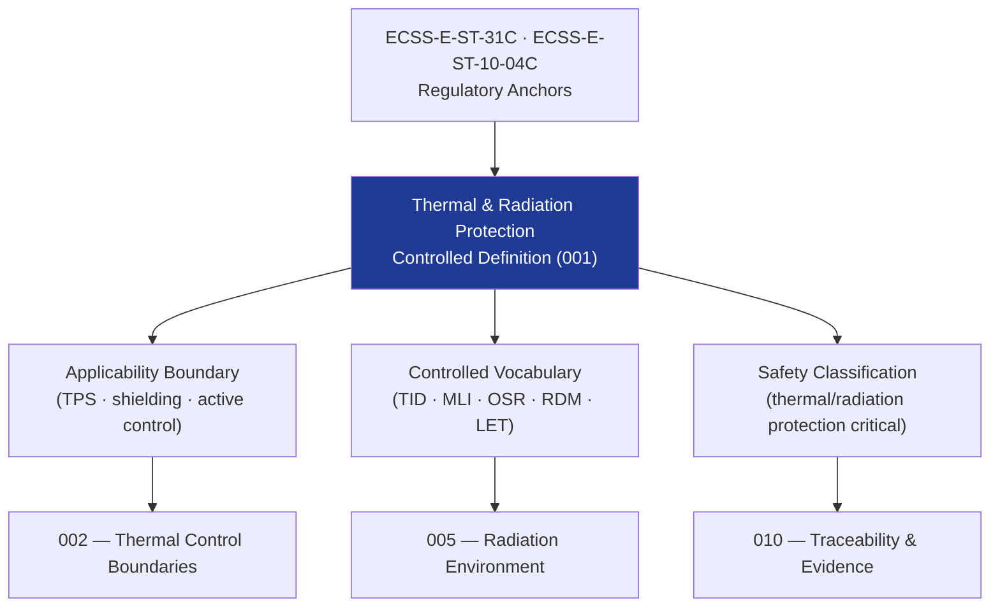

# STA 110-119 · Section 01 · Subsection 112 · Subsubject 001 — Thermal and Radiation Protection Controlled Definition

## 1. Purpose

Establishes the **normative definition and controlled scope** of thermal and radiation protection within the Q+ATLANTIDE STA band, defining applicability limits, key controlled terms, and the regulatory reference hierarchy per ECSS-E-ST-31C[^ecssest31] and ECSS-E-ST-10-04C[^ecssest1004].

## 2. Scope

- Covers the *Thermal and Radiation Protection Controlled Definition* subsubject (`001`) of subsection `112`.
- Inherits Q-Division authority and ORB support from the parent row in [`../../README.md` §3](../../README.md#3-architecture-table)[^archtable].
- Concepts in scope:
  - **Controlled definition** — Thermal and radiation protection encompasses all design provisions, materials, coatings, shielding structures, active control hardware, and governance measures that maintain spacecraft, payload, and crew within allowable temperature and radiation dose limits across the full mission lifecycle.
  - **Applicability boundary** — STA `112` covers all thermal and radiation protection elements for Q+ATLANTIDE STA-band platforms; excludes ECLSS thermal control loops (→ `102`) and crew radiation medical protocols (→ `101`).
  - **Controlled vocabulary** — *total ionising dose (TID)*, *single-event effect (SEE)*, *linear energy transfer (LET)*, *worst-case hot/cold*, *multi-layer insulation (MLI)*, *optical solar reflector (OSR)*, *thermal control coating*, *radiation design margin (RDM)*, *shielding depth (mm Al-eq)*.
  - **Safety classification** — thermal and radiation protection critical; all TPS/shielding elements shall have documented design margins, test evidence, and environmental assumptions per ECSS-E-ST-10-04C[^ecssest1004].

## 3. Diagram — Thermal and Radiation Protection Definition Framework

## 4. Footprint

| Metric | Value |
|---|---|
| Architecture | `STA` — Space Technology Architecture |
| Master range | `100–199` |
| Code range | `110-119` |
| Section | `01` — Estructuras y Materiales Espaciales |
| Subsection | `112` — Protección Térmica y Radiación |
| Subsubject | `001` — Thermal and Radiation Protection Controlled Definition |
| Primary Q-Division | Q-SPACE[^qdiv] |
| Support Q-Divisions | Q-STRUCTURES, Q-GREENTECH, Q-DATAGOV, Q-HORIZON, Q-HPC, Q-INDUSTRY |
| ORB support | ORB-PMO, ORB-FIN |
| Governance class | `baseline`[^gov] |
| Document | `001_Thermal-and-Radiation-Protection-Controlled-Definition.md` (this file) |
| Parent subsection | [`README.md`](./README.md) · [`000_Overview.md`](./000_Overview.md) |
| Parent architecture | [`../../README.md`](../../README.md) |
| Parent baseline | [`organization/Q+ATLANTIDE.md`](../../../../organization/Q+ATLANTIDE.md) |

## 5. References & Citations

[^baseline]: **Q+ATLANTIDE controlled baseline (v1.0.0)** — [`organization/Q+ATLANTIDE.md`](../../../../organization/Q+ATLANTIDE.md).

[^archtable]: **STA §3 Architecture Table** — [`../../README.md` §3](../../README.md#3-architecture-table).

[^qdiv]: **Q-Division authority** — See [`organization/Q+ATLANTIDE.md` §4](../../../../organization/Q+ATLANTIDE.md#4-notes).

[^gov]: **Governance class** — `baseline` denotes documents under controlled change management.

[^ecssest31]: **ECSS-E-ST-31C — Thermal Control** — European standard for spacecraft thermal control design, analysis, and verification.

[^ecssest1004]: **ECSS-E-ST-10-04C — Space Environment** — European standard for natural space environment characterisation and design models.

### Applicable industry standards

- ECSS-E-ST-31C — Thermal Control[^ecssest31]
- ECSS-E-ST-10-04C — Space Environment[^ecssest1004]
