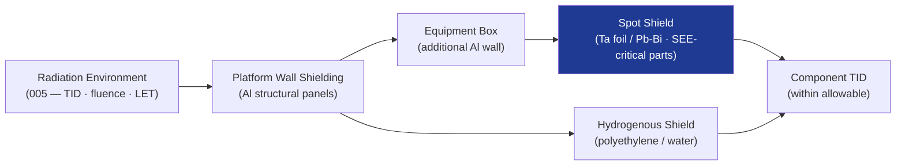

# STA 110-119 · Section 01 · Subsection 112 · Subsubject 006 — Radiation Shielding Materials and Architectures

## 1. Purpose

Defines the **radiation shielding materials and architectural configurations** used to attenuate ionising radiation to within the dose budget, covering aluminium shielding, hydrogenous shielding materials, spot shielding, and structural integration approaches.

## 2. Scope

- Covers radiation shielding design within subsection `112`.
- Concepts in scope: aluminium equivalent shielding depth (mm Al-eq); polyethylene and water-filled panels for high-energy proton shielding; spot shielding for radiation-sensitive components; tantalum spot shields for SEE-sensitive devices; tiered shielding architecture (platform wall → equipment enclosure → spot shield); mass penalty vs. dose reduction trade; Monte Carlo transport codes (GEANT4, MULASSIS, SHIELDOSE-2).

## 3. Diagram — Shielding Architecture

## 4. Footprint

| Metric | Value |
|---|---|
| Architecture | `STA` — Space Technology Architecture |
| Subsection | `112` — Protección Térmica y Radiación |
| Subsubject | `006` — Radiation Shielding Materials and Architectures |
| Primary Q-Division | Q-SPACE[^qdiv] |
| Governance class | `baseline`[^gov] |
| Document | `006_Radiation-Shielding-Materials-and-Architectures.md` (this file) |
| Parent subsection | [`README.md`](./README.md) |

## 5. References & Citations

[^qdiv]: **Q-Division authority** — See [`organization/Q+ATLANTIDE.md` §4](../../../../organization/Q+ATLANTIDE.md#4-notes).

[^gov]: **Governance class** — `baseline`.

### Applicable industry standards

- ECSS-E-ST-10-04C — Space Environment
- NASA-HDBK-4002A — Mitigating In-Space Charging Effects
- ESA SHIELDOSE-2 — Dose-depth curve tool
