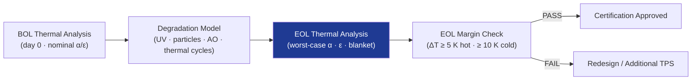

# STA 110-119 · Section 01 · Subsection 112 · Subsubject 008 — Thermal Cycling, Degradation and Lifetime Effects

## 1. Purpose

Defines the **thermal cycling, environmental degradation, and end-of-life (EOL) effects** on TPS materials and coatings — including solar absorptance (α) increase, emissivity (ε) change, MLI blanket degradation, and structural fatigue at thermal joints — and the design margins required to accommodate them.

## 2. Scope

- Covers TPS degradation mechanisms within subsection `112`.
- Concepts in scope: solar absorptance increase due to UV and particle irradiation (Δα/year); MLI layer density loss and on-orbit repair constraints; thermal fatigue at mounting feet and interfaces (→ `110`); coating peel-off risks; BOL vs. EOL thermal analysis requirement; degradation margins: ΔT margin ≥ 5 K EOL; annual α increase allowance ≤ 0.02; atomic oxygen erosion of surface coatings in LEO.

## 3. Diagram — TPS Degradation Over Mission Lifetime

## 4. Footprint

| Metric | Value |
|---|---|
| Architecture | `STA` — Space Technology Architecture |
| Subsection | `112` — Protección Térmica y Radiación |
| Subsubject | `008` — Thermal Cycling, Degradation and Lifetime Effects |
| Primary Q-Division | Q-SPACE[^qdiv] |
| Governance class | `baseline`[^gov] |
| Document | `008_Thermal-Cycling-Degradation-and-Lifetime-Effects.md` (this file) |
| Parent subsection | [`README.md`](./README.md) |

## 5. References & Citations

[^qdiv]: **Q-Division authority** — See [`organization/Q+ATLANTIDE.md` §4](../../../../organization/Q+ATLANTIDE.md#4-notes).

[^gov]: **Governance class** — `baseline`.

### Applicable industry standards

- ECSS-E-ST-31C — Thermal Control
- ECSS-E-ST-10-04C — Space Environment (atomic oxygen model)
- NASA-HDBK-7005 — Dynamic Environmental Criteria (thermal fatigue)
