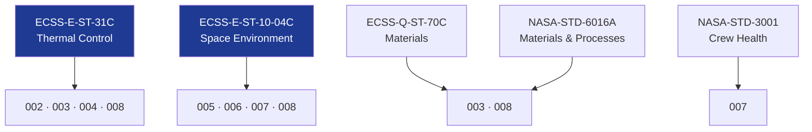

# STA 110-119 · Section 01 · Subsection 112 · Subsubject 009 — ECSS / NASA Thermal and Radiation Standards Mapping

## 1. Purpose

Provides the **normative standards cross-reference** for all `112` subsubjects, mapping ECSS and NASA standard identifiers to the thermal and radiation protection topics covered by subsection `112`.

## 2. Scope

- Covers thermal and radiation standards mapping for subsection `112`.
- Standards in scope:

| Standard | Scope | Applicable `112` Subsubjects |
|---|---|---|
| ECSS-E-ST-31C | Thermal control design, analysis, verification | 001, 002, 003, 004, 008 |
| ECSS-E-ST-10-04C | Space environment models | 001, 005, 006, 007, 008 |
| ECSS-E-HB-31-01 Part 1 | Thermal design handbook | 002, 003, 004 |
| ECSS-Q-ST-70C | Space materials (TPS coatings, MLI) | 003, 008 |
| ECSS-Q-ST-70-01C | Cleanliness and contamination | 003 |
| NASA-STD-6016A | Materials and processes for spacecraft | 003 |
| NASA-HDBK-4001 | Electrical grounding (radiation shielding context) | 006, 007 |
| NASA-HDBK-4002A | Mitigating in-space charging | 005, 006 |
| NASA-STD-3001 Vol.1 | Crew health (radiation dose limits) | 007 |
| NCRP Report 132 | Radiation protection guidance for LEO crew | 007 |
| NASA-HDBK-7005 | Dynamic environmental criteria (thermal fatigue) | 008 |

## 3. Diagram — Standards Mapping Overview

## 4. Footprint

| Metric | Value |
|---|---|
| Architecture | `STA` — Space Technology Architecture |
| Subsection | `112` — Protección Térmica y Radiación |
| Subsubject | `009` — ECSS / NASA Thermal and Radiation Standards Mapping |
| Primary Q-Division | Q-SPACE[^qdiv] |
| Governance class | `baseline`[^gov] |
| Document | `009_ECSS-NASA-Thermal-and-Radiation-Standards-Mapping.md` (this file) |
| Parent subsection | [`README.md`](./README.md) |

## 5. References & Citations

[^qdiv]: **Q-Division authority** — See [`organization/Q+ATLANTIDE.md` §4](../../../../organization/Q+ATLANTIDE.md#4-notes).

[^gov]: **Governance class** — `baseline`.

### Applicable industry standards

- ECSS-E-ST-31C — Thermal Control
- ECSS-E-ST-10-04C — Space Environment
- ECSS-E-HB-31-01 Part 1 — Thermal Design Handbook
- ECSS-Q-ST-70C — Space Product Assurance: Materials
- NASA-STD-6016A — Standard Materials and Processes Requirements for Spacecraft
- NASA-HDBK-4002A — Mitigating In-Space Charging Effects
- NASA-STD-3001 Vol.1 — Crew Health Requirements
- NCRP Report 132 — Radiation Protection Guidance for LEO
