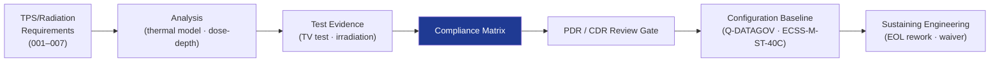

# STA 110-119 · Section 01 · Subsection 112 · Subsubject 010 — Traceability, Evidence and Lifecycle Governance

## 1. Purpose

Defines the **traceability, compliance evidence package, and lifecycle change governance** for all thermal and radiation protection elements in subsection `112`, ensuring that requirements, analyses, tests, and EOL margins are traceable to the Q+ATLANTIDE baseline across the full mission lifecycle.

## 2. Scope

- Covers traceability and lifecycle governance for subsection `112`.
- Concepts in scope: thermal analysis report tree (BOL/EOL, hot/cold case, unit-level); radiation analysis report (dose-depth, TID budget, SEE analysis); TPS test evidence (thermal vacuum, EMI/radiation exposure); compliance matrix mapping requirements → analyses → test results; configuration change authority (Q-DATAGOV; → ECSS-M-ST-40C); baseline freeze at PDR and CDR; sustaining engineering rules for EOL rework.

## 3. Diagram — Traceability Chain

## 4. Footprint

| Metric | Value |
|---|---|
| Architecture | `STA` — Space Technology Architecture |
| Subsection | `112` — Protección Térmica y Radiación |
| Subsubject | `010` — Traceability, Evidence and Lifecycle Governance |
| Primary Q-Division | Q-SPACE[^qdiv] |
| Governance class | `baseline`[^gov] |
| Document | `010_Traceability-Evidence-and-Lifecycle-Governance.md` (this file) |
| Parent subsection | [`README.md`](./README.md) |

## 5. References & Citations

[^qdiv]: **Q-Division authority** — See [`organization/Q+ATLANTIDE.md` §4](../../../../organization/Q+ATLANTIDE.md#4-notes).

[^gov]: **Governance class** — `baseline`.

### Applicable industry standards

- ECSS-M-ST-40C — Configuration and Information Management
- ECSS-E-ST-31C — Thermal Control
- ECSS-E-ST-10-04C — Space Environment
- ECSS-Q-ST-70C — Space Product Assurance: Materials
