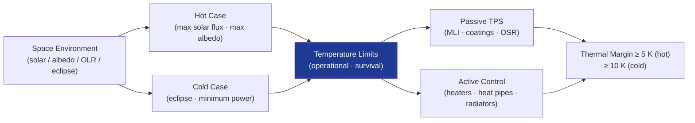

# STA 110-119 · 112-020 — Thermal Control Boundaries and Protection Functions

## 1. Purpose

Defines the **thermal control boundaries** and the protective functions that maintain all spacecraft units within their allowable temperature limits across hot-case and cold-case design extremes.

## 2. Scope

- Covers the *Thermal Control Boundaries and Protection Functions* subsubject (`002`) of subsection `112`.
- Concepts in scope: thermal balance analysis; worst-case hot/cold mission phases; unit-level temperature limits (survival, operational); thermal interfaces and conductance paths; thermal protection function allocation (passive vs. active); margins per ECSS-E-ST-31C[^ecssest31].

## 3. Diagram — Thermal Control Boundaries

## 4. Footprint

| Metric | Value |
|---|---|
| Architecture | `STA` — Space Technology Architecture |
| Subsection | `112` — Protección Térmica y Radiación |
| Subsubject | `002` — Thermal Control Boundaries and Protection Functions |
| Primary Q-Division | Q-SPACE[^qdiv] |
| Governance class | `baseline`[^gov] |
| Document | `112-020-Thermal-Control-Boundaries-and-Protection-Functions.md` (this file) |
| Parent subsection | [`README.md`](./README.md) |

## 5. References & Citations

[^ecssest31]: **ECSS-E-ST-31C — Thermal Control** — European standard for spacecraft thermal control design, analysis, and verification.

[^qdiv]: **Q-Division authority** — See [`organization/Q+ATLANTIDE.md` §4](../../../../organization/Q+ATLANTIDE.md#4-notes).

[^gov]: **Governance class** — `baseline` denotes documents under controlled change management.

### Applicable industry standards

- ECSS-E-ST-31C — Thermal Control[^ecssest31]
- ECSS-E-ST-10-04C — Space Environment
- NASA-SP-8105 — Hinge Moments of Aerodynamic Surfaces (thermal interface reference)
