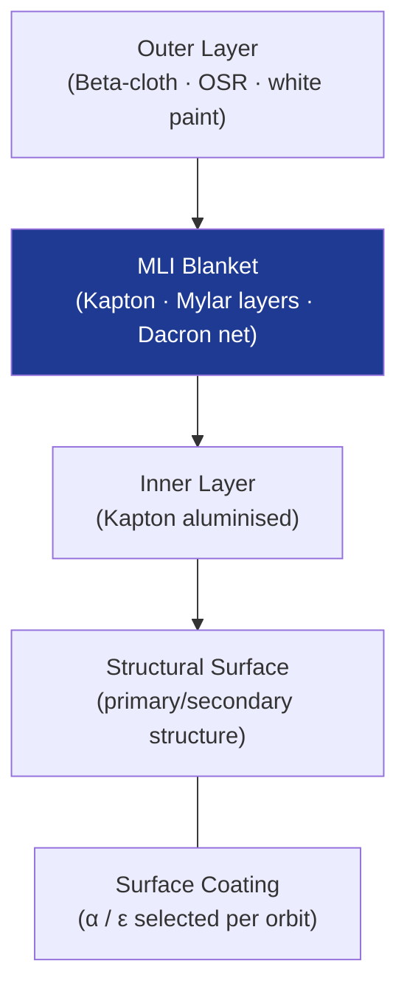

# STA 110-119 · 112-030 — Passive Thermal Protection Materials and Coatings

## 1. Purpose

Defines the **passive thermal protection (TPS) materials and surface coatings** used to control spacecraft temperatures without active power, covering multi-layer insulation (MLI), optical solar reflectors (OSR), thermal control paints, ablative systems, and foam insulation.

## 2. Scope

- Covers passive TPS materials within subsection `112`.
- Concepts in scope: MLI design (number of layers, spacer type, Beta-cloth outer layer, Kapton inner); OSR properties (α/ε ratio); second-surface mirrors; thermal control coatings (black/white paint, gold evaporation); foam insulation; ablative TPS (PICA, Avcoat); on-orbit aging and α degradation.

## 3. Diagram — Passive TPS Material Stack

## 4. Footprint

| Metric | Value |
|---|---|
| Architecture | `STA` — Space Technology Architecture |
| Subsection | `112` — Protección Térmica y Radiación |
| Subsubject | `003` — Passive Thermal Protection Materials and Coatings |
| Primary Q-Division | Q-SPACE[^qdiv] |
| Governance class | `baseline`[^gov] |
| Document | `112-030-Passive-Thermal-Protection-Materials-and-Coatings.md` (this file) |
| Parent subsection | [`README.md`](./README.md) |

## 5. References & Citations

[^qdiv]: **Q-Division authority** — See [`organization/Q+ATLANTIDE.md` §4](../../../../organization/Q+ATLANTIDE.md#4-notes).

[^gov]: **Governance class** — `baseline`.

### Applicable industry standards

- ECSS-E-ST-31C — Thermal Control
- ECSS-Q-ST-70C — Space Product Assurance: Materials
- NASA-STD-6016A — Standard Materials and Processes Requirements for Spacecraft
