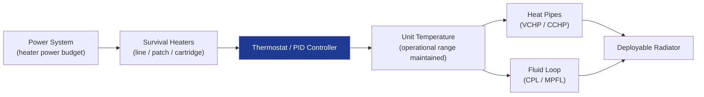

# STA 110-119 · 112-040 — Active Thermal Control Interfaces

## 1. Purpose

Defines the **active thermal control interfaces** — heaters, thermostats, heat pipes, two-phase loops, deployable radiators, and fluid loop systems — and their integration constraints with the spacecraft power, structural, and ECLSS subsystems.

## 2. Scope

- Covers active TCS hardware and interfaces within subsection `112`.
- Concepts in scope: survival heaters (line/patch/cartridge); proportional heater controllers; variable-conductance heat pipes (VCHP); constant-conductance heat pipes (CCHP); capillary pumped loops (CPL); mechanically pumped fluid loops (MPFL); deployable radiator panels; interface with ECLSS thermal loops (→ `102`); interface with structure mounting (→ `110`).

## 3. Diagram — Active TCS Architecture

## 4. Footprint

| Metric | Value |
|---|---|
| Architecture | `STA` — Space Technology Architecture |
| Subsection | `112` — Protección Térmica y Radiación |
| Subsubject | `004` — Active Thermal Control Interfaces |
| Primary Q-Division | Q-SPACE[^qdiv] |
| Governance class | `baseline`[^gov] |
| Document | `112-040-Active-Thermal-Control-Interfaces.md` (this file) |
| Parent subsection | [`README.md`](./README.md) |

## 5. References & Citations

[^qdiv]: **Q-Division authority** — See [`organization/Q+ATLANTIDE.md` §4](../../../../organization/Q+ATLANTIDE.md#4-notes).

[^gov]: **Governance class** — `baseline`.

### Applicable industry standards

- ECSS-E-ST-31C — Thermal Control
- ECSS-E-HB-31-01 Part 1 — Thermal Design Handbook
