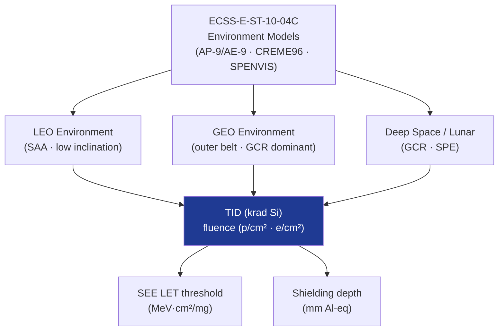

# STA 110-119 · 112-050 — Radiation Environment and Exposure Regimes

## 1. Purpose

Characterises the **natural space radiation environment** for each Q+ATLANTIDE mission class, defining total ionising dose (TID), proton/electron belt fluence, GCR/SPE spectra, and single-event effect (SEE) exposure regimes used as inputs to shielding and electronics hardening design.

## 2. Scope

- Covers radiation environment characterisation within subsection `112`.
- Concepts in scope: Van Allen belt electron and proton fluence (AP-8/AE-8, AP-9/AE-9 models); GCR iron/proton spectra; solar particle event (SPE) probabilities; TID per mission lifetime; SEE LET threshold and cross-section data; ECSS-E-ST-10-04C[^ecssest1004] environment specification; orbit-dependent dose-depth curves.

## 3. Diagram — Radiation Environment Characterisation

## 4. Footprint

| Metric | Value |
|---|---|
| Architecture | `STA` — Space Technology Architecture |
| Subsection | `112` — Protección Térmica y Radiación |
| Subsubject | `005` — Radiation Environment and Exposure Regimes |
| Primary Q-Division | Q-SPACE[^qdiv] |
| Governance class | `baseline`[^gov] |
| Document | `112-050-Radiation-Environment-and-Exposure-Regimes.md` (this file) |
| Parent subsection | [`README.md`](./README.md) |

## 5. References & Citations

[^ecssest1004]: **ECSS-E-ST-10-04C — Space Environment** — European standard for natural space environment characterisation.

[^qdiv]: **Q-Division authority** — See [`organization/Q+ATLANTIDE.md` §4](../../../../organization/Q+ATLANTIDE.md#4-notes).

[^gov]: **Governance class** — `baseline`.

### Applicable industry standards

- ECSS-E-ST-10-04C — Space Environment[^ecssest1004]
- NASA-HDBK-4002A — Mitigating In-Space Charging Effects
