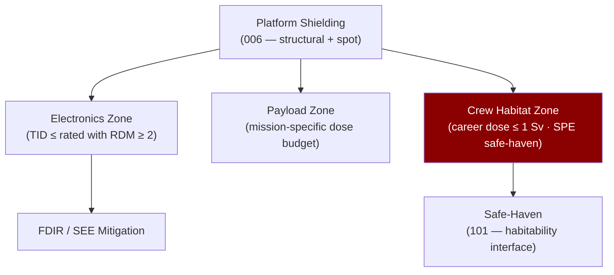

# STA 110-119 · 112-070 — Electronics Payload and Crew Protection Zones

## 1. Purpose

Defines the **protection zone hierarchy** — electronics enclosures, payload sheltered volumes, and crewed safe-haven zones — establishing allowable dose limits per zone type and the interface with crew radiation safety protocols (→ `101`).

## 2. Scope

- Covers protection zone taxonomy within subsection `112`.
- Concepts in scope: electronics TID tolerance (typically 20–100 krad Si with RDM ≥ 2); payload zone dose budget; crew career dose limits (NCRP 132; 1 Sv career LEO); acute dose safe-haven threshold; dose alert levels during SPE events; zone boundary definition and physical implementation; cross-reference to habitability safe-haven (→ `101_Habitabilidad`) and ECLSS monitoring (→ `102_Soporte-Vital-ECLSS`).

## 3. Diagram — Protection Zone Hierarchy

## 4. Footprint

| Metric | Value |
|---|---|
| Architecture | `STA` — Space Technology Architecture |
| Subsection | `112` — Protección Térmica y Radiación |
| Subsubject | `007` — Electronics, Payload and Crew Protection Zones |
| Primary Q-Division | Q-SPACE[^qdiv] |
| Governance class | `baseline`[^gov] |
| Document | `112-070-Electronics-Payload-and-Crew-Protection-Zones.md` (this file) |
| Parent subsection | [`README.md`](./README.md) |

## 5. References & Citations

[^qdiv]: **Q-Division authority** — See [`organization/Q+ATLANTIDE.md` §4](../../../../organization/Q+ATLANTIDE.md#4-notes).

[^gov]: **Governance class** — `baseline`.

### Applicable industry standards

- ECSS-E-ST-10-04C — Space Environment
- NASA-STD-3001 Vol.1 — Crew Health (radiation dose limits)
- NCRP Report 132 — Radiation Protection Guidance for Activities in LEO
