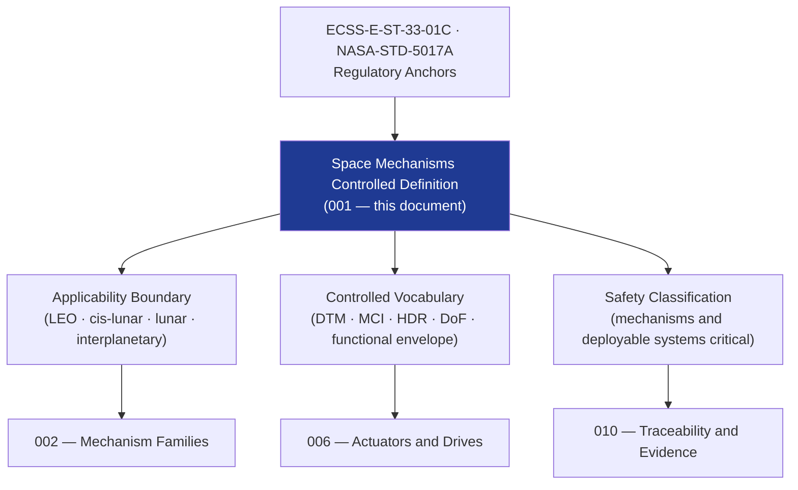

# STA 110-119 · 113-010 — Space Mechanisms Controlled Definition

## 1. Purpose

Establishes the **normative definition and controlled scope** of space mechanisms within the Q+ATLANTIDE STA band, defining applicability limits, key controlled terms, and the regulatory reference hierarchy per ECSS-E-ST-33-01C[^ecsse3301].

## 2. Scope

- Covers the *Space Mechanisms Controlled Definition* subsubject (`001`) of subsection `113`.
- Inherits Q-Division authority and ORB support from the parent row in [`../../README.md` §3](../../README.md#3-architecture-table)[^archtable].
- Concepts in scope:
  - **Controlled definition** — Space Mechanisms as all mechanical devices that perform a defined kinematic function (deployment, retention, drive, separation, capture) in the space environment throughout launch, ascent, orbit, and re-entry mission phases.
  - **Applicability boundary** — STA `113` covers mechanisms for all Q+ATLANTIDE STA-band missions: LEO stations, cis-lunar vehicles, lunar surface systems, and interplanetary transit craft; excludes propulsion valve mechanisms (→ `120`) and landing-leg actuators (→ `150`).
  - **Controlled vocabulary** — *mechanism*, *deployment*, *retention/release device*, *hold-down release (HDR)*, *driving torque margin (DTM)*, *functional envelope*, *kinematic chain*, *degrees of freedom (DoF)*, *mechanism critical item (MCI)*.
  - **Safety classification** — space mechanisms and deployable systems critical; all mechanisms shall have defined functional envelopes, driving torque margins per ECSS-E-ST-33-01C[^ecsse3301], and mechanism qualification evidence.
  - **Relationship to other subsections** — `110` (structures), `111` (materials), `114` (loads), `112` (thermal protection); deployment load inputs from `114`.

## 3. Diagram — Space Mechanisms Controlled Definition Framework

## 3. Footprint

| Metric | Value |
|---|---|
| Architecture | `STA` — Space Technology Architecture |
| Master range | `100–199` |
| Code range | `110-119` |
| Section | `01` — Estructuras y Materiales Espaciales |
| Subsection | `113` — Mecanismos Espaciales y Desplegables |
| Subsubject | `010` — Space Mechanisms Controlled Definition |
| Primary Q-Division | Q-SPACE[^qdiv] |
| Support Q-Divisions | Q-STRUCTURES, Q-DATAGOV, Q-HORIZON, Q-HPC, Q-INDUSTRY |
| ORB support | ORB-PMO, ORB-FIN |
| Governance class | `baseline`[^gov] |
| Folder path | `Q+ATLANTIDE/100-199_STA/110-119_Estructuras-y-Materiales-Espaciales/113_Mecanismos-Espaciales-y-Desplegables/` |
| Document | `113-010-Space-Mechanisms-Controlled-Definition.md` (this file) |
| Parent subsection | [`README.md`](./README.md) · [`113-000-General.md`](./113-000-General.md) |
| Parent architecture | [`../../README.md`](../../README.md) |
| Parent baseline | [`organization/Q+ATLANTIDE.md`](../../../../organization/Q+ATLANTIDE.md) |

## 5. References & Citations

[^baseline]: **Q+ATLANTIDE controlled baseline (v1.0.0)** — [`organization/Q+ATLANTIDE.md`](../../../../organization/Q+ATLANTIDE.md). Defines the controlled `000-999` architecture-band taxonomy and the ATLAS-1000 register subpart.

[^archtable]: **STA §3 Architecture Table** — [`../../README.md` §3](../../README.md#3-architecture-table). Authoritative source for the `110-119` row.

[^qdiv]: **Q-Division authority** — Q-Divisions provide technical authority over an architecture row (Q+ATLANTIDE Note N-002). See [`organization/Q+ATLANTIDE.md` §4](../../../../organization/Q+ATLANTIDE.md#4-notes).

[^gov]: **Governance class** — `baseline` denotes documents under controlled change management within the Q+ATLANTIDE baseline.

[^ecsse3301]: **ECSS-E-ST-33-01C Rev.2 — Space Engineering: Mechanisms** — European standard governing design, development, qualification and acceptance of space mechanisms including release devices, hinges, latches, drives and deployable systems.

[^ecsse33]: **ECSS-E-ST-33C — Space Engineering: Mechanisms General Requirements** — European standard defining general requirements for space mechanism design, analysis, testing, and documentation.

[^nasastd5017]: **NASA-STD-5017A — Design, Development, and Test Standard for Mechanisms** — NASA standard for mechanism design, development, qualification and acceptance testing.

[^nasahdbk7005]: **NASA-HDBK-7005 — Dynamic Environmental Criteria** — NASA handbook providing dynamic environmental criteria applicable to mechanism qualification testing.

[^iso9283]: **ISO 9283:1998 — Manipulating Industrial Robots: Performance Criteria and Related Test Methods** — Applicable to robotic deployment and drive systems performance characterisation.

### Applicable industry standards

- ECSS-E-ST-33-01C Rev.2 — Space Engineering: Mechanisms[^ecsse3301]
- ECSS-E-ST-33C — Space Engineering: Mechanisms General Requirements[^ecsse33]
- NASA-STD-5017A — Design, Development, and Test Standard for Mechanisms[^nasastd5017]
- NASA-HDBK-7005 — Dynamic Environmental Criteria[^nasahdbk7005]
- ISO 9283:1998 — Manipulating Industrial Robots: Performance Criteria and Related Test Methods[^iso9283]
