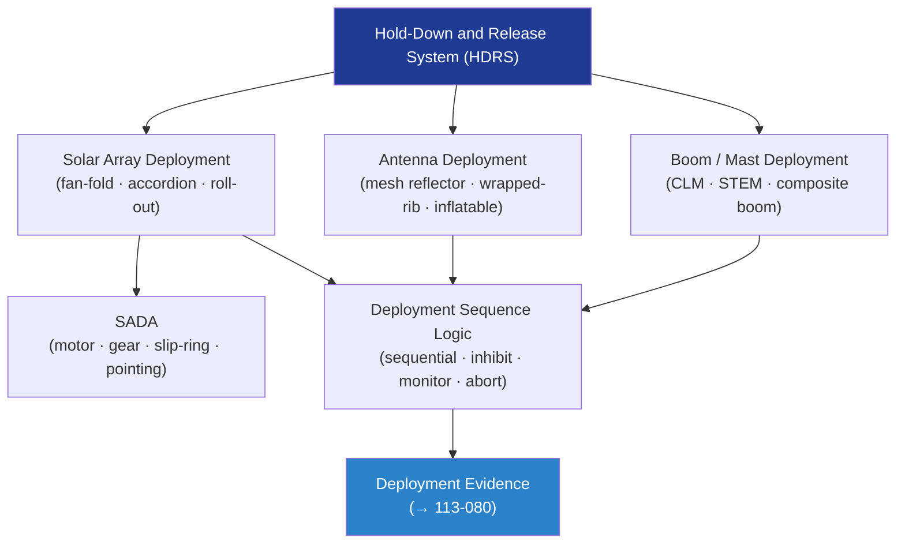

# STA 110-119 · 113-040 — Deployable Solar Array Antenna Boom and Mast Systems

## 1. Purpose

Defines the **design and verification requirements** for deployable solar arrays, deployable antennas, booms, and mast systems within Q+ATLANTIDE STA-band missions, covering deployment architecture, drive train, hold-down release, and deployment sequence logic per ECSS-E-ST-33-01C[^ecsse3301].

## 2. Scope

- Covers the *Deployable Solar Array, Antenna, Boom and Mast Systems* subsubject (`004`) of subsection `113`.
- Inherits Q-Division authority and ORB support from the parent row in [`../../README.md` §3](../../README.md#3-architecture-table)[^archtable].
- Concepts in scope:
  - **Deployable solar array architectures** — fan-fold, accordion, roll-out (ROSA), and hybrid composite panel arrays; deployed stiffness and fundamental frequency requirements.
  - **Deployable antenna systems** — mesh reflector, wrapped-rib, inflatable, and AstroMesh architectures; surface-accuracy (RMS) and deployment repeatability requirements.
  - **Deployable booms and masts** — coilable lattice masts (CLM), storable tubular extendible member (STEM), deployable composite booms; tip-mass and dynamic coupling to host spacecraft.
  - **Hold-down and release system (HDRS)** — hold-down points per panel/segment, clamp-band or bolt-cutter release, release-shock prediction and isolation.
  - **Deployment sequence logic** — sequential vs. simultaneous deployment, inhibit logic, deployment monitoring (current/position/torque), and abort-and-retract capability where required.
  - **Solar array drive assembly (SADA)** — drive motor selection, gear ratio, slip-ring power/signal capacity, pointing accuracy, and lifetime cycles budget.

## 3. Diagram — Deployable System Architecture

## 3. Footprint

| Metric | Value |
|---|---|
| Architecture | `STA` — Space Technology Architecture |
| Master range | `100–199` |
| Code range | `110-119` |
| Section | `01` — Estructuras y Materiales Espaciales |
| Subsection | `113` — Mecanismos Espaciales y Desplegables |
| Subsubject | `040` — Deployable Solar Array Antenna Boom and Mast Systems |
| Primary Q-Division | Q-SPACE[^qdiv] |
| Support Q-Divisions | Q-STRUCTURES, Q-DATAGOV, Q-HORIZON, Q-HPC, Q-INDUSTRY |
| ORB support | ORB-PMO, ORB-FIN |
| Governance class | `baseline`[^gov] |
| Folder path | `Q+ATLANTIDE/100-199_STA/110-119_Estructuras-y-Materiales-Espaciales/113_Mecanismos-Espaciales-y-Desplegables/` |
| Document | `113-040-Deployable-Solar-Array-Antenna-Boom-and-Mast-Systems.md` (this file) |
| Parent subsection | [`README.md`](./README.md) · [`113-000-General.md`](./113-000-General.md) |
| Parent architecture | [`../../README.md`](../../README.md) |
| Parent baseline | [`organization/Q+ATLANTIDE.md`](../../../../organization/Q+ATLANTIDE.md) |

## 5. References & Citations

[^baseline]: **Q+ATLANTIDE controlled baseline (v1.0.0)** — [`organization/Q+ATLANTIDE.md`](../../../../organization/Q+ATLANTIDE.md). Defines the controlled `000-999` architecture-band taxonomy and the ATLAS-1000 register subpart.

[^archtable]: **STA §3 Architecture Table** — [`../../README.md` §3](../../README.md#3-architecture-table). Authoritative source for the `110-119` row.

[^qdiv]: **Q-Division authority** — Q-Divisions provide technical authority over an architecture row (Q+ATLANTIDE Note N-002). See [`organization/Q+ATLANTIDE.md` §4](../../../../organization/Q+ATLANTIDE.md#4-notes).

[^gov]: **Governance class** — `baseline` denotes documents under controlled change management within the Q+ATLANTIDE baseline.

[^ecsse3301]: **ECSS-E-ST-33-01C Rev.2 — Space Engineering: Mechanisms** — European standard governing design, development, qualification and acceptance of space mechanisms including release devices, hinges, latches, drives and deployable systems.

[^ecsse33]: **ECSS-E-ST-33C — Space Engineering: Mechanisms General Requirements** — European standard defining general requirements for space mechanism design, analysis, testing, and documentation.

[^nasastd5017]: **NASA-STD-5017A — Design, Development, and Test Standard for Mechanisms** — NASA standard for mechanism design, development, qualification and acceptance testing.

[^nasahdbk7005]: **NASA-HDBK-7005 — Dynamic Environmental Criteria** — NASA handbook providing dynamic environmental criteria applicable to mechanism qualification testing.

[^iso9283]: **ISO 9283:1998 — Manipulating Industrial Robots: Performance Criteria and Related Test Methods** — Applicable to robotic deployment and drive systems performance characterisation.

### Applicable industry standards

- ECSS-E-ST-33-01C Rev.2 — Space Engineering: Mechanisms[^ecsse3301]
- ECSS-E-ST-33C — Space Engineering: Mechanisms General Requirements[^ecsse33]
- NASA-STD-5017A — Design, Development, and Test Standard for Mechanisms[^nasastd5017]
- NASA-HDBK-7005 — Dynamic Environmental Criteria[^nasahdbk7005]
- ISO 9283:1998 — Manipulating Industrial Robots: Performance Criteria and Related Test Methods[^iso9283]
