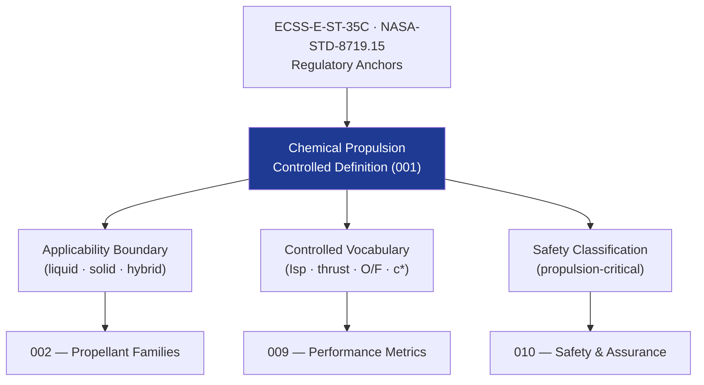

# STA 120-129 · Section 02 · Subsection 120 · Subsubject 001 — Chemical Propulsion Controlled Definition

## 1. Purpose

Establishes the **normative definition and controlled scope** of chemical propulsion within the Q+ATLANTIDE STA band, per ECSS-E-ST-35C[^ecssest35].

## 2. Scope

- Covers controlled definition for subsection `120`.
- **Controlled definition** — Chemical propulsion systems convert stored chemical energy (combustion or decomposition of propellants) into kinetic energy via controlled thrust generation to achieve orbital manoeuvring, attitude control, and de-orbit for Q+ATLANTIDE space platforms.
- **Applicability boundary** — STA `120` covers all chemical propulsion systems on Q+ATLANTIDE STA-band platforms; excludes electric propulsion (→ `121`), advanced/nuclear propulsion (→ `123`), and aerodynamic surfaces (→ ATLAS band).
- **Controlled vocabulary** — *specific impulse (Isp)*, *thrust*, *propellant mass fraction*, *mixture ratio (O/F)*, *characteristic velocity (c*)*, *thrust coefficient (C_F)*, *propellant combination*, *pressure-fed*, *pump-fed*, *monopropellant*, *bipropellant*.
- **Safety classification** — propulsion-critical; all propulsion elements shall have documented hazard analysis, propellant compatibility, and pressure-system assurance per NASA-STD-8719.15[^nasastd871915].

## 3. Diagram — Chemical Propulsion Definition Framework

## 4. Footprint

| Metric | Value |
|---|---|
| Architecture | `STA` — Space Technology Architecture |
| Subsection | `120` — Propulsión Química |
| Subsubject | `001` — Chemical Propulsion Controlled Definition |
| Primary Q-Division | Q-SPACE[^qdiv] |
| Governance class | `baseline`[^gov] |
| Document | `001_Chemical-Propulsion-Controlled-Definition.md` (this file) |
| Parent subsection | [`README.md`](./README.md) · [`000_Overview.md`](./000_Overview.md) |

## 5. References & Citations

[^ecssest35]: **ECSS-E-ST-35C — Propulsion General Requirements** — European standard for space propulsion systems.

[^nasastd871915]: **NASA-STD-8719.15 — Safety Standard for Explosives, Propellants and Pyrotechnics**.

[^qdiv]: **Q-Division authority** — See [`organization/Q+ATLANTIDE.md` §4](../../../../organization/Q+ATLANTIDE.md#4-notes).

[^gov]: **Governance class** — `baseline`.

### Applicable industry standards

- ECSS-E-ST-35C — Propulsion General Requirements[^ecssest35]
- NASA-STD-8719.15 — Safety Standard for Explosives, Propellants and Pyrotechnics[^nasastd871915]
