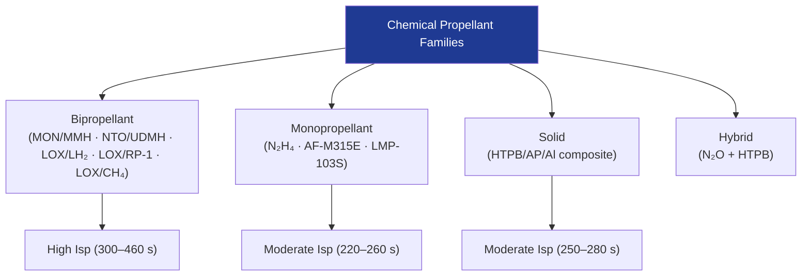

# STA 120-129 · Section 02 · Subsection 120 · Subsubject 002 — Propellant Families and Selection Criteria

## 1. Purpose

Defines the **taxonomy of chemical propellant families** — bipropellant, monopropellant, solid, and hybrid — and the mission-level selection criteria (Isp, storability, toxicity, temperature range, heritage).

## 2. Scope

- Propellant families: MON/MMH, NTO/UDMH (hypergolic bipropellant); LOX/LH₂, LOX/RP-1, LOX/LCH₄ (cryogenic bipropellant); hydrazine, AF-M315E, LMP-103S (monopropellant); HTPB/AP/Al (composite solid); hybrid (N₂O/HTPB).
- Selection criteria: delivered Isp; storability (pressure vs. cryogenic); toxicity class (REACH/GHS); mission impulse budget; heritage and TRL; compatibility with feed system materials (→ `007`).

## 3. Diagram — Propellant Family Taxonomy

## 4. Footprint

| Metric | Value |
|---|---|
| Architecture | `STA` — Space Technology Architecture |
| Subsection | `120` — Propulsión Química |
| Subsubject | `002` — Propellant Families and Selection Criteria |
| Primary Q-Division | Q-SPACE[^qdiv] |
| Governance class | `baseline`[^gov] |
| Document | `002_Propellant-Families-and-Selection-Criteria.md` (this file) |

## 5. References & Citations

[^qdiv]: **Q-Division authority** — See [`organization/Q+ATLANTIDE.md` §4](../../../../organization/Q+ATLANTIDE.md#4-notes).

[^gov]: **Governance class** — `baseline`.

### Applicable industry standards

- ECSS-E-ST-35C — Propulsion General Requirements
- NASA-STD-8719.15 — Safety Standard for Explosives, Propellants and Pyrotechnics
