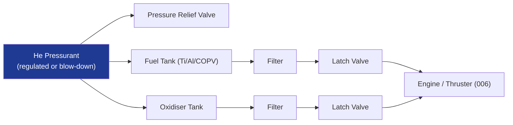

# STA 120-129 · Section 02 · Subsection 120 · Subsubject 007 — Feed Systems, Tanks, Valves and Pressurization

## 1. Purpose

Defines the **propellant feed system** — propellant tanks, pressurant bottles, fill/drain valves, filter assemblies, latch valves, pyro valves, and pressure-regulation components — and their structural and materials interfaces (→ `110`, `111`).

## 2. Scope

- Tank design: spherical/cylindrical metallic (Ti-6Al-4V, 6061-T6 Al) or COPV (carbon-overwrapped pressure vessel); propellant management devices (PMDs): screen/vane, surface-tension); tank MEOP; proof factor 1.5×; burst factor 2.0×.
- Pressurisation: blow-down (simple, Δ P_c with burnout) vs. regulated (bang-bang or PRV); pressurant: He, GN₂.
- Valves: isolation/latch valve (normally-closed); fill/drain valve; filter (10–25 μm); check valve; pressure-relief valve (PRV); pyro valve (one-shot actuator).
- Propellant compatibility: material selection per propellant (PTFE seals for NTO/MON; Ti-6Al-4V for MMH/NTO; 316SS for H₂O₂).

## 3. Diagram — Feed System Schematic

## 4. Footprint

| Metric | Value |
|---|---|
| Architecture | `STA` — Space Technology Architecture |
| Subsection | `120` — Propulsión Química |
| Subsubject | `007` — Feed Systems, Tanks, Valves and Pressurization |
| Primary Q-Division | Q-SPACE[^qdiv] |
| Governance class | `baseline`[^gov] |
| Document | `007_Feed-Systems-Tanks-Valves-and-Pressurization.md` (this file) |

## 5. References & Citations

[^qdiv]: **Q-Division authority** — See [`organization/Q+ATLANTIDE.md` §4](../../../../organization/Q+ATLANTIDE.md#4-notes).

[^gov]: **Governance class** — `baseline`.

### Applicable industry standards

- ECSS-E-ST-35C — Propulsion General Requirements
- NASA-STD-5012 — Structural Test Requirements for Liquid Propulsion Systems
- AIAA S-080 — Space Systems Metallic Pressure Vessels, Pressurised Structures and Pressure Components
