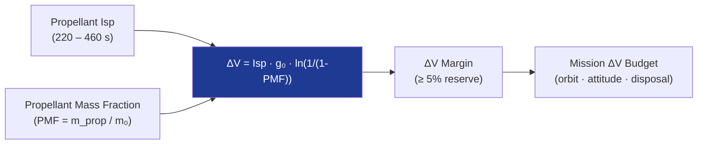

# STA 120-129 · Section 02 · Subsection 120 · Subsubject 009 — Performance Metrics: Isp, Thrust and Mass Fraction

## 1. Purpose

Defines the **key chemical propulsion performance metrics** — specific impulse (Isp), thrust, thrust-to-weight ratio (T/W), propellant mass fraction (PMF), and ΔV capability — and the methodology for calculating delivered performance margins.

## 2. Scope

- Specific impulse: Isp = F / (ṁ · g₀) [s]; vacuum vs. sea-level Isp; delivered Isp efficiency η (typically 92–98%); typical ranges: N₂H₄ monoprop ≈ 220–230 s; NTO/MMH biprop ≈ 310–320 s; LOX/LH₂ ≈ 450–460 s; LOX/RP-1 ≈ 310–360 s.
- Thrust: F = ṁ · Isp · g₀; thrust range (mN RCS thrusters → MN launch vehicles); thrust-to-weight T/W = F / (m₀ · g₀).
- Propellant mass fraction: PMF = m_prop / m₀; Tsiolkovsky rocket equation: ΔV = Isp · g₀ · ln(m₀/m_f).
- Mission ΔV budget: deterministic + statistical margin; residual propellant reserve; end-of-life ΔV.

## 3. Diagram — ΔV Budget and Isp Trade

## 4. Footprint

| Metric | Value |
|---|---|
| Architecture | `STA` — Space Technology Architecture |
| Subsection | `120` — Propulsión Química |
| Subsubject | `009` — Performance Metrics: Isp, Thrust and Mass Fraction |
| Primary Q-Division | Q-SPACE[^qdiv] |
| Governance class | `baseline`[^gov] |
| Document | `009_Performance-Metrics-Isp-Thrust-and-Mass-Fraction.md` (this file) |

## 5. References & Citations

[^qdiv]: **Q-Division authority** — See [`organization/Q+ATLANTIDE.md` §4](../../../../organization/Q+ATLANTIDE.md#4-notes).

[^gov]: **Governance class** — `baseline`.

### Applicable industry standards

- ECSS-E-ST-35C — Propulsion General Requirements
