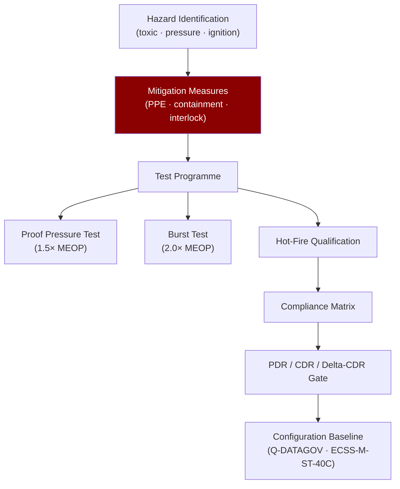

# STA 120-129 · Section 02 · Subsection 120 · Subsubject 010 — Safety, Hazards, Testing and Assurance Boundaries

## 1. Purpose

Defines the **propulsion safety framework** — hazard identification, propellant toxicity and flammability classification, pressure-system assurance (proof/burst), acceptance/qualification test sequence, handling procedures, and lifecycle traceability — per ECSS-E-ST-35C[^ecssest35] and NASA-STD-8719.15[^nasastd871915].

## 2. Scope

- Hazard taxonomy: toxic propellant exposure (IDLH; PPE; emergency procedures); fire/explosion (hypergolic ignition; liquid propellant spill); pressure-system burst (fragmentation, blast overpressure); unintended ignition (ESD; heat; shock).
- Propellant compatibility: material selection for seals, valves, tubing (PTFE/Kel-F for NTO; Ti/Al for MMH); REACH/RoHS compliance tracking for green propellants (AF-M315E, LMP-103S).
- Pressure-system assurance: MEOP; proof pressure test (1.5×MEOP); acceptance proof; burst test (2.0×MEOP, one specimen); leak test (He mass spectrometer).
- Test flow: component acceptance → subsystem proof → system functional → hot-fire qualification → flight acceptance.
- Handling: propellant loading procedures; personal protective equipment (PPE) requirements; containment zones; emergency spill response; transport classification (DOT/IATA).

## 3. Diagram — Propulsion Safety and Test Assurance Chain

## 4. Footprint

| Metric | Value |
|---|---|
| Architecture | `STA` — Space Technology Architecture |
| Subsection | `120` — Propulsión Química |
| Subsubject | `010` — Safety, Hazards, Testing and Assurance Boundaries |
| Primary Q-Division | Q-SPACE[^qdiv] |
| Governance class | `baseline`[^gov] |
| Safety boundary | propulsion-critical |
| Document | `010_Safety-Hazards-Testing-and-Assurance-Boundaries.md` (this file) |
| Parent subsection | [`README.md`](./README.md) |

## 5. References & Citations

[^ecssest35]: **ECSS-E-ST-35C — Propulsion General Requirements** — European standard for space propulsion systems.

[^nasastd871915]: **NASA-STD-8719.15 — Safety Standard for Explosives, Propellants and Pyrotechnics**.

[^qdiv]: **Q-Division authority** — See [`organization/Q+ATLANTIDE.md` §4](../../../../organization/Q+ATLANTIDE.md#4-notes).

[^gov]: **Governance class** — `baseline`.

### Applicable industry standards

- ECSS-E-ST-35C — Propulsion General Requirements[^ecssest35]
- ECSS-M-ST-40C — Configuration and Information Management
- NASA-STD-8719.15 — Safety Standard for Explosives, Propellants and Pyrotechnics[^nasastd871915]
- NASA-STD-5012 — Structural Test Requirements for Liquid Propulsion Systems
- AIAA S-080 — Space Systems Metallic Pressure Vessels
