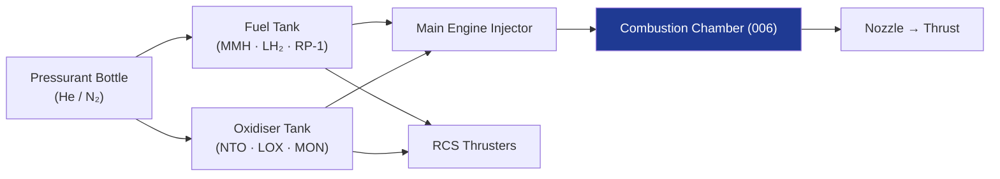

# STA 120-129 · 120-030 — Liquid Propulsion Systems

## 1. Purpose

Defines the **liquid propulsion system architectures** — pressure-fed and pump-fed — for main propulsion engines and reaction-control system (RCS) thrusters on Q+ATLANTIDE STA-band platforms.

## 2. Scope

- Covers liquid propulsion system topologies within subsection `120`.
- Architectures: pressure-fed blow-down (simple, variable thrust); pressure-fed regulated (constant chamber pressure); turbopump-fed (gas generator, staged combustion, expander cycle); electric pump-fed (EP-fed) emerging architectures.
- Components: propellant tanks (→ `007`); pressurant (He/N₂); latch valves; pyro valves; main injectors; main chamber; nozzle (→ `006`); RCS thruster clusters (200 mN – 400 N range).

## 3. Diagram — Liquid Propulsion System Topology

## 4. Footprint

| Metric | Value |
|---|---|
| Architecture | `STA` — Space Technology Architecture |
| Subsection | `120` — Propulsión Química |
| Subsubject | `003` — Liquid Propulsion Systems |
| Primary Q-Division | Q-SPACE[^qdiv] |
| Governance class | `baseline`[^gov] |
| Document | `120-030-Liquid-Propulsion-Systems.md` (this file) |

## 5. References & Citations

[^qdiv]: **Q-Division authority** — See [`organization/Q+ATLANTIDE.md` §4](../../../../organization/Q+ATLANTIDE.md#4-notes).

[^gov]: **Governance class** — `baseline`.

### Applicable industry standards

- ECSS-E-ST-35C — Propulsion General Requirements
- NASA-STD-5012 — Structural Test Requirements for Liquid Propulsion Systems
