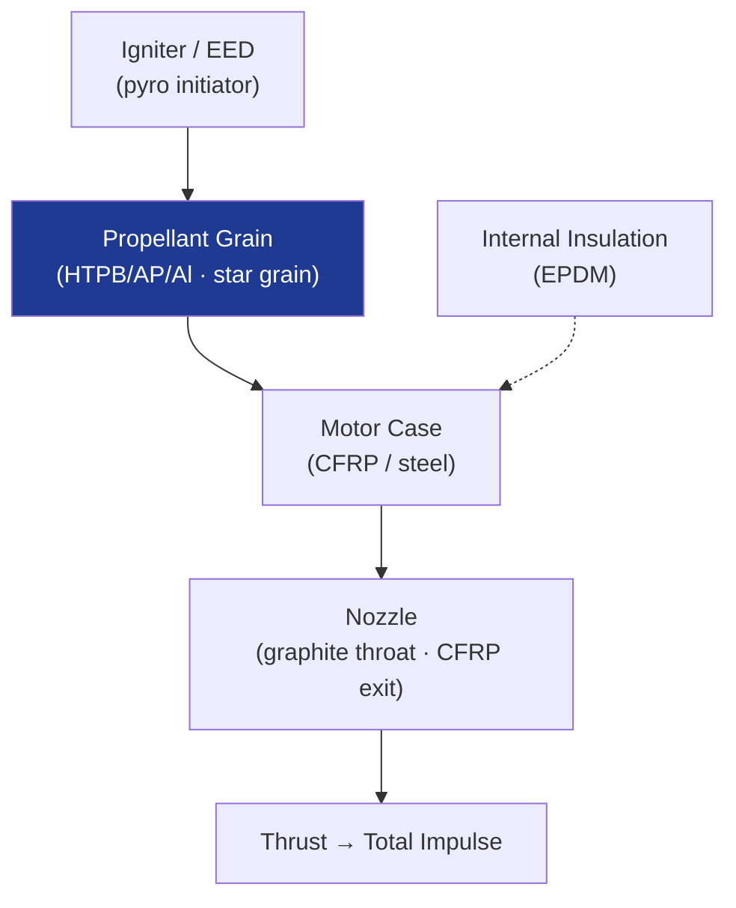

# STA 120-129 · 120-040 — Solid Propulsion Systems

## 1. Purpose

Defines **solid rocket motor (SRM) systems** — grain geometry, propellant formulations, insulation and case design, nozzle configuration, and ignition architecture — and their use in launch upper stages, kick motors, and separation systems.

## 2. Scope

- Grain geometries: cylindrical, star, finocyl, wagon-wheel (burn-rate tailoring); HTPB/AP/Al composite propellant; energetic binders (GAP); burn rate modifiers.
- Case design: filament-wound CFRP / metal-lined CFRP; internal insulation (EPDM/silicone); nozzle (graphite/C-C throat, submerged vs. exit nozzle).
- Ignition: electro-explosive devices (EEDs), safe/arm mechanisms; thermal pyro initiators.
- Performance drivers: volumetric loading fraction; burn rate pressure exponent (n); action time; total impulse; delivered Isp (250–280 s).

## 3. Diagram — Solid Rocket Motor Architecture

## 4. Footprint

| Metric | Value |
|---|---|
| Architecture | `STA` — Space Technology Architecture |
| Subsection | `120` — Propulsión Química |
| Subsubject | `004` — Solid Propulsion Systems |
| Primary Q-Division | Q-SPACE[^qdiv] |
| Governance class | `baseline`[^gov] |
| Document | `120-040-Solid-Propulsion-Systems.md` (this file) |

## 5. References & Citations

[^qdiv]: **Q-Division authority** — See [`organization/Q+ATLANTIDE.md` §4](../../../../organization/Q+ATLANTIDE.md#4-notes).

[^gov]: **Governance class** — `baseline`.

### Applicable industry standards

- ECSS-E-ST-35C — Propulsion General Requirements
- NASA-STD-8719.15 — Safety Standard for Explosives, Propellants and Pyrotechnics
