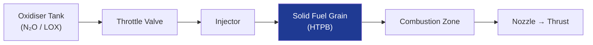

# STA 120-129 · 120-050 — Hybrid Propulsion Systems

## 1. Purpose

Defines **hybrid propulsion system architectures** combining a liquid/gaseous oxidiser with a solid fuel, covering throttleability, safety advantages, and mission applicability.

## 2. Scope

- Configurations: liquid oxidiser + solid fuel (N₂O/HTPB, LOX/HTPB, H₂O₂/HTPB, GOX/HTPB); gaseous oxidiser variants.
- Throttleability: oxidiser mass flow control (throttle valve) enables variable thrust (10–100%); restart capability distinguishes hybrid from solid.
- Safety: no energetic pre-mix (oxidiser separated from fuel at rest); lower handling hazard vs. bipropellant hypergolic; compatible with non-toxic oxidiser options (N₂O, H₂O₂).
- Limitations: regression rate uniformity; O/F shift with burn time; lower TRL vs. liquid or solid in orbital applications.

## 3. Diagram — Hybrid System Architecture

## 4. Footprint

| Metric | Value |
|---|---|
| Architecture | `STA` — Space Technology Architecture |
| Subsection | `120` — Propulsión Química |
| Subsubject | `005` — Hybrid Propulsion Systems |
| Primary Q-Division | Q-SPACE[^qdiv] |
| Governance class | `baseline`[^gov] |
| Document | `120-050-Hybrid-Propulsion-Systems.md` (this file) |

## 5. References & Citations

[^qdiv]: **Q-Division authority** — See [`organization/Q+ATLANTIDE.md` §4](../../../../organization/Q+ATLANTIDE.md#4-notes).

[^gov]: **Governance class** — `baseline`.

### Applicable industry standards

- ECSS-E-ST-35C — Propulsion General Requirements
