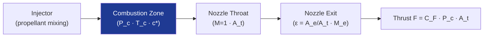

# STA 120-129 · 120-060 — Combustion Chambers Nozzles and Thrust Generation

## 1. Purpose

Defines the **combustion chamber and nozzle design** — chamber pressure, injector configuration, characteristic velocity (c*), thrust coefficient (C_F), nozzle expansion ratio, and thermal/structural margins — and the interface with TPS materials (→ `112`).

## 2. Scope

- Chamber design: cylindrical combustion chamber with converging-diverging (De Laval) nozzle; characteristic length (L*); chamber pressure P_c (1–300 bar); injector types (showerhead, swirl, impinging doublet/triplet, pintle).
- Nozzle: conical, bell (80% bell), truncated ideal contour (TIC); expansion ratio ε = A_e/A_t; nozzle materials (C-C, Nb, Iridium-lined Rhenium, film-cooled steel); radiation-cooled vs. film-cooled vs. regeneratively cooled.
- Performance: specific impulse Isp = c* · C_F / g₀; thrust F = C_F · P_c · A_t; delivered vs. theoretical Isp efficiency.

## 3. Diagram — Chamber and Nozzle Thermodynamics

## 4. Footprint

| Metric | Value |
|---|---|
| Architecture | `STA` — Space Technology Architecture |
| Subsection | `120` — Propulsión Química |
| Subsubject | `006` — Combustion Chambers, Nozzles and Thrust Generation |
| Primary Q-Division | Q-SPACE[^qdiv] |
| Governance class | `baseline`[^gov] |
| Document | `120-060-Combustion-Chambers-Nozzles-and-Thrust-Generation.md` (this file) |

## 5. References & Citations

[^qdiv]: **Q-Division authority** — See [`organization/Q+ATLANTIDE.md` §4](../../../../organization/Q+ATLANTIDE.md#4-notes).

[^gov]: **Governance class** — `baseline`.

### Applicable industry standards

- ECSS-E-ST-35C — Propulsion General Requirements
- NASA-SP-8120 — Selection of Materials for Rocket Exhaust Plume Components
