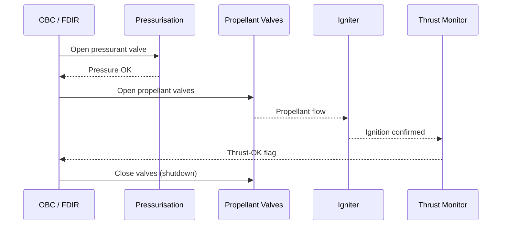

# STA 120-129 · 120-080 — Ignition Start Stop and Throttle Boundaries

## 1. Purpose

Defines the **ignition system types, start/stop sequence logic, restart envelope, throttle boundaries, and minimum impulse bit (MIB)** constraints for liquid, solid, and hybrid propulsion, and their interface with avionics FDIR (→ `103`).

## 2. Scope

- Ignition methods: hypergolic self-ignition (NTO/MMH — no igniter required); spark igniter (LOX/LH₂ · LOX/RP-1); augmented spark igniter (ASI); catalytic bed (hydrazine decomposition); pyrotechnic initiator (solid/hybrid).
- Start sequence: pressurisation → valve open → ignition verify → thrust-OK flag; typical start transient ≤ 1 s.
- Stop sequence: propellant valve close → pressurant isolation → purge (if applicable); minimum off-time between restarts (thermal soak-back constraint).
- Throttle boundaries: minimum throttle level (min. stable combustion) ≥ 10% thrust; maximum throttle = 100% rated thrust; throttle ramp rate (% thrust/s) per structural loads (→ `110`).
- MIB: minimum impulse bit for RCS thrusters (pulse-mode operation ≥ 0.5 N·s).

## 3. Diagram — Ignition and Start Sequence

## 4. Footprint

| Metric | Value |
|---|---|
| Architecture | `STA` — Space Technology Architecture |
| Subsection | `120` — Propulsión Química |
| Subsubject | `008` — Ignition, Start-Stop and Throttle Boundaries |
| Primary Q-Division | Q-SPACE[^qdiv] |
| Governance class | `baseline`[^gov] |
| Document | `120-080-Ignition-Start-Stop-and-Throttle-Boundaries.md` (this file) |

## 5. References & Citations

[^qdiv]: **Q-Division authority** — See [`organization/Q+ATLANTIDE.md` §4](../../../../organization/Q+ATLANTIDE.md#4-notes).

[^gov]: **Governance class** — `baseline`.

### Applicable industry standards

- ECSS-E-ST-35C — Propulsion General Requirements
- NASA-STD-8719.15 — Safety Standard for Explosives, Propellants and Pyrotechnics
