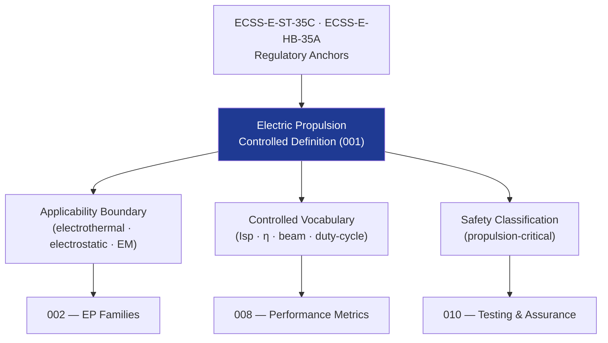

# STA 120-129 · Section 02 · Subsection 121 · Subsubject 001 — Electric Propulsion Controlled Definition

## 1. Purpose

Establishes the **normative definition and controlled scope** of electric propulsion within the Q+ATLANTIDE STA band, per ECSS-E-ST-35C[^ecssest35].

## 2. Scope

- **Controlled definition** — Electric propulsion systems convert electrical energy into thrust by accelerating a propellant using electrothermal heating, electrostatic fields, or electromagnetic forces, achieving specific impulses typically in the range of 500–10 000 s for Q+ATLANTIDE space platforms.
- **Applicability boundary** — STA `121` covers all electric propulsion subsystems on Q+ATLANTIDE STA-band platforms; excludes chemical propulsion (→ `120`), nuclear propulsion concepts (→ `122`), and advanced/experimental systems (→ `123`).
- **Controlled vocabulary** — *specific impulse (Isp)*, *thrust efficiency (η)*, *beam current*, *discharge voltage*, *Hall parameter*, *propellant utilisation efficiency*, *total impulse*, *power-to-thrust ratio*, *duty cycle*, *plume half-angle*.
- **Safety classification** — propulsion-critical; all EP subsystems shall have documented power-interface assurance, PPU validation evidence, plume interaction analysis, EMC characterisation, and thermal management per ECSS-E-HB-35A[^ecsshb35a].

## 3. Diagram — Electric Propulsion Definition Framework

## 4. Footprint

| Metric | Value |
|---|---|
| Architecture | `STA` — Space Technology Architecture |
| Subsection | `121` — Propulsión Eléctrica |
| Subsubject | `001` — Electric Propulsion Controlled Definition |
| Primary Q-Division | Q-SPACE[^qdiv] |
| Governance class | `baseline`[^gov] |
| Document | `001_Electric-Propulsion-Controlled-Definition.md` (this file) |
| Parent subsection | [`README.md`](./README.md) · [`000_Overview.md`](./000_Overview.md) |

## 5. References & Citations

[^ecssest35]: **ECSS-E-ST-35C — Propulsion General Requirements** — European standard for space propulsion systems.

[^ecsshb35a]: **ECSS-E-HB-35A — Propulsion Handbook** — European handbook for space propulsion systems design and testing.

[^qdiv]: **Q-Division authority** — See [`organization/Q+ATLANTIDE.md` §4](../../../../organization/Q+ATLANTIDE.md#4-notes).

[^gov]: **Governance class** — `baseline`.

### Applicable industry standards

- ECSS-E-ST-35C — Propulsion General Requirements[^ecssest35]
- ECSS-E-HB-35A — Propulsion Handbook[^ecsshb35a]
