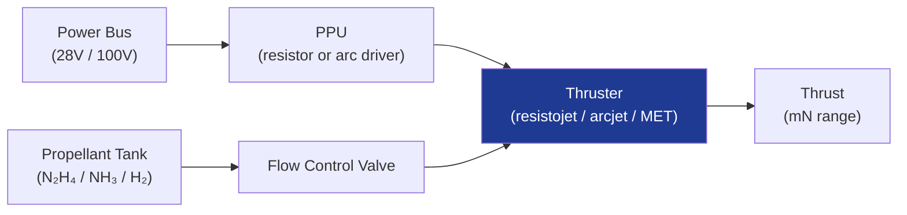

# STA 120-129 · Section 02 · Subsection 121 · Subsubject 003 — Electrothermal Propulsion

## 1. Purpose

Defines **electrothermal propulsion** systems architecture, performance envelope, and application boundaries for Q+ATLANTIDE STA-band platforms.

## 2. Scope

- **Resistojets** — Propellant heated by resistive element; Isp 150–300 s; power 0.1–1 kW; propellants: hydrazine, ammonia, N₂, CO₂; heritage: ACS/reaction control.
- **Arcjets** — Propellant heated by electric arc discharge; Isp 450–1 800 s; power 0.5–30 kW; propellants: hydrazine, ammonia, hydrogen; heritage: GEO station-keeping (ETS-VI, DS-1).
- **Microwave electrothermal thrusters (MET)** — Microwave-excited plasma heats propellant; Isp 500–1 500 s; research/SmallSat applications.
- **Design constraints** — Electrode erosion lifetime (arcjet cathode ≥ 10 000 h per ECSS-E-ST-35C[^ecssest35]), heat soak-back to spacecraft, PPU mass and efficiency (η > 80%), restart envelope.
- **Interface boundaries** — Power bus (28 V or 100 V regulated), propellant feed line (compatible with upstream tank isolation), thermal isolator on thruster mounting bracket.

## 3. Diagram — Electrothermal Propulsion Architecture

## 4. Footprint

| Metric | Value |
|---|---|
| Subsection | `121` — Propulsión Eléctrica |
| Subsubject | `003` — Electrothermal Propulsion |
| Primary Q-Division | Q-SPACE[^qdiv] |
| Governance class | `baseline`[^gov] |
| Document | `003_Electrothermal-Propulsion.md` (this file) |

## 5. References & Citations

[^ecssest35]: **ECSS-E-ST-35C — Propulsion General Requirements**.

[^qdiv]: **Q-Division authority** — See [`organization/Q+ATLANTIDE.md` §4](../../../../organization/Q+ATLANTIDE.md#4-notes).

[^gov]: **Governance class** — `baseline`.

### Applicable industry standards

- ECSS-E-ST-35C — Propulsion General Requirements[^ecssest35]
