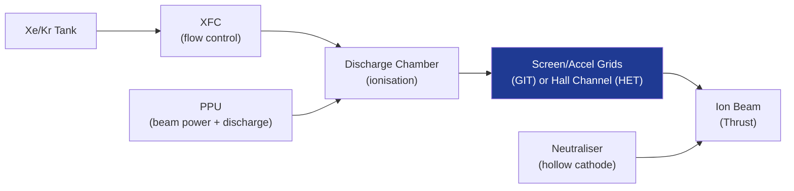

# STA 120-129 · Section 02 · Subsection 121 · Subsubject 004 — Electrostatic Propulsion: Ion and Hall Effect

## 1. Purpose

Defines **gridded ion thruster and Hall-effect thruster (HET)** architectures, performance envelopes, and application boundaries.

## 2. Scope

- **Gridded ion thrusters (GIT)** — Ionisation chamber + screen/accel grids; Isp 2 000–10 000 s; thrust 0.1–250 mN; propellants: Xe, Kr; heritage: Dawn (NSTAR), Hayabusa (µ10), BepiColombo (T6); neutraliser (hollow cathode) required.
- **Hall-effect thrusters (HET/SPT)** — Magnetic field confines electron drift creating Hall current; ions accelerated in axial electric field; Isp 1 500–3 500 s; thrust 5 mN–1 N; propellants: Xe, Kr; heritage: PPS-1350 (SMART-1), SPT-100, SPT-200, BHT-20k.
- **Erosion and lifetime** — Grid/wall erosion limits mission life; qualification per ECSS-E-ST-35C[^ecssest35]: endurance test ≥ mission life × 1.5 (heritage basis) or 2.0 (new design); µTh class: 10 000+ h demonstrated.
- **Power/propellant interfaces** — GIT: 300–1 200 V beam, 0.1–5 A beam current; HET: 200–700 V discharge, 1–50 A; xenon flow controller (XFC) flow range 0.1–10 mg/s.
- **Plume considerations** — Charge-exchange (CEX) plume impingement on solar arrays and optics; addressed in `009`.

## 3. Diagram — Electrostatic EP Architecture

## 4. Footprint

| Metric | Value |
|---|---|
| Subsection | `121` — Propulsión Eléctrica |
| Subsubject | `004` — Electrostatic Propulsion: Ion and Hall Effect |
| Primary Q-Division | Q-SPACE[^qdiv] |
| Governance class | `baseline`[^gov] |
| Document | `004_Electrostatic-Propulsion-Ion-and-Hall-Effect.md` (this file) |

## 5. References & Citations

[^ecssest35]: **ECSS-E-ST-35C — Propulsion General Requirements**.

[^qdiv]: **Q-Division authority** — See [`organization/Q+ATLANTIDE.md` §4](../../../../organization/Q+ATLANTIDE.md#4-notes).

[^gov]: **Governance class** — `baseline`.

### Applicable industry standards

- ECSS-E-ST-35C — Propulsion General Requirements[^ecssest35]
