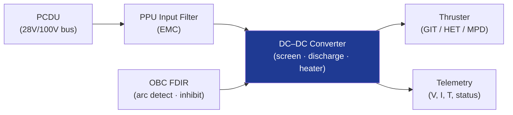

# STA 120-129 · Section 02 · Subsection 121 · Subsubject 006 — Power Processing Units and Electrical Interfaces

## 1. Purpose

Defines **Power Processing Unit (PPU) architecture, electrical interface requirements**, and PCDU coupling for electric propulsion on Q+ATLANTIDE STA-band platforms.

## 2. Scope

- **PPU functions** — Converts spacecraft bus voltage to thruster operating voltages; DC–DC conversion stages for discharge power, screen/accel voltage (GIT), heating power, keeper/igniter circuits; neutraliser heater supply.
- **Interface standard** — Input bus: 28 V (LEO heritage) or 100 V (GEO/deep-space heritage); ECSS-E-ST-20C[^ecssest20c] power bus standard compliance; galvanic isolation between bus and thruster circuits.
- **PPU efficiency** — η > 90% target for high-power EP; thermal dissipation in PPU chassis (radiator or conduction to platform); thermal model interfaced with spacecraft thermal budget.
- **EMC compliance** — Conducted/radiated emission limits per ECSS-E-ST-20-07C[^ecssemcc]; filter network on input bus; shielding of high-voltage harness.
- **FDIR integration** — PPU over-current, over-voltage, arc detection (current spike detection); inhibit signal from spacecraft OBC; redundant PPU architecture for critical missions.
- **Mass drivers** — PPU mass ~20–35% of total EP subsystem; key qualification heritage (T6 PPU for BepiColombo, BHT series PPU for commercial GEO).

## 3. Diagram — PPU Interface Architecture

## 4. Footprint

| Metric | Value |
|---|---|
| Subsection | `121` — Propulsión Eléctrica |
| Subsubject | `006` — Power Processing Units and Electrical Interfaces |
| Primary Q-Division | Q-SPACE[^qdiv] |
| Governance class | `baseline`[^gov] |
| Document | `006_Power-Processing-Units-and-Electrical-Interfaces.md` (this file) |

## 5. References & Citations

[^ecssest20c]: **ECSS-E-ST-20C — Electrical and Electronic** — Spacecraft electrical/electronic standard.

[^ecssemcc]: **ECSS-E-ST-20-07C — Electromagnetic Compatibility**.

[^qdiv]: **Q-Division authority** — See [`organization/Q+ATLANTIDE.md` §4](../../../../organization/Q+ATLANTIDE.md#4-notes).

[^gov]: **Governance class** — `baseline`.

### Applicable industry standards

- ECSS-E-ST-20C — Electrical and Electronic[^ecssest20c]
- ECSS-E-ST-20-07C — Electromagnetic Compatibility[^ecssemcc]
- ECSS-E-ST-35C — Propulsion General Requirements
