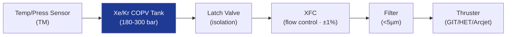

# STA 120-129 · Section 02 · Subsection 121 · Subsubject 007 — Propellant Feed, Storage and Compatibility

## 1. Purpose

Defines **propellant feed system, storage, and compatibility requirements** for electric propulsion on Q+ATLANTIDE STA-band platforms.

## 2. Scope

- **Propellant types** — Xenon (Xe): primary heritage EP propellant, boiling point −108 °C, stored as high-pressure gas (180–300 bar) or supercritical liquid (> 5.84 MPa, > −112 °C); Krypton (Kr): lower cost, comparable performance, higher storage pressure; Iodine (I₂): solid at ambient, sublimated for CubeSat EP; Bismuth (Bi): FEEP thruster propellant.
- **Storage tank** — Composite overwrapped pressure vessel (COPV) or metallic; compatibility with propellant (Xe/SS316L/Al); leak rate < 10⁻⁶ scc/s He-equivalent; burst factor ≥ 2.0 (ECSS-E-ST-35C[^ecssest35]).
- **Flow control** — Flow control valve (latching or proportional); xenon flow controller (XFC) accuracy ±1%; latch valve for isolation; filter (< 5 µm) upstream of thruster.
- **Compatibility** — All wetted materials shall be qualified for propellant contact; elastomers (PTFE, PEEK); seals torque-down specification; propellant contamination limit < 10 ppm for GIT grids.
- **Pressurisation** — Self-pressurising from tank vapour pressure; no separate pressurant needed for xenon; iodine requires dedicated heater system for sublimation.

## 3. Diagram — EP Propellant Feed System

## 4. Footprint

| Metric | Value |
|---|---|
| Subsection | `121` — Propulsión Eléctrica |
| Subsubject | `007` — Propellant Feed, Storage and Compatibility |
| Primary Q-Division | Q-SPACE[^qdiv] |
| Governance class | `baseline`[^gov] |
| Document | `007_Propellant-Feed-Storage-and-Compatibility.md` (this file) |

## 5. References & Citations

[^ecssest35]: **ECSS-E-ST-35C — Propulsion General Requirements**.

[^qdiv]: **Q-Division authority** — See [`organization/Q+ATLANTIDE.md` §4](../../../../organization/Q+ATLANTIDE.md#4-notes).

[^gov]: **Governance class** — `baseline`.

### Applicable industry standards

- ECSS-E-ST-35C — Propulsion General Requirements[^ecssest35]
- ECSS-E-ST-35-06C — Liquid and Electric Propulsion for Spacecraft Subsystems
