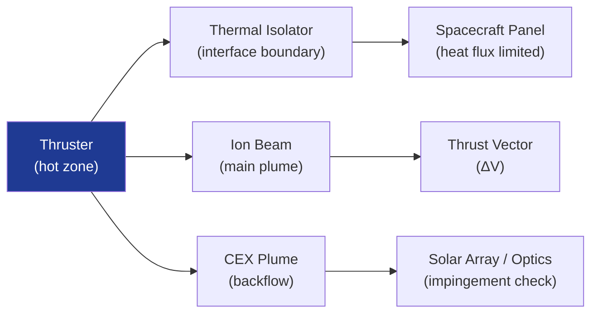

# STA 120-129 · Section 02 · Subsection 121 · Subsubject 009 — Thermal, EMC and Plume Interaction Boundaries

## 1. Purpose

Defines **thermal environment, EMC boundaries, and plume interaction analysis requirements** for electric propulsion on Q+ATLANTIDE STA-band platforms.

## 2. Scope

- **Thruster thermal zone** — Thruster body temperature 100–400 °C (HET discharge channel); thermal isolator at mounting interface (ECSS-E-ST-31C[^ecssest31c]); temperature telemetry required; heat soak-back to spacecraft panel limited per thermal model.
- **PPU thermal** — PPU thermal dissipation (10–100 W) conducted/radiated to spacecraft; PPU qualification temperature range per mission environment.
- **EMC — conducted emissions** — High-voltage arc events, ripple on input bus; filter network specification; ECSS-E-ST-20-07C[^ecssemcc] limit classes; neutraliser RF noise; coupling through structure.
- **EMC — radiated emissions** — Ion beam RF emission characterisation; magnetic dipole from coils (AF-MPD, MET); magnetic cleanliness per magnetometer requirements; ECSS-E-ST-20-07C exclusion zones.
- **Plume impingement** — CEX ions deposit on solar array cells (sputtering), thermal radiators (contamination), optical surfaces; plume half-angle ~60–80° for HET; backflow CEX flux analysis required; keepout zones defined relative to thruster vector.
- **Plume backpressure** — Neutral xenon/krypton ingestion by sensitive instruments (mass spectrometers, optical sensors); contamination level < 1 monolayer/mission per ECSS-Q-ST-70-01C[^ecssq].

## 3. Diagram — EP Thermal and Plume Boundaries

## 4. Footprint

| Metric | Value |
|---|---|
| Subsection | `121` — Propulsión Eléctrica |
| Subsubject | `009` — Thermal, EMC and Plume Interaction Boundaries |
| Primary Q-Division | Q-SPACE[^qdiv] |
| Governance class | `baseline`[^gov] |
| Document | `009_Thermal-EMC-and-Plume-Interaction-Boundaries.md` (this file) |

## 5. References & Citations

[^ecssest31c]: **ECSS-E-ST-31C — Thermal Control General Requirements**.

[^ecssemcc]: **ECSS-E-ST-20-07C — Electromagnetic Compatibility**.

[^ecssq]: **ECSS-Q-ST-70-01C — Cleanliness and Contamination Control**.

[^qdiv]: **Q-Division authority** — See [`organization/Q+ATLANTIDE.md` §4](../../../../organization/Q+ATLANTIDE.md#4-notes).

[^gov]: **Governance class** — `baseline`.

### Applicable industry standards

- ECSS-E-ST-31C — Thermal Control General Requirements[^ecssest31c]
- ECSS-E-ST-20-07C — Electromagnetic Compatibility[^ecssemcc]
- ECSS-Q-ST-70-01C — Cleanliness and Contamination Control[^ecssq]
